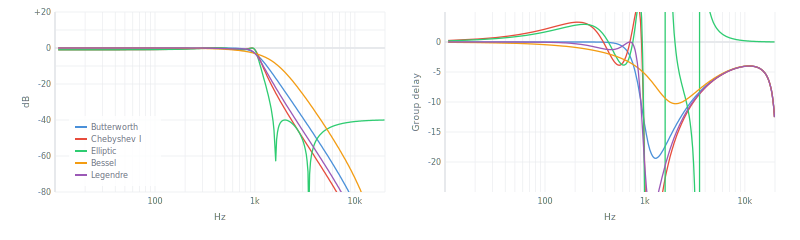
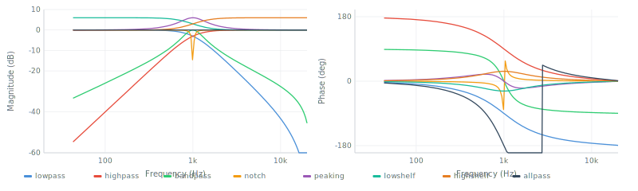
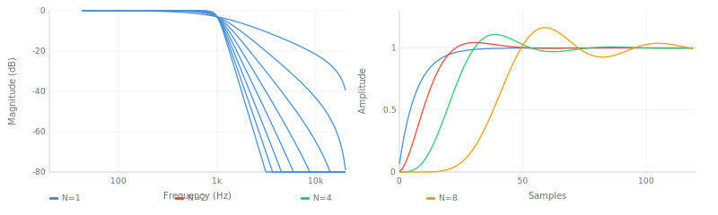

# IIR Filters

Infinite Impulse Response filters: the workhorses of real-time signal processing. They achieve sharp frequency cutoffs with minimal computation by using *feedback* — each output sample depends on previous outputs, not just inputs. This guide covers every IIR filter family in the library.



## How IIR filters work

Every IIR filter in this library follows the same pipeline:

```
Analog prototype → Frequency transform → Bilinear transform → Digital SOS
```

**Step 1: Analog prototype.** Each filter family (Butterworth, Chebyshev, etc.) defines a set of *poles* — points in the complex plane where the transfer function goes to infinity. These poles determine the filter's character. A Butterworth has poles evenly spaced on a circle. An elliptic filter has poles computed from elliptic integrals. The prototype is always a normalized lowpass at 1 rad/s.

**Step 2: Frequency transform.** The prototype is shifted to the desired cutoff frequency. For highpass, bandpass, or bandstop responses, the poles are algebraically mapped to new locations.

**Step 3: Bilinear transform.** The analog filter (continuous time, s-domain) is converted to a digital filter (discrete time, z-domain) using the substitution `s = (2/T)(z-1)/(z+1)`. This maps the entire analog frequency axis onto [0, Nyquist], with frequency warping corrected at the cutoff by prewarping.

**Step 4: SOS cascade.** The digital filter is factored into second-order sections (biquads), each with 5 coefficients: `{b0, b1, b2, a1, a2}`. High-order filters implemented directly need extreme coefficient precision — but cascaded biquads work with standard float64. This is why the library returns arrays of biquad objects.

The `filter()` function processes data through an SOS cascade using Direct Form II Transposed — the most numerically robust structure for floating-point arithmetic.

```js
import { butterworth, filter } from 'digital-filter'

let sos = butterworth(4, 1000, 44100)  // design returns [{b0,b1,b2,a1,a2}, ...]
let data = new Float64Array(1024)
filter(data, { coefs: sos })            // process in-place through cascade
```

For deeper treatment of the bilinear transform, stability, poles/zeros, and frequency domain fundamentals, see [concepts.md](concepts.md).

---

## Choosing an IIR filter

Start here. Answer these questions in order:

1. **Do you need linear phase?** IIR filters cannot provide it. Use an FIR filter, or `filtfilt` for offline zero-phase processing.

2. **Do you need to preserve waveform shape (no ringing, no overshoot)?** Use **Bessel**. Nothing else comes close — 0.9% overshoot vs 10%+ for all others.

3. **Do you need the sharpest possible transition for a given order?** Use **Elliptic**. It achieves the minimum order for any set of specifications, at the cost of ripple in both passband and stopband.

4. **Can you tolerate passband ripple?** If yes, use **Chebyshev Type I** — steeper than Butterworth, simpler than Elliptic. If no, continue.

5. **Do you need a flat passband with guaranteed stopband rejection?** Use **Chebyshev Type II** — flat passband like Butterworth but with controllable stopband floor.

6. **Do you want the steepest cutoff with zero ripple?** Use **Legendre** — provably the steepest monotonic response.

7. **Otherwise?** Use **Butterworth**. It is the default for a reason: maximally flat passband, monotonic rolloff, predictable behavior, no parameters beyond order and cutoff.

For specific use cases:

- **Audio crossover (splitting into bands):** Linkwitz-Riley. LP + HP sum to unity.
- **Real-time synth filter with modulation:** SVF. Stable parameter changes, 6 simultaneous outputs.
- **Classic analog synth tone:** Moog ladder. Resonant -24 dB/oct with saturation.
- **Single-band EQ, notch, shelf:** Biquad directly. No need for higher-order design.
- **Automatic filter selection from specs:** `iirdesign(fpass, fstop, rp, rs, fs)` picks the optimal family and order.

---

## IIR family comparison table

All measurements at order 4, fc = 1000 Hz, fs = 44100 Hz:

| | Butterworth | Chebyshev I | Chebyshev II | Elliptic | Bessel | Legendre |
|---|---|---|---|---|---|---|
| **Passband** | Flat | 1 dB ripple | Flat | 1 dB ripple | Flat (soft) | Flat |
| **@500 Hz** | 0.0 dB | -0.3 dB | 0.0 dB | -0.1 dB | -0.7 dB | -0.4 dB |
| **@1 kHz (-3 dB)** | -3.0 | -1.0 | -3.0 | -1.0 | -3.0 | -3.0 |
| **@2 kHz** | -24 dB | -34 dB | -40 dB | -40 dB | -14 dB | -31 dB |
| **@5 kHz** | -57 dB | -69 dB | -78 dB | -46 dB | -43 dB | -65 dB |
| **Overshoot** | 10.9% | 8.7% | 13.0% | 10.6% | **0.9%** | 11.3% |
| **Settling** | 73 smp | 256 smp | 89 smp | 256 smp | **28 smp** | 116 smp |
| **Group delay variation** | 14 smp | 30 smp | 16 smp | 39 smp | **5 smp** | 21 smp |
| **Best for** | General | Sharp cutoff | Flat pass + sharp | Minimum order | No ringing | Sharp + no ripple |

**Reading the table:** Butterworth is the default choice. Chebyshev and Elliptic trade ripple for steeper cutoff. Bessel preserves waveform shape (lowest overshoot, most constant group delay). Legendre is the steepest you can get without any ripple. Chebyshev II gives a flat passband like Butterworth but reaches the stopband floor faster — the tradeoff is that deep stopband attenuation is limited to the specified floor (it bounces back up at higher frequencies, visible as equiripple lobes).

---

## Biquad

### What it is

The biquad (bi-quadratic) is a second-order IIR filter defined by 5 coefficients. It is the fundamental building block — every IIR filter in this library is either a single biquad or a cascade of biquads. The name comes from the transfer function being a ratio of two quadratic polynomials in z⁻¹:

```
H(z) = (b0 + b1·z⁻¹ + b2·z⁻²) / (1 + a1·z⁻¹ + a2·z⁻²)
```

By choosing different coefficient formulas, a biquad becomes a lowpass, highpass, bandpass, notch, allpass, peaking EQ, low shelf, or high shelf. The library implements the Robert Bristow-Johnson (RBJ) Audio EQ Cookbook formulas, which are the standard.

### When to use it

When you need a single second-order filter: one band of parametric EQ, a simple lowpass/highpass, a notch to remove hum, a shelf for tonal balance. For most audio EQ tasks, a biquad is sufficient and anything more is overkill.

### When NOT to use it

When you need a steeper cutoff than -12 dB/octave. A single biquad is only 2nd order. For sharper filtering, use `butterworth`, `chebyshev`, etc., which return *cascaded* biquads of the order you specify.

### Origin

The biquad coefficient formulas used here were published by Robert Bristow-Johnson in the "Audio EQ Cookbook" (1998), which became the de facto standard for audio software.

### How it works

The two parameters that shape a biquad are the cutoff frequency `fc` and the quality factor `Q`. The cutoff sets where the filter acts. Q controls the resonance peak width — higher Q means a narrower, more resonant peak. For lowpass/highpass, `Q = 0.7071` (1/√2) gives the Butterworth-flat response. For peaking/shelf types, a `dBgain` parameter controls how much boost or cut is applied.

Internally, `fc` and `Q` are converted to intermediate values `w0 = 2π·fc/fs` (normalized angular frequency) and `α = sin(w0)/(2Q)` (bandwidth parameter), from which the 5 coefficients are computed analytically.

### Key characteristics

- **Passband behavior**: Depends on type — flat (lowpass/highpass at Q=0.707), resonant peak (higher Q), or shaped (shelf/peaking).
- **Transition sharpness**: -12 dB/octave (second order). This is fixed — it is the nature of a 2nd-order system.
- **Phase/group delay**: Nonlinear. Up to 180° phase shift across the transition. Group delay peaks at the cutoff frequency.
- **Overshoot in step response**: Depends on Q. At Q = 0.707 (Butterworth), about 4%. Higher Q means more ringing.
- **Stability**: Stable when both poles are inside the unit circle. The RBJ formulas guarantee stability for valid fc and Q > 0.

### Parameters

| Parameter | Type | Default | Range | What it controls |
|---|---|---|---|---|
| `fc` | number | — | 0 < fc < fs/2 | Cutoff or center frequency in Hz |
| `Q` | number | — | > 0 | Quality factor / resonance width |
| `fs` | number | — | > 0 | Sample rate in Hz |
| `dBgain` | number | — | any | Boost/cut in dB (peaking, lowshelf, highshelf only) |

### Biquad types



| Type | What it does | DC | @fc | Nyquist |
|---|---|---|---|---|
| `lowpass` | Passes below fc | 0 dB | -3 dB | -∞ |
| `highpass` | Passes above fc | -∞ | -3 dB | 0 dB |
| `bandpass` | Passes around fc | -∞ | 0 dB | -∞ |
| `notch` | Rejects fc | 0 dB | -∞ | 0 dB |
| `allpass` | Phase shift only | 0 dB | 0 dB | 0 dB |
| `peaking` | Boost/cut at fc | 0 dB | ±gain | 0 dB |
| `lowshelf` | Boost/cut below fc | ±gain | ±gain/2 | 0 dB |
| `highshelf` | Boost/cut above fc | 0 dB | ±gain/2 | ±gain |

### Example

```js
import { biquad } from 'digital-filter'
import filter from 'digital-filter/filter'

// Lowpass at 2kHz, Q=0.707 (Butterworth), 44.1kHz sample rate
let coefs = biquad.lowpass(2000, 0.707, 44100)
filter(data, { coefs })

// Peaking EQ: +6dB bell at 1kHz, Q=2 (narrow)
let eq = biquad.peaking(1000, 2, 44100, 6)
filter(data, { coefs: eq })

// Notch at 60Hz to remove hum
let hum = biquad.notch(60, 30, 44100)
filter(data, { coefs: hum })
```

### Comparison

vs **SVF**: The SVF provides all the same filter types with better behavior under real-time parameter modulation (no coefficient discontinuities). Use SVF for synthesis; use biquad for static EQ or when you need SOS coefficients for analysis.

vs **Higher-order IIR**: A single biquad is -12 dB/oct. If you need -24, -48, etc., use `butterworth(4, ...)`, `butterworth(8, ...)` which return cascaded biquads automatically.

### References

- Robert Bristow-Johnson, "Audio EQ Cookbook" (1998). The original formulas.
- Julius O. Smith III, *Introduction to Digital Filters* (2007).

---

## Butterworth

### What it is

A Butterworth filter has the flattest possible magnitude response in the passband. No ripple, no bumps — the response is monotonically decreasing from DC to Nyquist. The magnitude squared response is `1 / (1 + (ω/ωc)^(2N))` where N is the order. This is the mathematical definition of "maximally flat."

### When to use it

The default choice for general-purpose filtering. When you want a clean cutoff without any artifacts in the passband, and the transition width is not critical. Anti-aliasing before downsampling, audio crossovers (via Linkwitz-Riley), control system lowpass filtering, smoothing sensor data.

### When NOT to use it

When you need the sharpest possible transition (use Chebyshev or Elliptic — they are steeper for the same order). When you need to preserve the time-domain waveform shape (use Bessel — Butterworth has 10.9% step response overshoot at order 4).

### Origin

Stephen Butterworth, "On the Theory of Filter Amplifiers" (1930). Designed to achieve the flattest possible frequency response with vacuum tube amplifiers.

### How it works

The Butterworth prototype has N poles equally spaced on the left half of the unit circle in the s-plane. For order N, the k-th pole is at angle `π(2k+1)/(2N)` from the positive real axis. This arrangement is what guarantees maximal flatness — it is the unique pole placement where all derivatives of the magnitude response at ω=0 are zero up to order 2N-1.

The rolloff slope is exactly -6N dB/octave (-20N dB/decade). Order 2 gives -12 dB/oct, order 4 gives -24 dB/oct, order 8 gives -48 dB/oct.

### Key characteristics

- **Passband behavior**: Maximally flat. No ripple whatsoever.
- **Transition sharpness**: -6N dB/octave. Moderate — steeper than Bessel, shallower than Chebyshev.
- **Phase/group delay**: Nonlinear, 14 samples variation at order 4. Moderate.
- **Overshoot in step response**: 10.9% at order 4. Noticeable ringing.
- **Stability**: Always stable for valid parameters. Poles are well inside the unit circle.

### Butterworth order comparison



| Order | Slope | @2 kHz | @5 kHz | @10 kHz |
|---|---|---|---|---|
| 1 | -6 dB/oct | -7 dB | -15 dB | -22 dB |
| 2 | -12 dB/oct | -12 dB | -29 dB | -43 dB |
| 3 | -18 dB/oct | -18 dB | -43 dB | -65 dB |
| 4 | -24 dB/oct | -24 dB | -57 dB | -87 dB |
| 5 | -30 dB/oct | -30 dB | -72 dB | -108 dB |
| 6 | -36 dB/oct | -36 dB | -86 dB | -130 dB |
| 8 | -48 dB/oct | -49 dB | -115 dB | -173 dB |

### Parameters

| Parameter | Type | Default | Range | What it controls |
|---|---|---|---|---|
| `order` | number | — | 1–∞ (practical: 1–10) | Filter steepness. Each +1 adds -6 dB/oct. |
| `fc` | number | — | 0 < fc < fs/2 (or `[fLow, fHigh]` for BP/BS) | Cutoff frequency in Hz (-3 dB point) |
| `fs` | number | 44100 | > 0 | Sample rate in Hz |
| `type` | string | `'lowpass'` | `'lowpass'`, `'highpass'`, `'bandpass'`, `'bandstop'` | Filter response type |

### Example

```js
import { butterworth, filter } from 'digital-filter'

// 4th-order lowpass at 1kHz
let sos = butterworth(4, 1000, 44100)
filter(data, { coefs: sos })

// 6th-order highpass at 80Hz (rumble filter)
let hp = butterworth(6, 80, 44100, 'highpass')
filter(data, { coefs: hp })

// 4th-order bandpass 300–3400Hz (telephone band)
let bp = butterworth(4, [300, 3400], 44100, 'bandpass')
filter(data, { coefs: bp })
```

### Comparison

vs **Chebyshev I**: Chebyshev is steeper (-34 dB vs -24 dB at 2× cutoff for order 4) but has 1 dB passband ripple. If the ripple is acceptable, Chebyshev gives you one less order of complexity.

vs **Bessel**: Bessel has much less ringing (0.9% vs 10.9% overshoot) but a much gentler slope (-14 dB vs -24 dB at 2× cutoff). Bessel is better when waveform shape matters.

vs **Legendre**: Legendre is steeper (-31 dB vs -24 dB at 2× cutoff) while still being monotonic. If you want the steepest ripple-free response, Legendre wins.

### References

- S. Butterworth, "On the Theory of Filter Amplifiers," *Wireless Engineer*, vol. 7, pp. 536–541, 1930.
- A.V. Oppenheim & R.W. Schafer, *Discrete-Time Signal Processing*, 3rd ed., Pearson, 2010, ch. 7.

---

## Chebyshev Type I

### What it is

A Chebyshev Type I filter trades passband flatness for transition steepness. It allows a specified amount of ripple (oscillation) in the passband, and in return achieves a steeper cutoff than a Butterworth of the same order. The ripple is *equiripple* — it oscillates between 0 dB and -Rp dB with equal amplitude throughout the passband. The stopband is monotonically decreasing.

### When to use it

When you need a sharper cutoff than Butterworth and can accept some passband variation. Common in anti-aliasing filters, channel selection filters, and any application where frequencies just above the cutoff must be suppressed aggressively but small passband fluctuations are tolerable.

### When NOT to use it

When passband flatness matters (audio EQ, precision measurement — use Butterworth or Legendre). When you also need stopband control (use Elliptic or Chebyshev Type II). When waveform shape matters (use Bessel — Chebyshev I has the worst settling time of the classic families).

### Origin

Named after Pafnuty Chebyshev (1821–1894), whose work on polynomial approximation theory provides the mathematical foundation. The filter was developed in the 1950s–60s for use in telecommunications.

### How it works

The magnitude squared response is `1 / (1 + ε²·Tₙ²(ω/ωc))`, where `Tₙ` is the Chebyshev polynomial of order N and `ε` controls the ripple depth. The Chebyshev polynomial oscillates between -1 and +1 in [-1, 1] (the passband), creating equiripple, then grows explosively outside that range (the stopband), creating steep rolloff.

The prototype poles lie on an ellipse in the s-plane (not a circle like Butterworth). The ellipse is defined by `sinh(μ)` and `cosh(μ)` where `μ = asinh(1/ε)/N`. More ripple (larger ε) → flatter ellipse → steeper transition.

### Key characteristics

- **Passband behavior**: Equiripple. Oscillates between 0 dB and -Rp dB. Default Rp = 1 dB.
- **Transition sharpness**: Steeper than Butterworth for the same order. -34 dB at 2× cutoff (order 4, 1 dB ripple) vs Butterworth's -24 dB.
- **Phase/group delay**: Highly nonlinear. 30 samples variation at order 4 — worst among classic families (tied with Elliptic). The group delay peaks sharply at the passband edge.
- **Overshoot in step response**: 8.7% at order 4, but settling time is 256 samples — the worst. The equiripple nature causes prolonged ringing.
- **Stability**: Stable for valid parameters. Poles move closer to the jω axis with higher ripple, which can cause numerical sensitivity at very high orders.

### Parameters

| Parameter | Type | Default | Range | What it controls |
|---|---|---|---|---|
| `order` | number | — | 1–∞ (practical: 1–10) | Filter steepness |
| `fc` | number | — | 0 < fc < fs/2 (or `[fLow, fHigh]` for BP/BS) | Cutoff frequency in Hz (passband edge, NOT -3 dB point) |
| `fs` | number | 44100 | > 0 | Sample rate in Hz |
| `ripple` | number | 1 | > 0 | Maximum passband ripple in dB |
| `type` | string | `'lowpass'` | `'lowpass'`, `'highpass'`, `'bandpass'`, `'bandstop'` | Filter response type |

Note: for Chebyshev I, `fc` is the passband edge frequency (where gain = -Rp dB), not the -3 dB point. The actual -3 dB point is slightly above fc (1054 Hz for fc=1000, Rp=1 dB, order 4).

### Example

```js
import { chebyshev, filter } from 'digital-filter'

// 4th-order Chebyshev I lowpass, 1kHz cutoff, 1dB ripple
let sos = chebyshev(4, 1000, 44100, 1)
filter(data, { coefs: sos })

// 6th-order with tighter ripple (0.5dB)
let tight = chebyshev(6, 2000, 44100, 0.5)
filter(data, { coefs: tight })

// Highpass
let hp = chebyshev(4, 200, 44100, 1, 'highpass')
filter(data, { coefs: hp })
```

### Comparison

vs **Butterworth**: Chebyshev I is always steeper for the same order but introduces passband ripple. A 4th-order Chebyshev I with 1 dB ripple matches a 5th-order Butterworth in transition steepness.

vs **Chebyshev II**: Type I has ripple in the passband and monotonic stopband. Type II is the mirror: flat passband and ripple in the stopband. Choose based on which band needs to be clean.

vs **Elliptic**: Elliptic is steeper still (it has ripple in *both* bands), but Chebyshev I is simpler — no stopband attenuation parameter, and no finite zeros to reason about.

### References

- Pafnuty Chebyshev, "Théorie des mécanismes connus sous le nom de parallélogrammes," 1854.
- L.P. Huelsman, *Active and Passive Analog Filter Design*, McGraw-Hill, 1993.

---

## Chebyshev Type II

### What it is

A Chebyshev Type II (also called inverse Chebyshev) filter is the mirror image of Type I. The passband is maximally flat (like Butterworth), but the stopband has equiripple — it oscillates at a guaranteed minimum attenuation level rather than falling monotonically to -∞. The result is a flat passband with a sharper initial rolloff than Butterworth, at the cost of a "floor" in the stopband that the attenuation bounces along.

### When to use it

When you need a flat passband (no ripple tolerance) but also need a sharper initial transition than Butterworth, and you can accept a finite stopband floor. Useful when the precise stopband depth matters less than where the rejection *starts* — for example, rejecting interference at a known frequency while keeping the passband pristine.

### When NOT to use it

When you need deep stopband rejection that keeps growing with frequency (use Butterworth — it falls at -6N dB/oct forever). When you need the absolute steepest transition and can tolerate passband ripple (use Elliptic). The equiripple stopband means attenuation bounces back up periodically — at 10 kHz a 4th-order Chebyshev II is only -42 dB, worse than Butterworth's -87 dB.

### Origin

The Type II variant follows from Chebyshev's polynomial theory applied to the stopband rather than the passband. It was developed as a practical alternative in filter synthesis during the 1960s.

### How it works

The key insight: invert the Chebyshev I poles. A Type I pole at location `p` becomes a Type II pole at `1/p`. This swaps the ripple from passband to stopband. Additionally, Type II has *finite zeros* on the jω axis (the imaginary axis) — these create the notches in the stopband where attenuation reaches its deepest points. The zeros are at frequencies `1/cos(θ)` where `θ` are the same angles used for Type I.

The attenuation parameter specifies the minimum stopband rejection in dB. Common values: 40 dB (1% amplitude), 60 dB (0.1%), 80 dB (0.01%).

### Key characteristics

- **Passband behavior**: Flat (monotonic), like Butterworth.
- **Transition sharpness**: Sharper initial rolloff than Butterworth. -40 dB at 2× cutoff (order 4, 40 dB attenuation) vs Butterworth's -24 dB — but the stopband bounces back up.
- **Phase/group delay**: 16 samples variation at order 4. Better than Chebyshev I (30 smp), close to Butterworth (14 smp).
- **Overshoot in step response**: 13.0% at order 4 — slightly worse than Butterworth. Settling time is 89 samples, much better than Chebyshev I.
- **Stability**: Stable. The finite zeros can cause the stopband attenuation to be non-monotonic — this is by design, not instability.

### Parameters

| Parameter | Type | Default | Range | What it controls |
|---|---|---|---|---|
| `order` | number | — | 1–∞ (practical: 1–10) | Filter steepness |
| `fc` | number | — | 0 < fc < fs/2 (or `[fLow, fHigh]` for BP/BS) | Stopband edge frequency (NOT passband edge) |
| `fs` | number | 44100 | > 0 | Sample rate in Hz |
| `attenuation` | number | 40 | > 0 | Minimum stopband rejection in dB |
| `type` | string | `'lowpass'` | `'lowpass'`, `'highpass'`, `'bandpass'`, `'bandstop'` | Filter response type |

Note: `fc` for Chebyshev II is the *stopband* edge — the frequency where attenuation first reaches the specified floor. The actual -3 dB point is slightly below fc (999 Hz for fc=1000, 40 dB attenuation, order 4).

### Example

```js
import { chebyshev2, filter } from 'digital-filter'

// 4th-order Chebyshev II lowpass, stopband edge at 1kHz, 40dB attenuation
let sos = chebyshev2(4, 1000, 44100, 40)
filter(data, { coefs: sos })

// Higher stopband rejection
let deep = chebyshev2(6, 1000, 44100, 60)
filter(data, { coefs: deep })

// Highpass
let hp = chebyshev2(4, 500, 44100, 40, 'highpass')
filter(data, { coefs: hp })
```

### Comparison

vs **Butterworth**: Both have flat passbands. Chebyshev II has a sharper initial rolloff but the stopband doesn't keep falling — it oscillates at the attenuation floor. If you need rejection beyond -40 dB at high frequencies, Butterworth eventually wins.

vs **Chebyshev I**: Mirror images. Type I ripples in the passband and is monotonic in the stopband. Type II is flat in the passband and ripples in the stopband. Choose based on which band you care about more.

vs **Elliptic**: Elliptic achieves steeper transitions by allowing ripple in *both* bands. Chebyshev II only ripples in the stopband, so the passband is cleaner.

### References

- A.V. Oppenheim & R.W. Schafer, *Discrete-Time Signal Processing*, 3rd ed., Pearson, 2010.
- R.W. Daniels, *Approximation Methods for Electronic Filter Design*, McGraw-Hill, 1974.

---

## Elliptic / Cauer

### What it is

The elliptic filter (also called Cauer filter) achieves the sharpest possible transition band for a given order, passband ripple, and stopband attenuation. It is the mathematically optimal IIR filter — no other filter of the same order can have a narrower transition. The price: equiripple in *both* the passband and the stopband. It has ripple everywhere, but it makes every pole and zero count.

### When to use it

When transition width is the primary constraint. Spectrum channelization, sharp anti-aliasing, any situation where you need maximum selectivity with minimum computational cost. A 4th-order elliptic can outperform a 6th or 7th-order Butterworth in transition steepness.

### When NOT to use it

When passband flatness matters (use Butterworth or Legendre). When waveform shape matters (use Bessel). When simplicity matters — elliptic filters have more parameters and more complex behavior (the stopband doesn't fall monotonically, it oscillates). Also, the phase response is the worst of all classic families (39 samples group delay variation at order 4).

### Origin

Wilhelm Cauer, "Synthesis of Linear Communication Networks" (1958). The theory uses Jacobian elliptic functions, giving the filter its name.

### How it works

The elliptic filter's optimality comes from using both poles and zeros. While Butterworth and Chebyshev I are *all-pole* filters (zeros only at infinity), the elliptic filter places finite zeros on the jω axis to create deep notches in the stopband. The zeros are computed from the Jacobi elliptic function `sn(u, m)`, and the poles from `cd(u - jv₀, m)`, where `m` is the selectivity parameter and `v₀` controls the ripple balance.

The mathematics involves elliptic integrals (`K(m)` — the complete elliptic integral of the first kind) and the degree equation: `K(k)/K'(k) = N × K(k₁)/K'(k₁)`, which links the filter order N, the selectivity k, and the ripple/attenuation ratio k₁. This library solves these numerically using Carlson's symmetric form for the elliptic integrals and the arithmetic-geometric mean (AGM) for the Jacobi functions.

Three parameters control the filter shape: `ripple` (passband ripple in dB), `attenuation` (stopband rejection in dB), and `order`. Given any two of ripple and attenuation, the order determines the transition width — and it is always the minimum possible.

### Key characteristics

- **Passband behavior**: Equiripple (like Chebyshev I). Oscillates between 0 dB and -Rp dB.
- **Transition sharpness**: The sharpest possible for the given order. -40 dB at 2× cutoff (order 4) — matching Chebyshev II and far exceeding Butterworth (-24 dB). But unlike Chebyshev II, it achieves this even closer to the cutoff.
- **Phase/group delay**: Worst of the classic families. 39 samples variation at order 4. The sharp transition concentrates the phase distortion.
- **Overshoot in step response**: 10.6% at order 4. Settling time is 256 samples — tied with Chebyshev I for slowest.
- **Stability**: Stable for valid parameters. The implementation uses binary search for the v₀ parameter to ensure the passband/stopband ripple targets are met precisely.

### Parameters

| Parameter | Type | Default | Range | What it controls |
|---|---|---|---|---|
| `order` | number | — | 1–∞ (practical: 1–10) | Filter steepness |
| `fc` | number | — | 0 < fc < fs/2 (or `[fLow, fHigh]` for BP/BS) | Cutoff frequency in Hz |
| `fs` | number | 44100 | > 0 | Sample rate in Hz |
| `ripple` | number | 1 | > 0 | Maximum passband ripple in dB |
| `attenuation` | number | 40 | > 0 | Minimum stopband rejection in dB |
| `type` | string | `'lowpass'` | `'lowpass'`, `'highpass'`, `'bandpass'`, `'bandstop'` | Filter response type |

### Example

```js
import { elliptic, filter } from 'digital-filter'

// 4th-order elliptic lowpass, 1kHz, 1dB ripple, 40dB stopband
let sos = elliptic(4, 1000, 44100, 1, 40)
filter(data, { coefs: sos })

// Tighter specs: 0.5dB ripple, 60dB stopband
let tight = elliptic(4, 1000, 44100, 0.5, 60)
filter(data, { coefs: tight })

// Highpass
let hp = elliptic(4, 200, 44100, 1, 40, 'highpass')
filter(data, { coefs: hp })
```

### Comparison

vs **Chebyshev I**: Elliptic is steeper because it uses both passband ripple *and* stopband zeros. Chebyshev I is simpler (no stopband parameter) and its stopband falls monotonically.

vs **Chebyshev II**: Elliptic trades passband flatness for even sharper transitions. Chebyshev II keeps the passband flat.

vs **Butterworth**: A 4th-order elliptic achieves similar selectivity to a 7th-order Butterworth — at roughly half the computation.

### References

- W. Cauer, *Synthesis of Linear Communication Networks*, McGraw-Hill, 1958.
- R.W. Daniels, *Approximation Methods for Electronic Filter Design*, McGraw-Hill, 1974.
- A. Antoniou, *Digital Signal Processing*, 2nd ed., McGraw-Hill, 2016, ch. 6.

---

## Bessel / Thomson

### What it is

A Bessel filter (also called Thomson filter) has the flattest possible group delay in the passband. Where Butterworth optimizes for flat *magnitude*, Bessel optimizes for flat *delay*. This means different frequencies pass through the filter with nearly equal delay, preserving the waveform shape. The step response has almost no overshoot or ringing.

### When to use it

When waveform shape matters more than frequency selectivity. Filtering ECG/EEG signals before measuring peak heights. Audio applications where transient response is critical (drum transients, percussive sounds). Control systems where overshoot causes problems. Any measurement where phase distortion changes the result.

### When NOT to use it

When you need a sharp frequency cutoff. The Bessel rolloff is the gentlest of all classic families — only -14 dB at 2× cutoff (order 4) compared to Butterworth's -24 dB. If frequency separation is the goal, Bessel is a poor choice.

### Origin

W.E. Thomson, "Delay Networks having Maximally Flat Frequency Characteristics" (1949). Named after Friedrich Bessel whose polynomials provide the mathematical basis, though Thomson did the filter design work.

### How it works

The Bessel polynomial of order N defines the denominator of the transfer function. These polynomials have the unique property that their group delay is maximally flat at ω = 0 — all derivatives of the group delay are zero at DC, up to the maximum possible order. This is the group-delay analog of what Butterworth does for magnitude.

The poles are precomputed and stored as a lookup table (orders 1–10) normalized to -3 dB at ω = 1 rad/s. The normalization is important: historically, Bessel filters were normalized for flat *delay* rather than -3 dB cutoff, which made the cutoff frequency confusing. This library normalizes to -3 dB like all other families, so `fc` means the same thing for Bessel as for Butterworth.

### Key characteristics

- **Passband behavior**: Flat but soft. Already -0.7 dB at half the cutoff frequency (where Butterworth is 0.0 dB). The passband rolls off earlier and more gradually.
- **Transition sharpness**: Gentlest of all families. -14 dB at 2× cutoff (order 4). About 10 dB less rejection than Butterworth at the same point.
- **Phase/group delay**: The defining strength. Only 5 samples variation at order 4. Nearly linear phase through the passband — the best of any IIR filter.
- **Overshoot in step response**: **0.9%** at order 4 — essentially none. Settling time is 28 samples — by far the fastest. No ringing.
- **Stability**: Very stable. Poles are well-separated and far from the unit circle.

### Parameters

| Parameter | Type | Default | Range | What it controls |
|---|---|---|---|---|
| `order` | number | — | 1–10 | Filter steepness |
| `fc` | number | — | 0 < fc < fs/2 (or `[fLow, fHigh]` for BP/BS) | Cutoff frequency in Hz (-3 dB point) |
| `fs` | number | 44100 | > 0 | Sample rate in Hz |
| `type` | string | `'lowpass'` | `'lowpass'`, `'highpass'`, `'bandpass'`, `'bandstop'` | Filter response type |

### Example

```js
import { bessel, filter } from 'digital-filter'

// 4th-order Bessel lowpass at 1kHz — preserves waveform shape
let sos = bessel(4, 1000, 44100)
filter(data, { coefs: sos })

// Higher order for steeper rolloff (still gentle compared to other families)
let steep = bessel(8, 500, 44100)
filter(data, { coefs: steep })

// Highpass
let hp = bessel(4, 100, 44100, 'highpass')
filter(data, { coefs: hp })
```

### Comparison

vs **Butterworth**: Butterworth is 10 dB steeper at 2× cutoff but has 12× more overshoot (10.9% vs 0.9%) and 2.5× longer settling (73 vs 28 samples). If you are measuring waveform features, Bessel is correct; if you are separating frequencies, Butterworth is correct.

vs **Legendre**: Legendre is significantly steeper (-31 dB vs -14 dB at 2× cutoff) but has 11.3% overshoot and 4× the group delay variation. Legendre is between Butterworth and Chebyshev in character; Bessel is in a class by itself for time-domain fidelity.

vs **FIR (linear phase)**: An FIR with symmetric coefficients achieves *perfect* linear phase (zero group delay variation), but at much higher cost (hundreds of taps). Bessel is the best IIR approximation to this, trading perfection for efficiency.

### References

- W.E. Thomson, "Delay Networks having Maximally Flat Frequency Characteristics," *Proc. IEE*, vol. 96, pt. 3, pp. 487–490, 1949.
- A.I. Zverev, *Handbook of Filter Synthesis*, Wiley, 1967.

---

## Legendre / Papoulis

### What it is

A Legendre filter (also called Papoulis or optimal monotonic filter) achieves the steepest possible rolloff among all monotonic (ripple-free) magnitude responses. It sits between Butterworth and Chebyshev I: steeper than Butterworth, but without any passband ripple. It is provably optimal — no other monotonic filter of the same order can have a steeper transition.

### When to use it

When you want the sharpest cutoff available without introducing any ripple. Situations where both flatness and selectivity matter: precision audio filtering, scientific measurement, applications where downstream processing is sensitive to passband variations.

### When NOT to use it

When maximum steepness is critical and ripple is acceptable (use Chebyshev I or Elliptic — they are steeper). When waveform preservation matters (use Bessel). For most general-purpose work, the improvement over Butterworth may not justify the less-familiar behavior.

### Origin

Athanasios Papoulis proposed the optimal monotonic filter in 1958. C.R. Bond published practical pole tables and computational methods in "Optimum 'L' Filters" (2004). Orders 1–2 are identical to Butterworth (there is only one monotonic solution at those orders).

### How it works

The Legendre filter's magnitude squared response is expressed using integrals of Legendre polynomials. The optimization maximizes the integral of the magnitude squared response over the passband, subject to the constraint that the response is monotonically decreasing. This produces a response that is flatter than Chebyshev (no ripple) but rolls off faster than Butterworth (which spends its "flatness budget" on making the maximum number of derivatives zero at DC).

The key difference from Butterworth: where Butterworth makes the response as flat as possible *at DC* (maximally flat), Legendre makes the response as steep as possible *at the cutoff* while remaining monotonic everywhere. Butterworth wastes flatness at DC where it is not needed; Legendre redistributes it toward the transition.

The poles are precomputed for orders 1–8 and normalized to -3 dB at ω = 1 rad/s, like all other families.

### Key characteristics

- **Passband behavior**: Monotonic (no ripple), but not maximally flat. The passband droops slightly more than Butterworth near the cutoff (-0.4 dB at 500 Hz vs Butterworth's -0.0 dB for fc=1000).
- **Transition sharpness**: -31 dB at 2× cutoff (order 4) — 7 dB steeper than Butterworth (-24 dB), and approaching Chebyshev I (-34 dB).
- **Phase/group delay**: 21 samples variation at order 4. Between Butterworth (14 smp) and Chebyshev I (30 smp).
- **Overshoot in step response**: 11.3% at order 4 — slightly worse than Butterworth (10.9%). Settling time is 116 samples.
- **Stability**: Stable. Poles are similar in distribution to Butterworth but with more spread.

### Parameters

| Parameter | Type | Default | Range | What it controls |
|---|---|---|---|---|
| `order` | number | — | 1–8 | Filter steepness |
| `fc` | number | — | 0 < fc < fs/2 (or `[fLow, fHigh]` for BP/BS) | Cutoff frequency in Hz (-3 dB point) |
| `fs` | number | 44100 | > 0 | Sample rate in Hz |
| `type` | string | `'lowpass'` | `'lowpass'`, `'highpass'`, `'bandpass'`, `'bandstop'` | Filter response type |

### Example

```js
import { legendre, filter } from 'digital-filter'

// 4th-order Legendre lowpass — steepest ripple-free cutoff
let sos = legendre(4, 1000, 44100)
filter(data, { coefs: sos })

// 8th-order for maximum steepness
let steep = legendre(8, 2000, 44100)
filter(data, { coefs: steep })

// Highpass
let hp = legendre(4, 200, 44100, 'highpass')
filter(data, { coefs: hp })
```

### Comparison

vs **Butterworth**: Legendre is ~30% steeper in the transition band for the same order, with no ripple in either band. The tradeoff is a less-flat passband (slight droop near cutoff) and 60% more settling time.

vs **Chebyshev I**: Chebyshev I is slightly steeper still (-34 dB vs -31 dB at 2× cutoff, order 4) but has 1 dB passband ripple. Legendre is the monotonic ceiling that Chebyshev I exceeds by introducing ripple.

### References

- A. Papoulis, "Optimum Filters with Monotonic Response," *Proc. IRE*, vol. 46, pp. 606–609, 1958.
- C.R. Bond, "Optimum 'L' Filters," 2004.

---

## State Variable Filter (SVF)

### What it is

The state variable filter is a second-order filter structure that produces lowpass, highpass, bandpass, notch, peaking, and allpass outputs *simultaneously* from a single computation. Unlike the biquad, which computes coefficients from formulas and processes them through a difference equation, the SVF simulates the topology of an analog state-variable circuit using the trapezoidal integrator method. This makes it numerically stable under real-time parameter modulation — you can sweep the cutoff frequency smoothly without clicks or instability.

### When to use it

Real-time audio synthesis where filter parameters change every sample (LFO-modulated filters, envelope-controlled filters, touch-controlled effects). Any interactive application where `fc` and `Q` are continuously varying. The SVF is the standard filter for modern software synthesizers.

### When NOT to use it

When you need higher than 2nd order (the SVF is inherently second-order; cascade manually for steeper slopes). When you need SOS coefficients for analysis (the SVF doesn't expose them — use biquad instead). When parameters are static (biquad is equally good and the coefficient form is more standard).

### Origin

The analog state variable filter dates to the 1960s (Kerwin, Huelsman, Newcomb). The digital version used here is the trapezoidal SVF by Andrew Simper (Cytomic, 2013), which resolves the numerical issues of naive digital implementations by using the trapezoidal (bilinear) integration rule with implicit solving.

### How it works

The SVF maintains two state variables (`ic1eq`, `ic2eq`) that represent the integrator states. Each sample, it computes three intermediate values (`v0`, `v1`, `v2`) that correspond to the highpass, bandpass, and lowpass outputs respectively. Other responses are derived by combining these:

- **lowpass** = `v2`
- **highpass** = `v0 - k·v1 - v2`
- **bandpass** = `v1`
- **notch** = `v0 - k·v1`
- **peak** = `v0 - k·v1 - 2·v2`
- **allpass** = `v0 - 2·k·v1`

where `k = 1/Q`. The coefficient `g = tan(π·fc/fs)` is the prewarped cutoff, and all internal coefficients are derived from `g` and `k`. Coefficients are only recomputed when `fc`, `Q`, or `fs` change.

### Key characteristics

- **Passband behavior**: Same as a biquad — depends on the output type selected.
- **Transition sharpness**: -12 dB/oct (second order), same as a biquad.
- **Phase/group delay**: Same as the equivalent biquad type.
- **Overshoot**: Depends on Q, same as biquad.
- **Stability**: More robust than biquad under parameter modulation. The trapezoidal integration ensures no energy blowup when sweeping fc rapidly. Self-oscillation at Q→∞ is controlled.

### Parameters

The SVF uses a params object that is mutated in-place (for state persistence across calls):

| Parameter | Type | Default | Range | What it controls |
|---|---|---|---|---|
| `fc` | number | — | 0 < fc < fs/2 | Cutoff frequency in Hz |
| `Q` | number | 0.707 | > 0 | Quality factor / resonance |
| `fs` | number | 44100 | > 0 | Sample rate |
| `type` | string | `'lowpass'` | `'lowpass'`, `'highpass'`, `'bandpass'`, `'notch'`, `'peak'`, `'allpass'` | Output type |
| `ic1eq` | number | 0 | any | Internal state (persisted between calls) |
| `ic2eq` | number | 0 | any | Internal state (persisted between calls) |

### Example

```js
import { svf } from 'digital-filter'

// Lowpass at 1kHz with resonance
let params = { fc: 1000, Q: 2, fs: 44100, type: 'lowpass' }
svf(data, params)
// params.ic1eq and params.ic2eq are now updated — pass same object for next block

// Modulate cutoff in real time (safe — no clicks)
for (let block = 0; block < 100; block++) {
  params.fc = 500 + 1500 * Math.sin(block * 0.1)  // LFO sweep
  svf(audioBlock, params)
}
```

### Comparison

vs **Biquad**: Equivalent frequency response. The SVF is superior for real-time parameter modulation (no coefficient jumps). The biquad is better when you need the `{b0,b1,b2,a1,a2}` coefficient form for analysis, `freqz`, or interoperability.

vs **Moog ladder**: The SVF is -12 dB/oct (2nd order), clean and linear. The Moog ladder is -24 dB/oct (4th order) with nonlinear saturation. Use SVF for general synthesis; use Moog for the specific Moog character.

### References

- A. Simper (Cytomic), "Linear Trapezoidal Integrated SVF," 2013.
- K.J. Werner et al., "An Improved and Generalized Diode Clipper Model for Wave Digital Filters," 2014.
- H. Chamberlin, *Musical Applications of Microprocessors*, 2nd ed., 1985. (Original analog SVF for music.)

---

## Moog Ladder

### What it is

A digital model of the Moog transistor ladder filter, the most iconic analog synthesizer filter. It is a 4-pole (-24 dB/octave) lowpass filter with a resonance control that feeds the output back to the input. At maximum resonance, the filter self-oscillates, producing a pure sine wave at the cutoff frequency. The nonlinear `tanh` saturation gives it the warm, compressed character of the original analog circuit.

### When to use it

Synthesizer and music production applications where you want the specific Moog sound: warm, fat, singing resonance. Sound design, virtual analog instruments, electronic music production. The Moog ladder is a *tonal color*, not a precision tool.

### When NOT to use it

For precision filtering (use Butterworth or any classic family). For measurement (the nonlinear saturation distorts the signal intentionally). For crossovers or EQ (use Linkwitz-Riley or biquad). The Moog ladder is a musical instrument, not an engineering filter.

### Origin

Robert Moog, US Patent 3,475,623 (1966). The transistor ladder topology became the defining sound of the Minimoog (1970). The digital model used here follows Stilson & Smith, "Analyzing the Moog VCF with Considerations for Digital Implementation" (1996).

### How it works

Four one-pole lowpass filters are cascaded (each contributing -6 dB/oct for a total of -24 dB/oct). The output of the fourth stage is fed back to the input with gain `fb = 4 × resonance`. At `resonance = 1`, the loop gain is exactly 4, which is the theoretical self-oscillation threshold for 4 cascaded one-pole filters.

Before entering the cascade, the signal passes through `tanh(x × 0.5)` — a soft-clipping nonlinearity that:
1. Prevents amplitude blowup at high resonance
2. Creates the characteristic harmonic richness (even and odd harmonics from the saturation)
3. Reduces the effective loop gain at high amplitudes, stabilizing self-oscillation

Each pole is a simple one-pole lowpass: `s[i] += f × (input - s[i])`, where `f = 2·sin(π·fc/fs)` is the cutoff coefficient, clamped to 0.45×Nyquist for stability.

### Key characteristics

- **Passband behavior**: Approximately flat at low resonance. As resonance increases, frequencies near the cutoff are boosted (resonance peak) and the overall passband level drops (bass loss — a characteristic Moog trait).
- **Transition sharpness**: -24 dB/oct — fixed by the 4-pole topology.
- **Phase/group delay**: Not meaningful in the traditional sense — the filter is nonlinear.
- **Overshoot**: At high resonance, the filter rings and eventually self-oscillates. This is the intended behavior.
- **Stability**: Stable for `resonance` in [0, 1]. The cutoff is clamped to 0.45×fs to prevent numerical instability near Nyquist. Above `resonance = 1`, self-oscillation amplitude is limited by the tanh saturation.

### Parameters

| Parameter | Type | Default | Range | What it controls |
|---|---|---|---|---|
| `fc` | number | 1000 | 0 < fc < 0.45×fs | Cutoff frequency in Hz |
| `resonance` | number | 0 | 0–1 (0=none, 1=self-oscillation) | Feedback amount. 0 = clean lowpass, 1 = singing resonance |
| `fs` | number | 44100 | > 0 | Sample rate |

State is stored in `params._s` (4-element Float64Array), persisted between calls.

### Example

```js
import { moogLadder } from 'digital-filter'

// Clean lowpass, no resonance
let params = { fc: 2000, resonance: 0, fs: 44100 }
moogLadder(data, params)

// Classic squelchy bass: moderate resonance, low cutoff
let bass = { fc: 400, resonance: 0.7, fs: 44100 }
moogLadder(data, bass)

// Self-oscillation: pure sine at cutoff frequency
let osc = { fc: 440, resonance: 1.0, fs: 44100 }
moogLadder(silence, osc)  // silence in → 440Hz sine out
```

### Comparison

vs **SVF**: SVF is a clean, linear, modular 2nd-order filter. Moog ladder is a nonlinear, 4th-order, character filter. Use SVF for general synthesis, Moog for the Moog sound.

vs **Diode ladder** (`diodeLadder`): Different saturation character — the diode ladder (TB-303 style) has a brighter, more aggressive resonance. The Moog is warmer and fatter.

vs **Butterworth order 4**: Butterworth is a precise -24 dB/oct lowpass with no saturation, no resonance, and no bass loss. It is a measurement tool. The Moog ladder is a musical instrument. They share the slope but nothing else.

### References

- R.A. Moog, US Patent 3,475,623, "Electronic High-Pass and Low-Pass Filters Employing the Base to Emitter Diode Resistance of Bipolar Transistors," 1969.
- T. Stilson & J. Smith, "Analyzing the Moog VCF with Considerations for Digital Implementation," *Proc. ICMC*, 1996.
- V. Välimäki & A. Huovilainen, "Oscillator and Filter Algorithms for Virtual Analog Synthesis," *CMJ*, 30(2), 2006.

---

## Linkwitz-Riley

### What it is

A Linkwitz-Riley crossover filter splits a signal into a lowpass and a highpass band that sum back to a perfectly flat magnitude response (allpass). It achieves this by cascading two Butterworth filters of half the target order. An LR-4 (4th-order Linkwitz-Riley) is two cascaded 2nd-order Butterworth filters. The crossover point is at -6 dB (not -3 dB), so the LP and HP outputs each contribute half power at the crossover frequency, summing to 0 dB.

### When to use it

Audio crossovers — splitting a signal into frequency bands for multi-driver loudspeakers (tweeter, woofer) or multi-band processing (dynamics, effects). The Linkwitz-Riley alignment is the industry standard for crossovers because the LP + HP sum is exactly flat in magnitude (allpass).

### When NOT to use it

When you only need a single lowpass or highpass (use Butterworth directly). When you need more than two bands (use the `crossover` module, which chains Linkwitz-Riley stages). When you need the flattest *phase* sum rather than magnitude sum (all IIR crossovers introduce phase shift — the Linkwitz-Riley sum is flat in magnitude but not in phase; for perfect phase, use FIR crossovers).

### Origin

Siegfried Linkwitz and Russ Riley, "Active Crossover Networks for Noncoincident Drivers" (1976). They identified that two cascaded Butterworth filters produce a crossover with perfect magnitude summation.

### How it works

The construction is simple and elegant:

1. Design a Butterworth lowpass of order N/2.
2. Cascade it with itself (apply it twice) → LR-N lowpass.
3. Do the same for highpass.

The magic: at the crossover frequency, a single Butterworth is -3 dB. Two cascaded Butterworths are -6 dB. When you add the lowpass (-6 dB) and highpass (-6 dB) outputs, they sum to 0 dB — but only because the phase relationship between the two cascades produces constructive interference that exactly compensates. The result is an allpass: flat magnitude, varying phase.

The order must be even (LR-2, LR-4, LR-8 are common). LR-4 (-24 dB/oct slopes) is the most popular for loudspeaker crossovers.

### Key characteristics

- **Passband behavior**: Each band (LP and HP) is flat in its passband (it is Butterworth).
- **Transition sharpness**: -6N dB/octave for each band. LR-4 gives -24 dB/oct.
- **Phase/group delay**: The summed output has constant magnitude but nonlinear phase. Each band individually has Butterworth phase characteristics.
- **Crossover summation**: LP + HP = allpass (flat magnitude at all frequencies). This is the defining property.
- **Stability**: Inherits Butterworth stability.

### Parameters

| Parameter | Type | Default | Range | What it controls |
|---|---|---|---|---|
| `order` | number | — | Even: 2, 4, 6, 8, ... | Crossover steepness (-6N dB/oct per band) |
| `fc` | number | — | 0 < fc < fs/2 | Crossover frequency in Hz (-6 dB point) |
| `fs` | number | 44100 | > 0 | Sample rate |

Returns `{ low, high }` — each is an SOS array. `low` is the lowpass band, `high` is the highpass band.

### Example

```js
import { linkwitzRiley, filter } from 'digital-filter'

// LR-4 crossover at 2kHz
let { low, high } = linkwitzRiley(4, 2000, 44100)

// Split signal into bands
let lo = Float64Array.from(data)
let hi = Float64Array.from(data)
filter(lo, { coefs: low })
filter(hi, { coefs: high })

// Process bands independently, then sum back to flat
// lo + hi = original signal (magnitude-flat, phase-shifted)

// For a 3-way crossover, use the `crossover` module instead:
import { crossover } from 'digital-filter'
let bands = crossover([500, 3000], 4, 44100)  // low, mid, high
```

### Comparison

vs **Butterworth crossover**: A single Butterworth at the crossover frequency gives -3 dB. LP + HP with Butterworth sums to +3 dB at the crossover point (they are in-phase). Linkwitz-Riley fixes this by cascading two Butterworths, reaching -6 dB and summing to exactly 0 dB. Always prefer Linkwitz-Riley for crossovers.

vs **FIR crossover**: FIR crossovers can achieve linear phase (no phase distortion in the summed output), but at much higher latency and computation. Linkwitz-Riley has minimal latency and is the standard for real-time audio.

### References

- S.H. Linkwitz, "Active Crossover Networks for Noncoincident Drivers," *JAES*, vol. 24, no. 1, pp. 2–8, 1976.
- D. Bohn, "A Fourth-Order State-Variable Filter for Linkwitz-Riley Active Crossover Designs," *JAES*, vol. 31, no. 11, 1983.

---

## Quick reference

### Import patterns

```js
// Named import (IIR design functions)
import { butterworth, chebyshev, chebyshev2, elliptic, bessel, legendre } from 'digital-filter'

// Named import (specialized)
import { svf, linkwitzRiley, moogLadder } from 'digital-filter'

// Named import (biquad types)
import { biquad } from 'digital-filter'
biquad.lowpass(fc, Q, fs)
biquad.peaking(fc, Q, fs, dBgain)

// Direct import
import butterworth from 'digital-filter/butterworth'
import svf from 'digital-filter/svf'
```

### Return values

| Filter | Returns | Process with |
|---|---|---|
| `butterworth`, `chebyshev`, `chebyshev2`, `elliptic`, `bessel`, `legendre` | `[{b0,b1,b2,a1,a2}, ...]` (SOS array) | `filter(data, { coefs: sos })` |
| `biquad.*` | `{b0,b1,b2,a1,a2}` (single section) | `filter(data, { coefs })` |
| `linkwitzRiley` | `{ low: SOS[], high: SOS[] }` | `filter(data, { coefs: lr.low })` |
| `svf` | Modifies `data` in-place | Direct call: `svf(data, params)` |
| `moogLadder` | Modifies `data` in-place | Direct call: `moogLadder(data, params)` |

### Supported filter types

All SOS-returning functions support `type` parameter:

| Type | What it does | fc parameter |
|---|---|---|
| `'lowpass'` | Pass below fc | Single frequency |
| `'highpass'` | Pass above fc | Single frequency |
| `'bandpass'` | Pass between fLow and fHigh | `[fLow, fHigh]` |
| `'bandstop'` | Reject between fLow and fHigh | `[fLow, fHigh]` |
