# Filter Encyclopedia

A complete guide to digital filters — what they are, how they work, which one to use.

## Start here

- **[Concepts](concepts.md)** — What is a filter? Frequency domain, phase, IIR vs FIR, biquads, stability. Read this first if you're new to DSP.
- **[Choosing a filter](choosing.md)** — 50+ task→filter mappings, decision flowcharts, common mistakes.

## Filter references

- **[IIR filters](iir.md)** — Biquad, Butterworth, Chebyshev I & II, Elliptic, Bessel, Legendre, SVF, Moog Ladder, Linkwitz-Riley. Includes family comparison plots and tables.
- **[FIR filters](fir.md)** — Window method, least-squares, Parks-McClellan, Hilbert, differentiator, raised cosine, Savitzky-Golay, minimum-phase conversion.
- **[Adaptive filters](adaptive.md)** — LMS, NLMS, RLS, Levinson-Durbin. Echo cancellation, noise cancellation, system identification.
- **[Weighting filters](weighting.md)** — A-weighting, C-weighting, K-weighting (LUFS), ITU-R 468, RIAA. Standards, code, LUFS metering recipe.

## Practical guides

- **[Applications](applications.md)** — Domain-specific recipes with working code: audio, synthesis, speech, communications, biomedical, measurement.

## Visual reference

All plots are generated from the library itself (`node docs/generate.js`).

### IIR comparison

### Individual filters

| IIR | | |
|---|---|---|
|  |  |  |
|  |  |  |

| Biquad types | | |
|---|---|---|
| 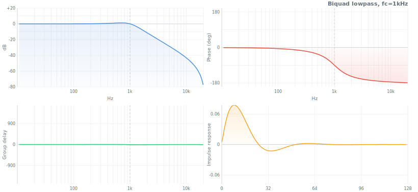 | 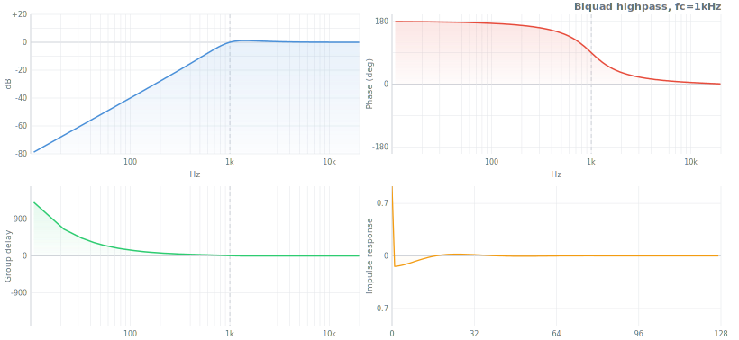 |  |
| 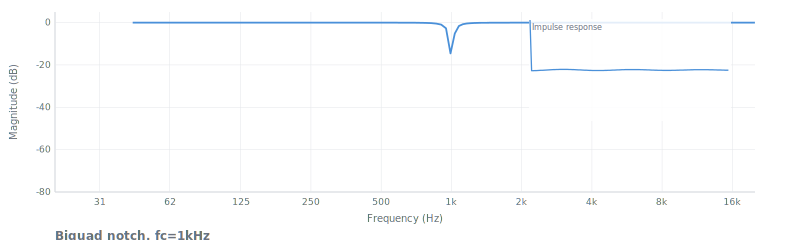 | 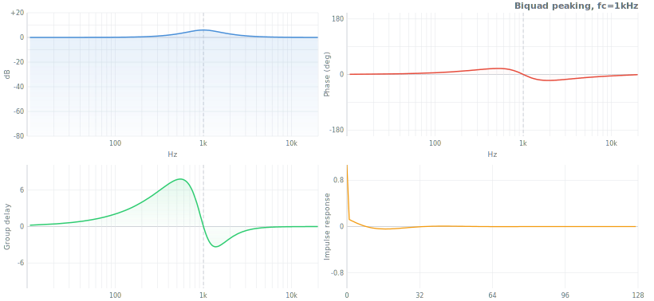 |  |
| 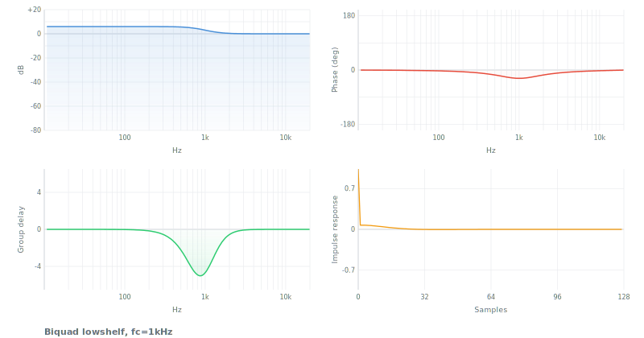 | 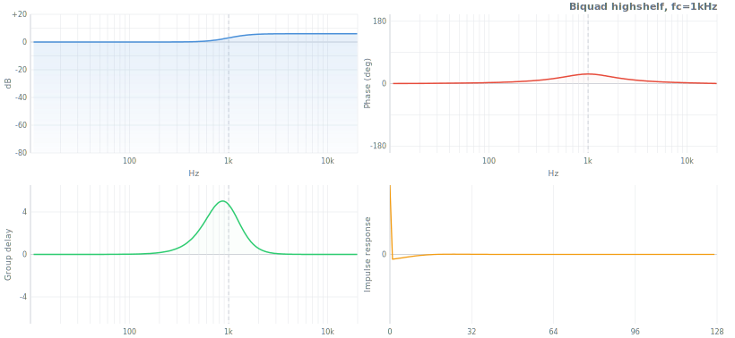 | |

| Virtual analog | | |
|---|---|---|
|  |  |  |

| SVF modes | | |
|---|---|---|
|  | 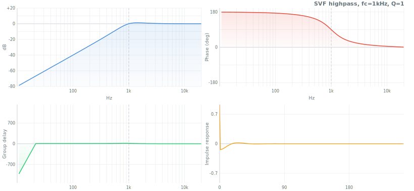 | 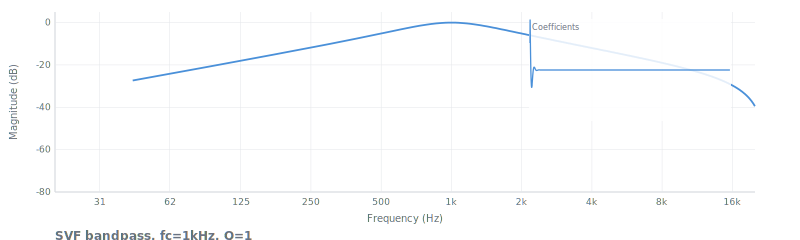 |

| Simple | | |
|---|---|---|
|  |  |  |
|  |  | |

| FIR | | |
|---|---|---|
|  | 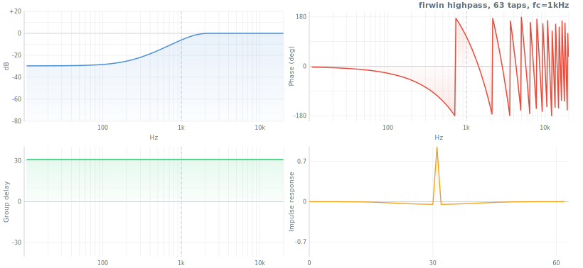 |  |
|  |  |  |
|  |  |  |

| Weighting | | |
|---|---|---|
|  |  |  |
|  |  | |

| Crossover | |
|---|---|
| 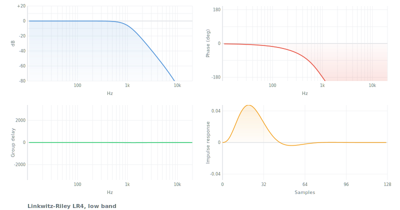 | 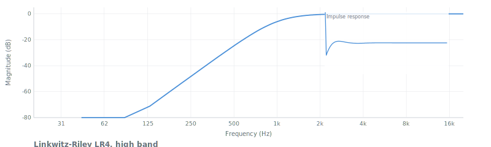 |

## References

### Textbooks

| Reference | Scope |
|---|---|
| Oppenheim & Schafer, *Discrete-Time Signal Processing* (3rd ed, 2009) | The canonical DSP textbook |
| Proakis & Manolakis, *DSP: Principles, Algorithms, and Applications* (4th ed, 2006) | Comprehensive undergraduate/graduate |
| J.O. Smith III, *Introduction to Digital Filters* (free, [ccrma.stanford.edu](https://ccrma.stanford.edu/~jos/filters/)) | Practical, audio-focused |
| Zolzer, *DAFX: Digital Audio Effects* (2nd ed, 2011) | Audio effects reference |
| Zavalishin, *The Art of VA Filter Design* (free, Native Instruments, 2012) | Virtual analog: SVF, Moog, zero-delay feedback |
| Pirkle, *Designing Audio Effect Plugins in C++* (2019) | Practical plugin development |
| Haykin, *Adaptive Filter Theory* (5th ed, 2014) | LMS, RLS, Kalman |
| Lyons, *Understanding DSP* (3rd ed, 2010) | Excellent for building intuition |
| Steven W. Smith, *The Scientist and Engineer's Guide to DSP* (free, [dspguide.com](http://www.dspguide.com)) | Beginner-friendly |

### Key papers & standards

| Reference | Year | Filters |
|---|---|---|
| [RBJ Audio EQ Cookbook](https://www.w3.org/TR/audio-eq-cookbook/) (W3C Note) | 1998 | Biquad (all 9 types) |
| Butterworth, "On the Theory of Filter Amplifiers" | 1930 | Butterworth |
| Thomson, "Delay networks having maximally flat frequency characteristics" | 1949 | Bessel |
| Dolph, "A Current Distribution for Broadside Arrays" (*Proc. IRE*) | 1946 | Dolph-Chebyshev window |
| Taylor, "Design of Line-Source Antennas" (*IRE Trans.*) | 1955 | Taylor window |
| Papoulis, "Optimum Filters with Monotonic Response" | 1958 | Legendre |
| Cauer, *Synthesis of Linear Communication Networks* | 1958 | Elliptic |
| Parks & McClellan, "Chebyshev Approximation for Nonrecursive Digital Filters" (*IEEE*) | 1972 | Remez / equiripple FIR |
| Kaiser, "Nonrecursive digital filter design using the I₀-sinh window function" | 1974 | Kaiser window, FIR order estimation |
| Linkwitz & Riley, "Active Crossover Networks for Noncoincident Drivers" (*JAES*) | 1976 | Linkwitz-Riley crossover |
| Harris, "On the Use of Windows for Harmonic Analysis with the DFT" (*Proc. IEEE*) | 1978 | Comprehensive window survey |
| Slepian, "Prolate Spheroidal Wave Functions" (*Bell System Tech. J.*) | 1978 | DPSS window |
| Widrow & Hoff, "Adaptive Switching Circuits" | 1960 | LMS |
| Moog, "A Voltage-Controlled Low-Pass High-Pass Filter" (*AES*) | 1965 | Moog ladder |
| Stilson & Smith, "Analyzing the Moog VCF" (*ICMC*) | 1996 | Digital Moog |
| Simper, "Linear Trapezoidal Integrated SVF" (Cytomic) | 2011 | SVF |
| Bond, "Optimum 'L' Filters: Polynomials, Poles and Circuit Elements" | 2004 | Legendre poles |
| Glasberg & Moore, "Derivation of auditory filter shapes" (*Hearing Research*) | 1990 | Gammatone, ERB |
| Zwicker & Terhardt, "Analytical expressions for critical-band rate" (*JASA*) | 1980 | Bark scale |
| Casiez et al., "1€ Filter" (*CHI*) | 2012 | One Euro |
| Savitzky & Golay, "Smoothing and Differentiation of Data" (*Anal. Chem.*) | 1964 | Savitzky-Golay |
| IEC 61672 | — | A/C-weighting |
| ITU-R BS.1770 | — | K-weighting, LUFS |
| ITU-R BS.468 | — | 468 noise weighting |
| IEC 98 / RIAA standard | 1954 | RIAA equalization |
| IEC 61260 | — | Octave-band filters |

### Online resources

| Resource | URL |
|---|---|
| Julius O. Smith III — 4 online books | [ccrma.stanford.edu/~jos/](https://ccrma.stanford.edu/~jos/) |
| Cytomic technical papers (SVF) | [cytomic.com/technical-papers](https://cytomic.com/technical-papers) |
| Nigel Redmon — biquad tutorials | [earlevel.com](https://www.earlevel.com/main/) |
| musicdsp.org — DSP snippet archive | [musicdsp.org](https://www.musicdsp.org/) |
| DSPRelated.com — articles, forums | [dsprelated.com](https://www.dsprelated.com/) |
| [`window-function`](https://github.com/scijs/window-function) — 34 window functions | Companion package |
