# Filter Reference

Complete API reference for every export in `digital-filter`. One file, Ctrl+F searchable.

## Contents

- [IIR Design](#iir-design) — butterworth, chebyshev, chebyshev2, elliptic, bessel, legendre, iirdesign
- [Biquad](#biquad) — lowpass, highpass, bandpass, notch, allpass, peaking, lowshelf, highshelf
- [FIR Design](#fir-design) — firwin, firwin2, firls, remez, kaiserord, hilbert, differentiator, integrator, raisedCosine, gaussianFir, matchedFilter, yulewalk
- [Simple Filters](#simple-filters) — onePole, movingAverage, leakyIntegrator, dcBlocker, comb, allpass, emphasis/deemphasis, resonator, envelope, slewLimiter, median
- [Specialized](#specialized) — svf, linkwitzRiley, savitzkyGolay, filtfilt, gaussianIir
- [Virtual Analog](#virtual-analog) — moogLadder, diodeLadder, korg35
- [Psychoacoustic](#psychoacoustic) — gammatone, octaveBank, erbBank, barkBank
- [Adaptive](#adaptive) — lms, nlms, rls, levinson
- [Dynamic](#dynamic) — noiseShaping, pinkNoise, oneEuro, dynamicSmoothing, spectralTilt, variableBandwidth
- [Multirate](#multirate) — decimate, interpolate, halfBand, cic, polyphase, farrow, thiran, oversample
- [Composites](#composites) — graphicEq, parametricEq, crossover, crossfeed, formant, vocoder
- [Structures](#structures) — lattice, warpedFir, convolution
- [Analysis & Conversion](#analysis--conversion) — freqz, mag2db, groupDelay, phaseDelay, impulseResponse, stepResponse, isStable, isMinPhase, isFir, isLinPhase, sos2zpk, sos2tf, tf2zpk, zpk2sos
- [Core](#core) — filter, transform, window
- [Weighting](#weighting) — aWeighting, cWeighting, kWeighting, itu468, riaa

---

## IIR Family Comparison

All measurements at order 4, fc = 1000 Hz, fs = 44100 Hz:

| | Butterworth | Chebyshev I | Chebyshev II | Elliptic | Bessel | Legendre |
|---|---|---|---|---|---|---|
| **Passband** | Flat | 1 dB ripple | Flat | 1 dB ripple | Flat (soft) | Flat |
| **@500 Hz** | 0.0 dB | -0.3 dB | 0.0 dB | -0.1 dB | -0.7 dB | -0.4 dB |
| **@1 kHz** | -3.0 | -1.0 | -3.0 | -1.0 | -3.0 | -3.0 |
| **@2 kHz** | -24 dB | -34 dB | -40 dB | -40 dB | -14 dB | -31 dB |
| **@5 kHz** | -57 dB | -69 dB | -78 dB | -46 dB | -43 dB | -65 dB |
| **Overshoot** | 10.9% | 8.7% | 13.0% | 10.6% | **0.9%** | 11.3% |
| **Settling** | 73 smp | 256 smp | 89 smp | 256 smp | **28 smp** | 116 smp |
| **Group delay var** | 14 smp | 30 smp | 16 smp | 39 smp | **5 smp** | 21 smp |
| **Best for** | General | Sharp cutoff | Flat pass + sharp | Minimum order | No ringing | Sharp + no ripple |

## Biquad Types

All biquad types at fc=1000 Hz, Q=1, fs=44100 Hz:

| Type | What it does | DC | @fc | Nyquist |
|---|---|---|---|---|
| `lowpass` | Passes below fc | 0 dB | -3 dB | -inf |
| `highpass` | Passes above fc | -inf | -3 dB | 0 dB |
| `bandpass` | Passes around fc | -inf | 0 dB | -inf |
| `bandpass2` | Constant-skirt bandpass | -inf | 0 dB | -inf |
| `notch` | Rejects fc | 0 dB | -inf | 0 dB |
| `allpass` | Phase shift only | 0 dB | 0 dB | 0 dB |
| `peaking` | Boost/cut at fc | 0 dB | +/-gain | 0 dB |
| `lowshelf` | Boost/cut below fc | +/-gain | +/-gain/2 | 0 dB |
| `highshelf` | Boost/cut above fc | 0 dB | +/-gain/2 | +/-gain |

## FIR Design Method Comparison

| Method | Optimality | Transition band | Stopband | Best for |
|---|---|---|---|---|
| `firwin` | Windowed ideal | Wide | Depends on window | 80% of tasks |
| `firls` | Min total squared error | Medium | Tapers smoothly | Average error |
| `remez` | Min max error (equiripple) | Narrowest | Uniform ripple | Sharpest cutoff |
| `firwin2` | Frequency sampling + window | Wide | Depends on window | Arbitrary shapes |

## Adaptive Algorithm Comparison

| | LMS | NLMS | RLS | Levinson |
|---|---|---|---|---|
| **Complexity** | O(N)/sample | O(N)/sample | O(N^2)/sample | O(N^2)/block |
| **Convergence** | Slow | Medium | Fast (~2N) | Instant (batch) |
| **Tracking** | Slow | Medium | Fast | N/A |
| **Stability** | Very robust | Robust | Fragile | Stable |
| **Step size** | Must tune mu | Self-normalizing | Forgetting factor | N/A |
| **Memory** | N weights | N weights | N x N matrix | N coefficients |
| **Best for** | Learning | Real-world adaptive | Fast-changing | LPC, speech |

---

# IIR Design

---

## butterworth

Maximally flat magnitude response. No ripple. The default choice. Butterworth (1930).

`butterworth(order, fc, fs, type?)` -> SOS[]

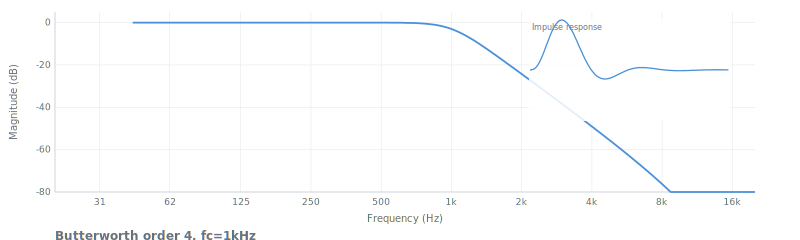

| Param | Type | Default | Description |
|---|---|---|---|
| order | number | -- | Filter order (1-10). Slope = -6N dB/oct. |
| fc | number | -- | Cutoff Hz (-3 dB). Array `[fLow, fHigh]` for BP/BS. |
| fs | number | 44100 | Sample rate Hz |
| type | string | `'lowpass'` | `'lowpass'` `'highpass'` `'bandpass'` `'bandstop'` |

### Mathematics

**Transfer function** (analog prototype): `|H(jw)|² = 1 / (1 + (w/wc)^2N)`. Digitized via bilinear transform and decomposed into second-order sections:

`H(z) = ∏ (b0 + b1·z⁻¹ + b2·z⁻²) / (1 + a1·z⁻¹ + a2·z⁻²)`

Each SOS section has poles at `s_k = wc · exp(j·π·(2k+N+1)/(2N))` for k=0..N-1 (left-half only), mapped to z-plane by `z = (1 + s·T/2)/(1 − s·T/2)`.

**Difference equation** (per section): `y[n] = b0·x[n] + b1·x[n-1] + b2·x[n-2] − a1·y[n-1] − a2·y[n-2]`

**Specs at order 4, fc=1000 Hz, fs=44100**: -3.0 dB at 1 kHz, -24 dB at 2 kHz, -57 dB at 5 kHz. Rolloff = -20N dB/decade = -80 dB/decade. Step response overshoot 10.9%, settling 73 samples. Group delay variation 14 samples.

**Stability**: Unconditionally stable. Poles lie on a circle in the s-plane left half — bilinear transform maps them strictly inside the unit circle for all valid fc < fs/2.

```js
import { butterworth, filter } from 'digital-filter'
let sos = butterworth(4, 1000, 44100)
filter(data, { coefs: sos })
```

**Use when**: general-purpose filtering, anti-aliasing, crossovers, smooth rolloff needed.
**Not when**: sharpest transition needed (use chebyshev/elliptic) or waveform preservation (use bessel).
**See also**: chebyshev, legendre, bessel, linkwitzRiley.

---

## chebyshev

Chebyshev Type I. Trades passband ripple for steeper cutoff. Equiripple passband, monotonic stopband. Chebyshev (1854).

`chebyshev(order, fc, fs, ripple?, type?)` -> SOS[]

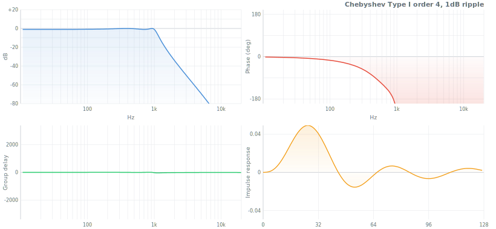

| Param | Type | Default | Description |
|---|---|---|---|
| order | number | -- | Filter order |
| fc | number | -- | Passband edge Hz (NOT -3 dB point). Array for BP/BS. |
| fs | number | 44100 | Sample rate Hz |
| ripple | number | 1 | Max passband ripple dB |
| type | string | `'lowpass'` | `'lowpass'` `'highpass'` `'bandpass'` `'bandstop'` |

### Mathematics

**Transfer function** (analog prototype): `|H(jw)|² = 1 / (1 + ε²·T_N²(w/wc))` where `T_N` is the Nth Chebyshev polynomial and `ε = √(10^(Rp/10) − 1)`. Digitized via bilinear transform into SOS cascade:

`H(z) = ∏ (b0 + b1·z⁻¹ + b2·z⁻²) / (1 + a1·z⁻¹ + a2·z⁻²)`

Poles lie on an ellipse in the s-plane: `s_k = σ_k + j·Ω_k` where `σ_k = −sinh(a)·sin(θ_k)`, `Ω_k = cosh(a)·cos(θ_k)`, `a = (1/N)·arcsinh(1/ε)`.

**Difference equation** (per section): `y[n] = b0·x[n] + b1·x[n-1] + b2·x[n-2] − a1·y[n-1] − a2·y[n-2]`

**Specs at order 4, Rp=1 dB, fc=1000 Hz, fs=44100**: passband equiripple between 0 and -1.0 dB. -1.0 dB at fc (passband edge, not -3 dB point). -34 dB at 2 kHz, -69 dB at 5 kHz. Overshoot 8.7%, settling 256 samples. Group delay variation 30 samples.

**Stability**: Stable for all positive ripple values. Poles on left-half s-plane ellipse map inside unit circle via bilinear transform.

```js
import { chebyshev, filter } from 'digital-filter'
let sos = chebyshev(4, 1000, 44100, 1)
filter(data, { coefs: sos })
```

**Use when**: sharper cutoff than Butterworth is needed and passband ripple is tolerable.
**Not when**: passband flatness matters (use butterworth/legendre) or waveform shape matters (use bessel).
**See also**: chebyshev2, elliptic, butterworth.

---

## chebyshev2

Chebyshev Type II (inverse Chebyshev). Flat passband, equiripple stopband with controllable floor. Mirror of Type I.

`chebyshev2(order, fc, fs, attenuation?, type?)` -> SOS[]

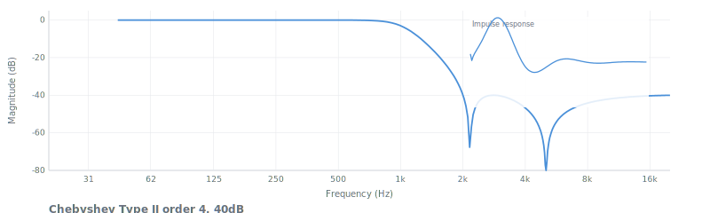

| Param | Type | Default | Description |
|---|---|---|---|
| order | number | -- | Filter order |
| fc | number | -- | Stopband edge Hz (NOT passband edge). Array for BP/BS. |
| fs | number | 44100 | Sample rate Hz |
| attenuation | number | 40 | Minimum stopband rejection dB |
| type | string | `'lowpass'` | `'lowpass'` `'highpass'` `'bandpass'` `'bandstop'` |

### Mathematics

**Transfer function** (analog prototype): `|H(jw)|² = 1 / (1 + 1/(ε²·T_N²(wc/w)))` where `ε = 1/√(10^(Rs/10) − 1)`. Inverse of Chebyshev I — zeros in the stopband create equiripple rejection:

`H(z) = ∏ (b0 + b1·z⁻¹ + b2·z⁻²) / (1 + a1·z⁻¹ + a2·z⁻²)`

Has both poles (on s-plane ellipse) and finite zeros (on the jw axis), producing notches that enforce the stopband floor.

**Difference equation** (per section): `y[n] = b0·x[n] + b1·x[n-1] + b2·x[n-2] − a1·y[n-1] − a2·y[n-2]`

**Specs at order 4, Rs=40 dB, fc=1000 Hz, fs=44100**: flat passband (0.0 dB at 500 Hz), -3.0 dB at fc. -40 dB at 2 kHz (stopband floor), equiripple stopband oscillates between -40 dB and -78 dB. Overshoot 13.0%, settling 89 samples.

**Stability**: Unconditionally stable. Poles are the reciprocal of Chebyshev I zeros reflected into the left half-plane — always inside the unit circle after bilinear transform.

```js
import { chebyshev2, filter } from 'digital-filter'
let sos = chebyshev2(4, 1000, 44100, 40)
filter(data, { coefs: sos })
```

**Use when**: flat passband needed but sharper initial rolloff than Butterworth, with finite stopband floor acceptable.
**Not when**: deep stopband attenuation at high frequencies needed (Butterworth keeps falling; Cheby II bounces).
**See also**: chebyshev, butterworth, elliptic.

---

## elliptic

Elliptic (Cauer) filter. Sharpest possible transition for a given order. Ripple in both passband and stopband. Cauer (1958).

`elliptic(order, fc, fs, ripple?, attenuation?, type?)` -> SOS[]

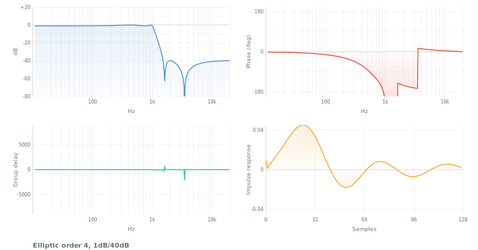

| Param | Type | Default | Description |
|---|---|---|---|
| order | number | -- | Filter order |
| fc | number | -- | Cutoff Hz. Array for BP/BS. |
| fs | number | 44100 | Sample rate Hz |
| ripple | number | 1 | Max passband ripple dB |
| attenuation | number | 40 | Min stopband rejection dB |
| type | string | `'lowpass'` | `'lowpass'` `'highpass'` `'bandpass'` `'bandstop'` |

### Mathematics

**Transfer function** (analog prototype): `|H(jw)|² = 1 / (1 + ε²·R_N²(w/wc))` where `R_N` is a rational Chebyshev (Jacobi elliptic) function, `ε = √(10^(Rp/10) − 1)`. Both poles and finite zeros:

`H(z) = ∏ (b0 + b1·z⁻¹ + b2·z⁻²) / (1 + a1·z⁻¹ + a2·z⁻²)`

Poles on an s-plane ellipse (like Chebyshev I). Zeros on the jw axis (like Chebyshev II). The combination yields the sharpest transition band of any classical IIR for a given order. Even orders produce exact equiripple; odd orders are approximate.

**Difference equation** (per section): `y[n] = b0·x[n] + b1·x[n-1] + b2·x[n-2] − a1·y[n-1] − a2·y[n-2]`

**Specs at order 4, Rp=1 dB, Rs=40 dB, fc=1000 Hz, fs=44100**: passband ripple 0 to -1.0 dB, -1.0 dB at fc. -40 dB at 2 kHz, -46 dB at 5 kHz (stopband bounces between -40 and -46 dB). Overshoot 10.6%, settling 256 samples. Group delay variation 39 samples (worst of all families). A 4th-order elliptic achieves the transition width of a 7th-order Butterworth.

**Stability**: Stable for all positive ripple and attenuation values. Poles in the left half s-plane map inside the unit circle via bilinear transform.

```js
import { elliptic, filter } from 'digital-filter'
let sos = elliptic(4, 1000, 44100, 1, 40)
filter(data, { coefs: sos })
```

**Use when**: minimum order / sharpest transition is critical (4th-order elliptic matches 7th-order Butterworth).
**Not when**: passband flatness or waveform shape matters; has worst phase response of all families.
**See also**: chebyshev, iirdesign.

---

## bessel

Maximally flat group delay. Preserves waveform shape. Near-zero overshoot (0.9%). Thomson (1949).

`bessel(order, fc, fs, type?)` -> SOS[]

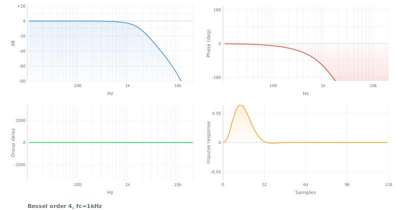

| Param | Type | Default | Description |
|---|---|---|---|
| order | number | -- | Filter order (1-10) |
| fc | number | -- | Cutoff Hz (-3 dB point). Array for BP/BS. |
| fs | number | 44100 | Sample rate Hz |
| type | string | `'lowpass'` | `'lowpass'` `'highpass'` `'bandpass'` `'bandstop'` |

### Mathematics

**Transfer function** (analog prototype): `H(s) = θ_N(0) / θ_N(s/wc)` where `θ_N(s)` is the Nth-order reverse Bessel polynomial. For N=4: `θ₄(s) = s⁴ + 10s³ + 45s² + 105s + 105`. Poles cluster near the negative real axis, producing maximally flat group delay. Digitized via bilinear transform into SOS cascade:

`H(z) = ∏ (b0 + b1·z⁻¹ + b2·z⁻²) / (1 + a1·z⁻¹ + a2·z⁻²)`

**Difference equation** (per section): `y[n] = b0·x[n] + b1·x[n-1] + b2·x[n-2] − a1·y[n-1] − a2·y[n-2]`

**Specs at order 4, fc=1000 Hz, fs=44100**: -3.0 dB at 1 kHz, -14 dB at 2 kHz (gentlest rolloff), -43 dB at 5 kHz. Overshoot 0.9% (near zero). Settling 28 samples (fastest). Group delay variation 5 samples (flattest of all families). Note: bilinear transform warps the group delay property — frequency prewarping at fc partially compensates.

**Stability**: Unconditionally stable. All Bessel polynomial roots are in the strict left half-plane, mapping inside the unit circle.

```js
import { bessel, filter } from 'digital-filter'
let sos = bessel(4, 1000, 44100)
filter(data, { coefs: sos })
```

**Use when**: waveform preservation matters (ECG, transients, control systems). Minimum ringing/overshoot.
**Not when**: sharp frequency cutoff needed (Bessel has gentlest rolloff: -14 dB at 2x cutoff for order 4).
**See also**: butterworth, filtfilt (for offline zero-phase).

---

## legendre

Steepest monotonic (ripple-free) response. Optimal L-filter. Papoulis (1958), Bond (2004).

`legendre(order, fc, fs, type?)` -> SOS[]

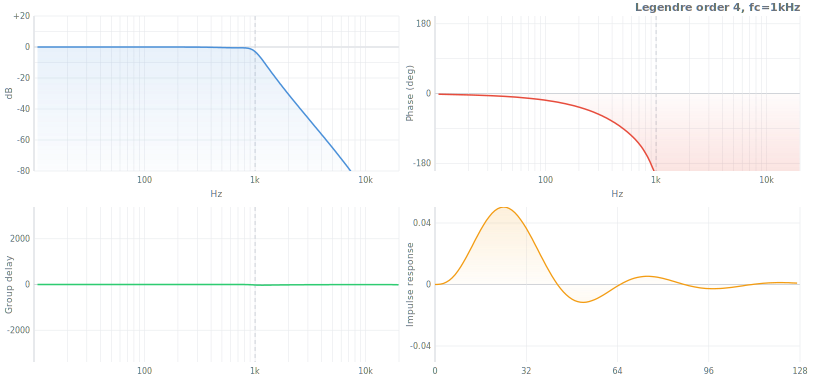

| Param | Type | Default | Description |
|---|---|---|---|
| order | number | -- | Filter order (1-8) |
| fc | number | -- | Cutoff Hz (-3 dB). Array for BP/BS. |
| fs | number | 44100 | Sample rate Hz |
| type | string | `'lowpass'` | `'lowpass'` `'highpass'` `'bandpass'` `'bandstop'` |

### Mathematics

**Transfer function** (analog prototype): `|H(jw)|² = 1 − P_N(1 − 2(w/wc)²)` where `P_N` is an optimized Legendre polynomial. Achieves the steepest possible monotonic (ripple-free) magnitude rolloff for a given order. Poles computed via Bond (2004) method — numerical root-finding on the optimal Legendre polynomial. Digitized via bilinear transform:

`H(z) = ∏ (b0 + b1·z⁻¹ + b2·z⁻²) / (1 + a1·z⁻¹ + a2·z⁻²)`

**Difference equation** (per section): `y[n] = b0·x[n] + b1·x[n-1] + b2·x[n-2] − a1·y[n-1] − a2·y[n-2]`

**Specs at order 4, fc=1000 Hz, fs=44100**: -3.0 dB at 1 kHz (monotonic, no ripple). -0.4 dB at 500 Hz, -31 dB at 2 kHz, -65 dB at 5 kHz. Steeper than Butterworth (-24 dB at 2 kHz) while remaining ripple-free. Overshoot 11.3%, settling 116 samples. Group delay variation 21 samples.

**Stability**: Unconditionally stable. Legendre polynomial roots lie in the left half-plane, mapping inside the unit circle via bilinear transform.

```js
import { legendre, filter } from 'digital-filter'
let sos = legendre(4, 1000, 44100)
filter(data, { coefs: sos })
```

**Use when**: sharpest cutoff without any ripple. Between Butterworth and Chebyshev.
**Not when**: ripple is acceptable (Chebyshev is steeper) or waveform matters (use Bessel).
**See also**: butterworth, chebyshev.

---

## iirdesign

Auto-design: picks optimal IIR family and order from passband/stopband specs.

`iirdesign(fpass, fstop, rp?, rs?, fs?)` -> `{ sos, order, type }`

| Param | Type | Default | Description |
|---|---|---|---|
| fpass | number | -- | Passband edge Hz |
| fstop | number | -- | Stopband edge Hz |
| rp | number | 1 | Max passband ripple dB |
| rs | number | 40 | Min stopband attenuation dB |
| fs | number | 44100 | Sample rate Hz |

```js
import { iirdesign, filter } from 'digital-filter'
let { sos, order, type } = iirdesign(1000, 1500, 1, 40, 44100)
filter(data, { coefs: sos })
```

**Use when**: you know the spec (passband, stopband, ripple, rejection) and want the minimum-order filter automatically.
**Not when**: you need a specific family or manual control over filter type.
**See also**: butterworth, chebyshev, elliptic.

---

# Biquad

Second-order IIR filter. Building block for all higher-order filters. RBJ Audio EQ Cookbook formulas.


All biquad functions: `biquad.type(fc, Q, fs, dBgain?)` -> `{b0, b1, b2, a1, a2}`

| Function | Params | Description |
|---|---|---|
| `biquad.lowpass(fc, Q, fs)` | fc, Q, fs | -12 dB/oct lowpass |
| `biquad.highpass(fc, Q, fs)` | fc, Q, fs | -12 dB/oct highpass |
| `biquad.bandpass(fc, Q, fs)` | fc, Q, fs | Constant-peak bandpass |
| `biquad.bandpass2(fc, Q, fs)` | fc, Q, fs | Constant-skirt bandpass |
| `biquad.notch(fc, Q, fs)` | fc, Q, fs | Band rejection |
| `biquad.allpass(fc, Q, fs)` | fc, Q, fs | Phase shift, unity magnitude |
| `biquad.peaking(fc, Q, fs, dBgain)` | fc, Q, fs, dBgain | Parametric EQ bell |
| `biquad.lowshelf(fc, Q, fs, dBgain)` | fc, Q, fs, dBgain | Shelf boost/cut below fc |
| `biquad.highshelf(fc, Q, fs, dBgain)` | fc, Q, fs, dBgain | Shelf boost/cut above fc |

### Mathematics (lowpass)

**Transfer function**: `H(z) = (b0 + b1·z⁻¹ + b2·z⁻²) / (1 + a1·z⁻¹ + a2·z⁻²)` (single section, pre-normalized by a0).

**RBJ Cookbook intermediates**: `w0 = 2π·fc/fs`, `alpha = sin(w0)/(2·Q)`.

**Lowpass coefficients**:
- `b0 = (1 − cos(w0))/2`, `b1 = 1 − cos(w0)`, `b2 = (1 − cos(w0))/2`
- `a0 = 1 + alpha`, `a1 = −2·cos(w0)`, `a2 = 1 − alpha`
- All divided by a0 for normalization.

**Difference equation**: `y[n] = b0·x[n] + b1·x[n-1] + b2·x[n-2] − a1·y[n-1] − a2·y[n-2]`

**Specs at fc=1000 Hz, Q=0.707, fs=44100**: -3 dB at fc, -12 dB/octave rolloff. Q=0.707 (1/√2) gives Butterworth-flat passband (no resonant peak). Higher Q produces resonance peak at fc.

**Stability**: Stable when Q > 0. Poles are inside the unit circle for all fc < fs/2 and Q > 0. Becomes marginally stable as Q approaches infinity (poles approach unit circle).

```js
import { biquad, filter } from 'digital-filter'
let coefs = biquad.lowpass(2000, 0.707, 44100)
filter(data, { coefs })

let eq = biquad.peaking(1000, 2, 44100, 6) // +6dB at 1kHz, narrow
filter(data, { coefs: eq })
```

**Use when**: single-band EQ, notch, shelf, or simple 2nd-order filter.
**Not when**: steeper than -12 dB/oct needed (use butterworth/chebyshev which return cascaded biquads).
**See also**: svf (better for real-time modulation), parametricEq, graphicEq.

---

# FIR Design

---

## firwin

Window method FIR design. Truncated sinc with window function. Simplest FIR design.

`firwin(numtaps, cutoff, fs, opts?)` -> Float64Array


| Param | Type | Default | Description |
|---|---|---|---|
| numtaps | number | -- | Filter length (odd, >=3) |
| cutoff | number or [number, number] | -- | Cutoff Hz. Array for bandpass/bandstop. |
| fs | number | 44100 | Sample rate Hz |
| opts.type | string | `'lowpass'` | `'lowpass'` `'highpass'` `'bandpass'` `'bandstop'` |
| opts.window | string or Float64Array | `'hamming'` | Window function name or custom array |

### Mathematics

**Ideal lowpass impulse response** (infinite, non-causal):
- `h_ideal[n] = sin(wc·n) / (π·n)` for n != 0, `h_ideal[0] = wc/π`
- where `wc = π·fc/f_nyq` (normalized cutoff)

**Window method**: `h[n] = h_ideal[n − M] · w[n]` where M = (numtaps−1)/2 (center), w[n] is the window function.

**DC gain normalization**: `h[n] = h[n] / Σh[n]` (lowpass/bandstop normalize at DC; highpass at Nyquist; bandpass at center frequency).

**Specs at numtaps=101, fc=4000 Hz, fs=44100, Hamming window**: linear phase (symmetric FIR), group delay = 50 samples. Stopband rejection -43 dB (Hamming), transition bandwidth ~ 8/N · fs/2 = 1746 Hz. Mainlobe width determined by window; sidelobes by window shape. Kaiser window with beta=8 achieves -65 dB; Blackman -58 dB.

**Stability**: Always stable — FIR filters have all poles at the origin (inside unit circle by definition).

```js
import { firwin, convolution } from 'digital-filter'
let h = firwin(101, 4000, 44100)
let out = convolution(signal, h)
```

**Use when**: standard LP/HP/BP/BS with linear phase. Default choice for 80% of FIR tasks.
**Not when**: sharpest transition needed (use remez) or arbitrary shapes (use firwin2).
**See also**: kaiserord (auto filter length), remez, firls.

---

## firwin2

Arbitrary frequency response via frequency sampling. Draw any magnitude curve.

`firwin2(numtaps, freq, gain, opts?)` -> Float64Array

| Param | Type | Default | Description |
|---|---|---|---|
| numtaps | number | -- | Filter length (odd, >=3) |
| freq | Array | -- | Normalized frequency breakpoints [0...1] (1=Nyquist). Must start at 0, end at 1. |
| gain | Array | -- | Desired gain at each frequency point |
| opts.window | string | `'hamming'` | Window function |
| opts.nfft | number | 1024 | FFT size for interpolation |

```js
import { firwin2, convolution } from 'digital-filter'
let h = firwin2(201, [0, 0.1, 0.2, 0.4, 0.5, 1], [0, 0, 1, 1, 0, 0])
let out = convolution(signal, h)
```

**Use when**: custom EQ curves, matching measured responses, arbitrary magnitude shapes.
**Not when**: standard shapes (use firwin) or tightest fit needed (use remez with multiband spec).
**See also**: firwin, firls.

---

## firls

Least-squares optimal FIR. Minimizes total squared error between actual and desired response.

`firls(numtaps, bands, desired, weight?)` -> Float64Array

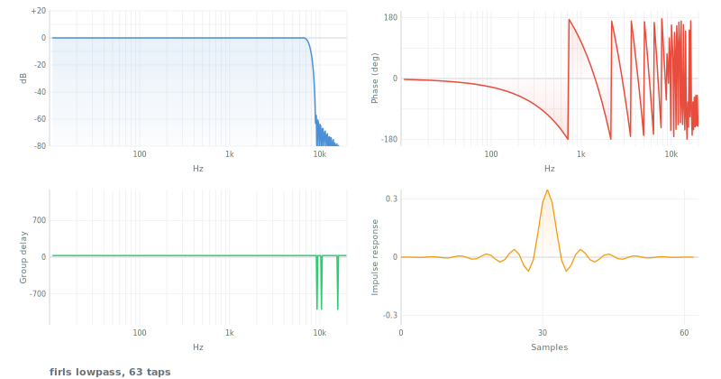

| Param | Type | Default | Description |
|---|---|---|---|
| numtaps | number | -- | Filter length (odd, >=3) |
| bands | Array | -- | Band edges as fractions of Nyquist [0-1], in pairs |
| desired | Array | -- | Desired gain at each band edge (piecewise linear) |
| weight | Array | all 1s | Weight per band. Higher = tighter fit. |

```js
import { firls, convolution } from 'digital-filter'
let h = firls(51, [0, 0.3, 0.4, 1], [1, 1, 0, 0])
let out = convolution(signal, h)
```

**Use when**: best average fit to desired response. Audio EQ where ear averages errors.
**Not when**: peak error matters (use remez). Standard shapes (use firwin).
**See also**: remez, firwin, firwin2.

---

## remez

Parks-McClellan equiripple. Optimal minimax FIR -- narrowest transition for given length. The gold standard.

`remez(numtaps, bands, desired, weight?, maxiter?)` -> Float64Array

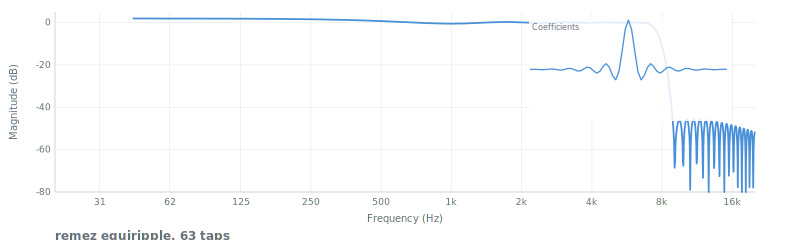

| Param | Type | Default | Description |
|---|---|---|---|
| numtaps | number | -- | Filter length (odd, >=3) |
| bands | Array | -- | Band edges as fractions of Nyquist [0-1] |
| desired | Array | -- | Desired gain at each band edge |
| weight | Array | all 1s | Relative importance per band |
| maxiter | number | 40 | Maximum Remez iterations |

### Mathematics

**Minimax criterion**: minimize `max|W(ω)·(H(ω) − D(ω))|` over all specified bands, where W(ω) is the weight function, H(ω) is the actual response, D(ω) is the desired response.

**Remez exchange algorithm**: iteratively finds the set of (N/2 + 2) extremal frequencies where the weighted error reaches its maximum, then solves for the optimal polynomial coefficients at those frequencies. Converges to equiripple solution where error oscillates at equal amplitude across each band.

**Chebyshev alternation theorem**: the optimal solution has at least (N/2 + 2) error extrema of alternating sign and equal magnitude — the equiripple property.

**Order estimates**:
- Bellanger: `N ≈ −2/3 · log10(10·δp·δs) / Δf`
- Kaiser: `N ≈ (−20·log10(√(δp·δs)) − 13) / (14.6·Δf)`

**Specs at numtaps=51, bands=[0,0.3,0.4,1], desired=[1,1,0,0], weight=[1,10]**: linear phase, equiripple in both passband and stopband. Transition width = 0.1·f_nyq. Stopband weighted 10x tighter than passband. Narrower transition than equivalent firwin or firls at the same length.

**Stability**: Always stable — FIR, all poles at origin.

```js
import { remez, convolution } from 'digital-filter'
let h = remez(51, [0, 0.3, 0.4, 1], [1, 1, 0, 0], [1, 10])
let out = convolution(signal, h)
```

**Use when**: sharpest FIR cutoff needed, guaranteed worst-case rejection.
**Not when**: sidelobes must decay (use firwin with window); average error matters more (use firls).
**See also**: firwin, firls, kaiserord.

---

## kaiserord

Estimate Kaiser window FIR filter length and beta from specifications.

`kaiserord(deltaF, attenuation)` -> `{ numtaps, beta }`

| Param | Type | Default | Description |
|---|---|---|---|
| deltaF | number | -- | Transition bandwidth as fraction of Nyquist (0-1) |
| attenuation | number | -- | Desired stopband attenuation dB |

```js
import { kaiserord, firwin } from 'digital-filter'
import { kaiser } from 'digital-filter/window'
let { numtaps, beta } = kaiserord(0.1, 60)
let h = firwin(numtaps, 2000, 44100, { window: kaiser(numtaps, beta) })
```

**Use when**: need to auto-compute FIR length for a given spec.
**See also**: firwin, window.kaiser.

---

## hilbert

FIR Hilbert transformer. 90-degree phase shift, unity magnitude. For analytic signal generation.

`hilbert(N, opts?)` -> Float64Array

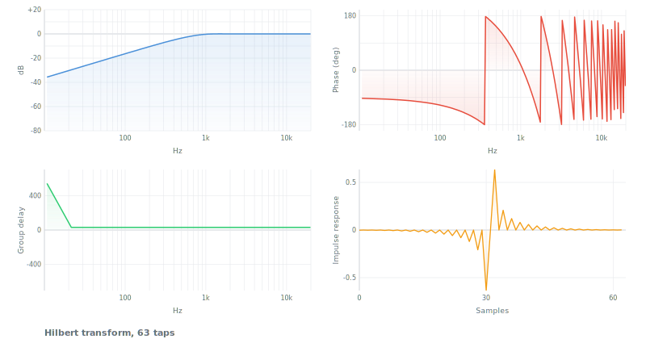

| Param | Type | Default | Description |
|---|---|---|---|
| N | number | -- | Filter length (odd, >=3). Longer = better low-freq accuracy. |
| opts.window | Float64Array or function | Hamming | Window function |

```js
import { hilbert, convolution } from 'digital-filter'
let h = hilbert(65)
let imag = convolution(signal, h)
```

**Use when**: analytic signal, envelope extraction, SSB modulation, 90-degree phase networks.
**Not when**: only envelope needed (use `envelope`); wideband to DC needed (Hilbert is zero at DC/Nyquist).
**See also**: envelope, minimumPhase.

---

## differentiator

FIR derivative filter. Computes discrete derivative with noise immunity.

`differentiator(N, opts?)` -> Float64Array

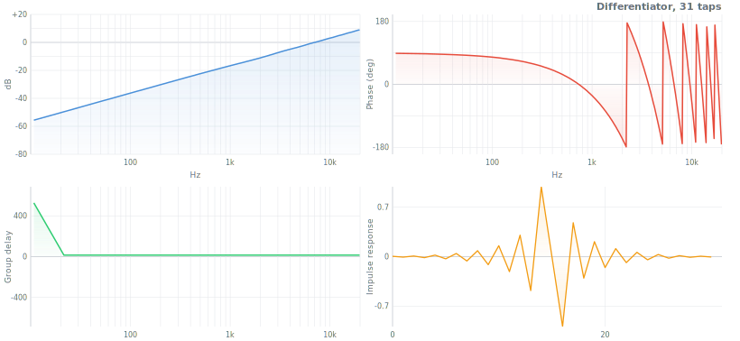

| Param | Type | Default | Description |
|---|---|---|---|
| N | number | -- | Filter length (odd, >=3) |
| opts.window | string | `'hamming'` | Window function |
| opts.fs | number | -- | If provided, scales output to units/second |

```js
import { differentiator, convolution } from 'digital-filter'
let h = differentiator(31, { fs: 44100 })
let deriv = convolution(signal, h)
```

**Use when**: rate-of-change estimation with better noise immunity than first difference.
**Not when**: noisy data needing simultaneous smoothing (use savitzkyGolay with derivative:1).
**See also**: savitzkyGolay, integrator.

---

## integrator

FIR integrator coefficients via Newton-Cotes quadrature rules.

`integrator(rule?)` -> Float64Array

| Param | Type | Default | Description |
|---|---|---|---|
| rule | string | `'trapezoidal'` | `'rectangular'` `'trapezoidal'` `'simpson'` `'simpson38'` |

Returns: FIR coefficients (`[1]`, `[0.5, 0.5]`, `[1/6, 4/6, 1/6]`, or `[1/8, 3/8, 3/8, 1/8]`).

```js
import { integrator, convolution } from 'digital-filter'
let h = integrator('simpson')
let integral = convolution(signal, h)
```

**See also**: differentiator.

---

## raisedCosine

Pulse shaping for digital communications. Satisfies Nyquist ISI criterion. Root variant for TX/RX splitting.

`raisedCosine(N, beta?, sps?, opts?)` -> Float64Array

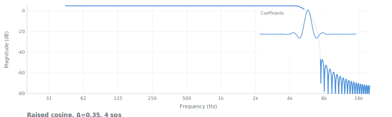

| Param | Type | Default | Description |
|---|---|---|---|
| N | number | -- | Filter length (odd) |
| beta | number | 0.35 | Roll-off factor (0=sinc, 1=widest) |
| sps | number | 4 | Samples per symbol |
| opts.root | boolean | false | Root-raised cosine if true |

```js
import { raisedCosine, convolution } from 'digital-filter'
let rrc = raisedCosine(65, 0.35, 4, { root: true })
let shaped = convolution(symbols, rrc)
```

**Use when**: QAM/PSK/OFDM pulse shaping, SDR baseband processing.
**Not when**: audio filtering (use firwin), spectral compactness over ISI (use gaussianFir).
**See also**: gaussianFir, matchedFilter.

---

## gaussianFir

Gaussian pulse shaping filter (GMSK, Bluetooth). Controlled by bandwidth-time product.

`gaussianFir(N, bt?, sps?)` -> Float64Array

| Param | Type | Default | Description |
|---|---|---|---|
| N | number | -- | Filter length (odd) |
| bt | number | 0.3 | Bandwidth-time product (0.3 = GMSK standard) |
| sps | number | 4 | Samples per symbol |

```js
import { gaussianFir, convolution } from 'digital-filter'
let g = gaussianFir(33, 0.3, 4)
let shaped = convolution(symbols, g)
```

**Use when**: GMSK/Bluetooth modulation, compact spectrum.
**Not when**: ISI-free pulses needed (use raisedCosine).
**See also**: raisedCosine, gaussianIir.

---

## matchedFilter

Optimal detector for known signal in white Gaussian noise. Time-reversed, energy-normalized template.

`matchedFilter(template)` -> Float64Array

| Param | Type | Default | Description |
|---|---|---|---|
| template | Float64Array or Array | -- | Known signal to detect |

```js
import { matchedFilter, convolution } from 'digital-filter'
let mf = matchedFilter(chirp)
let corr = convolution(received, mf)
let peakIdx = corr.indexOf(Math.max(...corr))
```

**Use when**: radar/sonar pulse detection, template matching, known-waveform detection in noise.
**Not when**: noise is colored (pre-whiten first) or template unknown (use adaptive).
**See also**: convolution, lms, nlms.

---

## yulewalk

IIR design matching arbitrary frequency response via Yule-Walker method.

`yulewalk(order, frequencies, magnitudes)` -> `{ b: Float64Array, a: Float64Array }`

| Param | Type | Default | Description |
|---|---|---|---|
| order | number | -- | Filter order (poles = zeros) |
| frequencies | Array | -- | Frequency points [0-1] where 1 = Nyquist |
| magnitudes | Array | -- | Desired magnitude at each point |

```js
import { yulewalk } from 'digital-filter'
let { b, a } = yulewalk(8, [0, 0.2, 0.3, 0.5, 1], [1, 1, 0, 0, 0])
```

**Use when**: IIR approximation of arbitrary magnitude response.
**Not when**: precision matters (use FIR methods); standard shapes (use butterworth etc.).
**See also**: firwin2, firls.

---

## minimumPhase

Converts linear-phase FIR to minimum-phase FIR. Same magnitude, near-zero latency. Cepstral method.

`minimumPhase(h)` -> Float64Array

| Param | Type | Default | Description |
|---|---|---|---|
| h | Float64Array | -- | Linear-phase FIR coefficients |

```js
import { firwin, minimumPhase, convolution } from 'digital-filter'
let linear = firwin(101, 4000, 44100)
let minph = minimumPhase(linear)
let out = convolution(signal, minph)
```

**Use when**: FIR latency is unacceptable, need same magnitude with fast response.
**Not when**: linear phase is required.
**See also**: firwin, hilbert.

---

# Simple Filters

---

## onePole

One-pole lowpass (exponential moving average). Simplest IIR filter: `y[n] = (1-a)x[n] + a*y[n-1]`.

`onePole(data, params)` -> data (in-place)

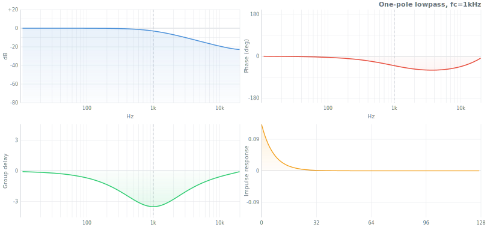

| Param | Type | Default | Description |
|---|---|---|---|
| params.fc | number | -- | Cutoff frequency Hz (used to compute `a`) |
| params.a | number | auto | Pole coefficient. Auto-computed from fc/fs if omitted. |
| params.fs | number | 44100 | Sample rate Hz |
| params.y1 | number | 0 | State (persisted) |

```js
import { onePole } from 'digital-filter'
let params = { fc: 1000, fs: 44100 }
onePole(data, params)
```

**Use when**: simple smoothing, control signal filtering, parameter interpolation.
**Not when**: sharp cutoff needed (use butterworth); sample-accurate frequency control (use svf).
**See also**: leakyIntegrator, movingAverage, svf.

---

## movingAverage

Simple moving average. Replaces each sample with mean of last N samples.

`movingAverage(data, params)` -> data (in-place)

| Param | Type | Default | Description |
|---|---|---|---|
| params.memory | number or Array | 8 | Window size (number) or pre-allocated buffer |
| params.ptr | number | auto | Circular buffer pointer (persisted) |

```js
import { movingAverage } from 'digital-filter'
let params = { memory: 16 }
movingAverage(data, params)
```

**Use when**: noise reduction where phase linearity matters, sensor smoothing.
**Not when**: preserving peak shapes (use savitzkyGolay); sharp frequency cutoff.
**See also**: savitzkyGolay, onePole, median.

---

## leakyIntegrator

Leaky integrator: `y[n] = lambda*y[n-1] + (1-lambda)*x[n]`. Equivalent to one-pole lowpass.

`leakyIntegrator(data, params)` -> data (in-place)

| Param | Type | Default | Description |
|---|---|---|---|
| params.lambda | number | 0.95 | Decay factor (0-1). Higher = more smoothing. |
| params.y | number | 0 | State (persisted) |

```js
import { leakyIntegrator } from 'digital-filter'
let params = { lambda: 0.95 }
leakyIntegrator(data, params)
```

**Use when**: running average, DC estimation, simple smoothing by decay factor.
**See also**: onePole, movingAverage.

---

## dcBlocker

Removes DC offset. First-order highpass: `H(z) = (1 - z^-1) / (1 - R*z^-1)`.

`dcBlocker(data, params)` -> data (in-place)

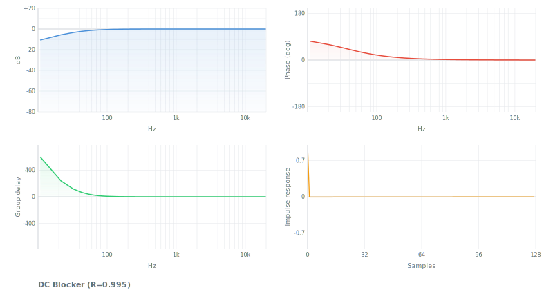

| Param | Type | Default | Description |
|---|---|---|---|
| params.R | number | 0.995 | Pole radius. Closer to 1 = lower cutoff. |
| params.x1 | number | 0 | State (persisted) |
| params.y1 | number | 0 | State (persisted) |

```js
import { dcBlocker } from 'digital-filter'
let params = { R: 0.995 }
dcBlocker(data, params)
```

**Use when**: removing DC offset from audio, sensor baseline wander.
**Not when**: precise highpass cutoff needed (use butterworth highpass).
**See also**: emphasis (pre-emphasis is related).

---

## comb

Comb filter. Feedforward (FIR) or feedback (IIR) with adjustable delay and gain.

`comb(data, params)` -> data (in-place)

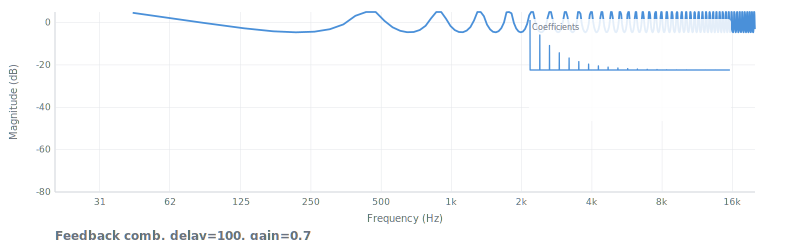

| Param | Type | Default | Description |
|---|---|---|---|
| params.delay | number | -- | Delay in samples (M) |
| params.gain | number | 0.5 | Feedforward/feedback gain |
| params.type | string | `'feedforward'` | `'feedforward'` or `'feedback'` |
| params.buffer | Float64Array | auto | Delay buffer (persisted) |
| params.ptr | number | auto | Buffer pointer (persisted) |

```js
import { comb } from 'digital-filter'
let params = { delay: 441, gain: 0.5, type: 'feedback' }
comb(data, params)
```

**Use when**: flanging, chorus, Karplus-Strong synthesis, reverb building blocks.
**Not when**: frequency-selective filtering (use biquad).
**See also**: allpass, resonator.

---

## allpass

Allpass filter. Unity magnitude, frequency-dependent phase shift.

`allpass.first(data, params)` -> data (in-place) -- First-order: `H(z) = (a + z^-1) / (1 + a*z^-1)`

`allpass.second(data, params)` -> data (in-place) -- Second-order via biquad

| Param | Type | Default | Description |
|---|---|---|---|
| params.a | number | -- | First-order coefficient |
| params.fc | number | -- | Center frequency Hz (second-order) |
| params.Q | number | 0.707 | Quality factor (second-order) |
| params.fs | number | 44100 | Sample rate Hz |

```js
import { allpass } from 'digital-filter'
allpass.first(data, { a: 0.5 })
allpass.second(data, { fc: 1000, Q: 2, fs: 44100 })
```

**Use when**: phase-shifting networks, phaser effects, dispersive delay.
**See also**: biquad.allpass, comb.

---

## emphasis / deemphasis

Pre-emphasis: `H(z) = 1 - alpha*z^-1` (boosts high). De-emphasis: `H(z) = 1/(1 - alpha*z^-1)` (cuts high). Used in speech processing, FM broadcast.

`emphasis(data, params)` -> data (in-place)

`deemphasis(data, params)` -> data (in-place)

| Param | Type | Default | Description |
|---|---|---|---|
| params.alpha | number | 0.97 | Coefficient (0-1). Higher = more boost/cut. |
| params.x1 / params.y1 | number | 0 | State (persisted) |

```js
import { emphasis, deemphasis } from 'digital-filter'
emphasis(data, { alpha: 0.97 })
// ... transmit/process ...
deemphasis(data, { alpha: 0.97 })
```

**Use when**: speech pre-emphasis before LPC/recognition, FM broadcast, noise reduction.
**See also**: riaa (specific emphasis curve), spectralTilt.

---

## resonator

Constant-peak-gain resonator. Peak gain stays constant regardless of Q. For modal/formant synthesis.

`resonator(data, params)` -> data (in-place)

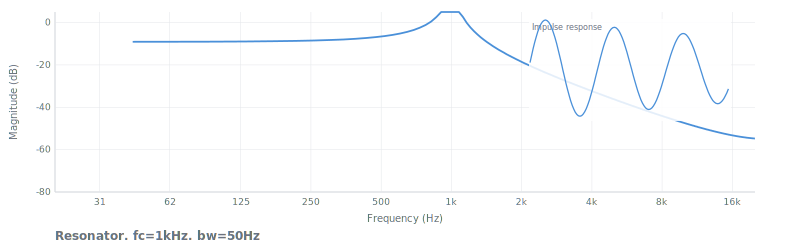

| Param | Type | Default | Description |
|---|---|---|---|
| params.fc | number | -- | Center frequency Hz |
| params.bw | number | 50 | Bandwidth Hz |
| params.fs | number | 44100 | Sample rate Hz |

```js
import { resonator } from 'digital-filter'
let params = { fc: 440, bw: 30, fs: 44100 }
resonator(data, params)
```

**Use when**: modal synthesis (bells, drums, strings), formant synthesis.
**Not when**: parametric EQ (use biquad.peaking -- resonator has no gain control).
**See also**: formant, biquad.peaking, gammatone.

---

## envelope

Attack/release envelope follower. Rectifies + asymmetric smoothing. Sidechain for dynamics.

`envelope(data, params)` -> data (in-place)

| Param | Type | Default | Description |
|---|---|---|---|
| params.attack | number | 0.001 | Attack time in seconds |
| params.release | number | 0.05 | Release time in seconds |
| params.fs | number | 44100 | Sample rate Hz |
| params.env | number | 0 | State (persisted) |

```js
import { envelope } from 'digital-filter'
let params = { attack: 0.001, release: 0.05, fs: 44100 }
envelope(data, params)
```

**Use when**: compressor sidechain, auto-wah, ducking, envelope extraction.
**Not when**: analytic signal envelope needed (use hilbert).
**See also**: hilbert, dynamicSmoothing.

---

## slewLimiter

Rate-of-change limiter. Clips the derivative. Prevents clicks, smooths control signals. Nonlinear.

`slewLimiter(data, params)` -> data (in-place)

| Param | Type | Default | Description |
|---|---|---|---|
| params.rise | number | 1000 | Max rise rate (units/second) |
| params.fall | number | 1000 | Max fall rate (units/second) |
| params.fs | number | 44100 | Sample rate Hz |
| params.y | number | data[0] | State (persisted) |

```js
import { slewLimiter } from 'digital-filter'
let params = { rise: 1000, fall: 1000, fs: 44100 }
slewLimiter(data, params)
```

**Use when**: click prevention, control signal smoothing, portamento.
**Not when**: linear filtering needed (slew limiter is nonlinear).
**See also**: onePole, dynamicSmoothing.

---

## median

Median filter. Replaces each sample with median of its neighborhood. Removes impulse noise.

`median(data, params)` -> data (in-place)

| Param | Type | Default | Description |
|---|---|---|---|
| params.size | number | 5 | Window size (odd) |

```js
import { median } from 'digital-filter'
median(data, { size: 5 })
```

**Use when**: impulse noise removal (clicks, pops, outliers). Preserves edges better than moving average.
**Not when**: frequency-selective filtering needed (median has no defined frequency response).
**See also**: movingAverage, savitzkyGolay.

---

# Specialized

---

## svf

State Variable Filter. Trapezoidal integration, stable under real-time parameter modulation. Produces LP/HP/BP/notch/peak/allpass simultaneously. Andrew Simper / Cytomic (2013).

`svf(data, params)` -> data (in-place)

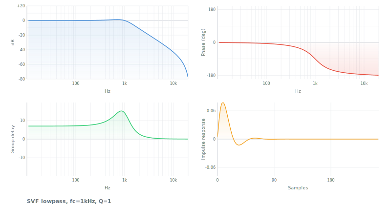

| Param | Type | Default | Description |
|---|---|---|---|
| params.fc | number | -- | Cutoff frequency Hz |
| params.Q | number | 0.707 | Quality factor |
| params.fs | number | 44100 | Sample rate Hz |
| params.type | string | `'lowpass'` | `'lowpass'` `'highpass'` `'bandpass'` `'notch'` `'peak'` `'allpass'` |
| params.ic1eq | number | 0 | State (persisted) |
| params.ic2eq | number | 0 | State (persisted) |

### Mathematics

**Trapezoidal SVF coefficients**: `g = tan(π·fc/fs)`, `k = 1/Q`.
- `a1 = 1/(1 + g·(g + k))`, `a2 = g·a1`, `a3 = g·a2`

**Per-sample update** (from integrator states ic1eq, ic2eq):
- `v3 = v0 − ic2eq`
- `v1 = a1·ic1eq + a2·v3` (bandpass)
- `v2 = ic2eq + a2·ic1eq + a3·v3` (lowpass)
- `ic1eq = 2·v1 − ic1eq`, `ic2eq = 2·v2 − ic2eq`

**Six simultaneous outputs** from one computation:
- lowpass: `v2`, highpass: `v0 − k·v1 − v2`, bandpass: `v1`
- notch: `v0 − k·v1`, peak: `v0 − k·v1 − 2·v2`, allpass: `v0 − 2·k·v1`

**Equivalent transfer function** (lowpass): `H(z) = (b0 + b1·z⁻¹ + b2·z⁻²) / (1 + a1·z⁻¹ + a2·z⁻²)` — identical to a bilinear-transformed biquad, but the trapezoidal integration topology allows zero-delay feedback, making it safe for per-sample parameter modulation.

**Stability**: Unconditionally stable for all fc < fs/2 and Q > 0. The trapezoidal (implicit) integration preserves stability where Euler-based SVFs (Chamberlin) fail above fs/6.

```js
import { svf } from 'digital-filter'
let params = { fc: 1000, Q: 2, fs: 44100, type: 'lowpass' }
svf(data, params)

// Safe to modulate every block:
params.fc = 500 + 1500 * Math.sin(lfo)
svf(nextBlock, params)
```

**Use when**: real-time synthesis with parameter modulation (LFO, envelope, touch).
**Not when**: need SOS coefficients for analysis (use biquad); higher than 2nd order (cascade manually).
**See also**: biquad, moogLadder, korg35.

---

## linkwitzRiley

Crossover filter. LP + HP sum to flat magnitude (allpass). Two cascaded Butterworth filters. Linkwitz & Riley (1976).

`linkwitzRiley(order, fc, fs)` -> `{ low: SOS[], high: SOS[] }`

| Param | Type | Default | Description |
|---|---|---|---|
| order | number | -- | Even: 2, 4, 6, 8. Slope = -6N dB/oct per band. |
| fc | number | -- | Crossover frequency Hz (-6 dB point) |
| fs | number | 44100 | Sample rate Hz |

```js
import { linkwitzRiley, filter } from 'digital-filter'
let { low, high } = linkwitzRiley(4, 2000, 44100)
let lo = Float64Array.from(data); filter(lo, { coefs: low })
let hi = Float64Array.from(data); filter(hi, { coefs: high })
// lo + hi = original (magnitude-flat)
```

**Use when**: audio crossovers, multi-band processing, loudspeaker band splitting.
**Not when**: more than 2 bands (use `crossover`); single LP or HP (use butterworth directly).
**See also**: crossover, butterworth.

---

## savitzkyGolay

Polynomial smoothing / derivative. Fits polynomial to sliding window. Preserves peak shapes. Savitzky & Golay (1964).

`savitzkyGolay(data, params)` -> data (in-place)

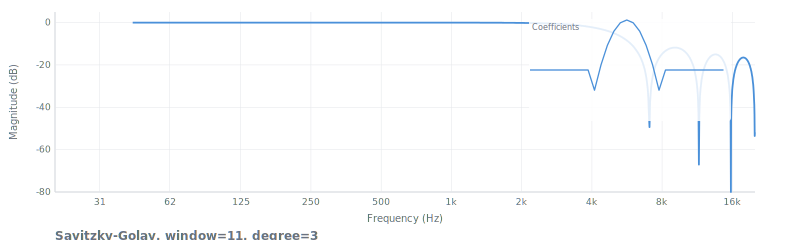

| Param | Type | Default | Description |
|---|---|---|---|
| params.windowSize | number | 5 | Sliding window width (odd, >=3) |
| params.degree | number | 2 | Polynomial degree (0 = moving average) |
| params.derivative | number | 0 | 0=smoothing, 1=first deriv, 2=second deriv |

```js
import { savitzkyGolay } from 'digital-filter'
savitzkyGolay(data, { windowSize: 11, degree: 2 })

// Smooth first derivative
savitzkyGolay(data, { windowSize: 11, degree: 3, derivative: 1 })
```

**Use when**: spectroscopy, chromatography, sensor data -- noise reduction preserving peaks and edges.
**Not when**: frequency-selective filtering (poorly controlled freq response); causal/online filtering.
**See also**: movingAverage, differentiator, gaussianIir.

---

## filtfilt

Zero-phase forward-backward filtering. Eliminates phase distortion (offline only). Doubles the filter order.

`filtfilt(data, params)` -> data (in-place)

| Param | Type | Default | Description |
|---|---|---|---|
| params.coefs | SOS[] | -- | Filter coefficients (SOS array or single section) |

```js
import { butterworth, filtfilt } from 'digital-filter'
let sos = butterworth(4, 1000, 44100)
filtfilt(data, { coefs: sos })
```

**Use when**: offline processing where zero phase distortion is needed. Measurement, analysis.
**Not when**: real-time / causal processing (filtfilt is non-causal by definition).
**See also**: bessel (best causal phase), minimumPhase, gaussianIir.

---

## gaussianIir

Recursive Gaussian smoothing (Young-van Vliet). O(N) cost regardless of sigma. Forward-backward for zero phase.

`gaussianIir(data, params)` -> data (in-place)

| Param | Type | Default | Description |
|---|---|---|---|
| params.sigma | number | 5 | Standard deviation in samples |

```js
import { gaussianIir } from 'digital-filter'
gaussianIir(data, { sigma: 10 })
```

**Use when**: Gaussian blur / smoothing with large kernels (IIR cost is O(N) vs O(N*sigma) for FIR).
**Not when**: exact Gaussian needed (this is an approximation); causal filtering.
**See also**: savitzkyGolay, filtfilt, gaussianFir.

---

# Virtual Analog

---

## moogLadder

Moog transistor ladder filter. 4-pole -24 dB/oct lowpass with tanh saturation and self-oscillation. Robert Moog (1966).

`moogLadder(data, params)` -> data (in-place)


| Param | Type | Default | Description |
|---|---|---|---|
| params.fc | number | 1000 | Cutoff frequency Hz (clamped to 0.45*fs) |
| params.resonance | number | 0 | Resonance 0-1 (1 = self-oscillation) |
| params.fs | number | 44100 | Sample rate Hz |

### Mathematics

**ZDF trapezoidal integrator**: `g = tan(π·fc/fs)`, `G = g/(1+g)` (one-pole gain factor).

**Implicit feedback solve** (4 cascaded one-pole stages with global feedback):
- `S = G³·s₀ + G²·s₁ + G·s₂ + s₃` (cascade state propagation)
- `u = (input − k·S) / (1 + k·G⁴)` (implicit solve, no unit delay in feedback)
- `u = tanh(u·drive)` (transistor saturation nonlinearity)

Where `k = resonance·4` (feedback coefficient 0-4, self-oscillation at k=4).

**Per-stage trapezoidal integrator** (applied 4 times in cascade):
- `y = G·(v − s[j]) + s[j]`, `s[j] = 2·y − s[j]`

**Transfer function** (linear, resonance=0): `H(z) = G⁴` through 4 cascaded first-order sections, yielding -24 dB/oct (-80 dB/decade). With feedback: resonance peak at fc, self-oscillation when k=4 (loop gain = 1).

**Stability**: Stable for resonance 0-1. The implicit (zero-delay) feedback solve prevents the instability of naive delay-in-feedback implementations. tanh saturation provides soft limiting that prevents unbounded oscillation at resonance=1.

```js
import { moogLadder } from 'digital-filter'
let params = { fc: 400, resonance: 0.7, fs: 44100 }
moogLadder(data, params)
```

**Use when**: the Moog sound. Warm, fat synth lowpass with singing resonance.
**Not when**: precision filtering (use butterworth); clean filter (use svf).
**See also**: diodeLadder, korg35, svf.

---

## diodeLadder

Diode ladder filter (TB-303 / EMS VCS3 style). Per-stage tanh saturation, preserves bass at high resonance. Zavalishin (2012).

`diodeLadder(data, params)` -> data (in-place)

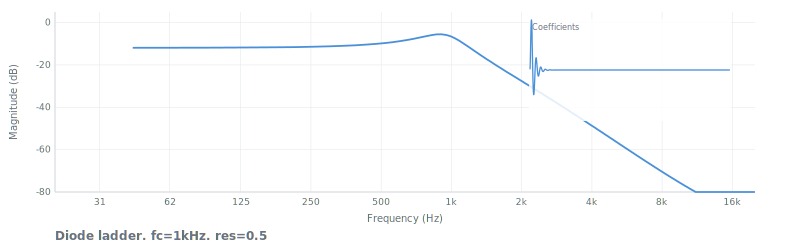

| Param | Type | Default | Description |
|---|---|---|---|
| params.fc | number | 1000 | Cutoff frequency Hz |
| params.resonance | number | 0 | Resonance 0-1 |
| params.fs | number | 44100 | Sample rate Hz |

```js
import { diodeLadder } from 'digital-filter'
let params = { fc: 800, resonance: 0.8, fs: 44100 }
diodeLadder(data, params)
```

**Use when**: TB-303 squelchy acid bass, brighter/more aggressive resonance than Moog.
**Not when**: precision filtering; clean response.
**See also**: moogLadder, korg35, svf.

---

## korg35

Korg MS-20 style filter. 2-pole with nonlinear feedback. Aggressive resonance character. Stilson & Smith (1996), Zavalishin (2012).

`korg35(data, params)` -> data (in-place)

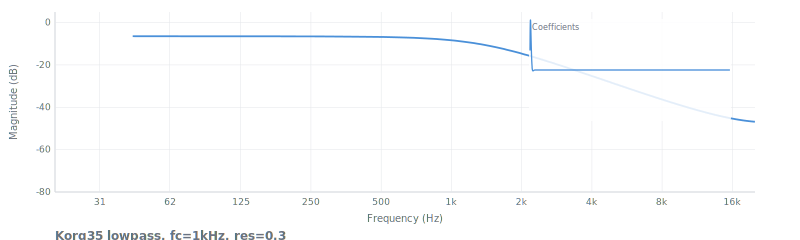

| Param | Type | Default | Description |
|---|---|---|---|
| params.fc | number | 1000 | Cutoff frequency Hz |
| params.resonance | number | 0 | Resonance 0-1 |
| params.fs | number | 44100 | Sample rate Hz |
| params.type | string | `'lowpass'` | `'lowpass'` or `'highpass'` |

```js
import { korg35 } from 'digital-filter'
let params = { fc: 1500, resonance: 0.6, fs: 44100, type: 'lowpass' }
korg35(data, params)
```

**Use when**: MS-20 character. Aggressive, screaming resonance different from Moog/TB-303.
**Not when**: precision filtering; 4-pole slope needed (Korg35 is 2-pole).
**See also**: moogLadder, diodeLadder, svf.

---

# Psychoacoustic

---

## gammatone

Gammatone auditory filter (cochlear model). Cascade of complex one-pole filters with ERB bandwidth.

`gammatone(data, params)` -> data (in-place)

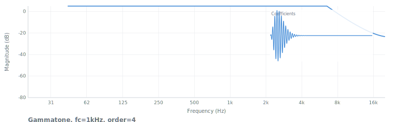

| Param | Type | Default | Description |
|---|---|---|---|
| params.fc | number | 1000 | Center frequency Hz |
| params.order | number | 4 | Filter order (cascade stages) |
| params.fs | number | 44100 | Sample rate Hz |

```js
import { gammatone } from 'digital-filter'
let params = { fc: 1000, order: 4, fs: 44100 }
gammatone(data, params)
```

**Use when**: auditory scene analysis, cochlear modeling, perceptual audio features.
**Not when**: standard bandpass needed (use biquad.bandpass).
**See also**: erbBank, barkBank, octaveBank.

---

## octaveBank

IEC 61260 fractional-octave filter bank. Standard ISO center frequencies with biquad bandpass filters.

`octaveBank(fraction?, fs?, opts?)` -> `[{ fc, coefs }]`

| Param | Type | Default | Description |
|---|---|---|---|
| fraction | number | 3 | Octave fraction (1=octave, 3=third-octave) |
| fs | number | 44100 | Sample rate Hz |
| opts.fmin | number | 31.25 | Minimum center frequency |
| opts.fmax | number | 16000 | Maximum center frequency |

```js
import { octaveBank, filter } from 'digital-filter'
let bands = octaveBank(3, 48000)
for (let band of bands) {
  let ch = Float64Array.from(data)
  filter(ch, { coefs: band.coefs })
}
```

**Use when**: spectrum analysis, noise measurement per ISO bands, acoustic analysis.
**See also**: erbBank, barkBank, gammatone.

---

## erbBank

ERB-spaced filter bank. Bands follow Equivalent Rectangular Bandwidth (human auditory resolution). Glasberg & Moore (1990).

`erbBank(fs?, opts?)` -> `[{ fc, erb, bw }]`

| Param | Type | Default | Description |
|---|---|---|---|
| fs | number | 44100 | Sample rate Hz |
| opts.fmin | number | 50 | Minimum frequency |
| opts.fmax | number | 16000 | Maximum frequency |
| opts.density | number | 1 | Bands per ERB |

Returns array of `{ fc, erb, bw }` objects (center frequencies and bandwidths; no pre-built coefficients).

```js
import { erbBank } from 'digital-filter'
let bands = erbBank(44100, { fmin: 100, fmax: 8000 })
```

**Use when**: perceptual frequency analysis, auditory filter modeling, hearing research.
**See also**: gammatone, barkBank, octaveBank.

---

## barkBank

Bark-scale filter bank. 24 critical bands per Zwicker. Biquad bandpass filters at Bark boundaries.

`barkBank(fs?, opts?)` -> `[{ bark, fLow, fHigh, fc, coefs }]`

| Param | Type | Default | Description |
|---|---|---|---|
| fs | number | 44100 | Sample rate Hz |
| opts.fmin | number | 20 | Minimum frequency |
| opts.fmax | number | 15500 | Maximum frequency |

```js
import { barkBank, filter } from 'digital-filter'
let bands = barkBank(44100)
for (let band of bands) {
  let ch = Float64Array.from(data)
  filter(ch, { coefs: band.coefs })
}
```

**Use when**: psychoacoustic analysis, critical-band processing, perceptual audio coding.
**See also**: octaveBank, erbBank, gammatone.

---

# Adaptive

---

## lms

Least Mean Squares adaptive filter. Simplest adaptive algorithm. Widrow & Hoff (1960).

`lms(input, desired, params)` -> Float64Array (filtered output)

| Param | Type | Default | Description |
|---|---|---|---|
| input | Float64Array | -- | Input signal |
| desired | Float64Array | -- | Desired (reference) signal, same length |
| params.order | number | 32 | Number of filter taps |
| params.mu | number | 0.01 | Step size. 0 < mu < 2/(N*sigma^2). |
| params.w | Float64Array | zeros | Weight vector (persisted) |

Returns: filtered output. `params.error` contains error signal. `params.w` updated in place.

### Mathematics

**Output**: `y[n] = wᵀ·x[n] = Σ w_j·x[n−j]` for j=0..N-1 (FIR filter with adaptive weights).

**Error**: `e[n] = d[n] − y[n]` (desired minus output).

**Weight update** (stochastic gradient descent on MSE): `w[n+1] = w[n] + μ·e[n]·x[n]`

**Convergence condition**: `0 < μ < 2/(N·σ²_x)` where N is the filter order and σ²_x is the input signal power. Too large: diverges. Too small: slow convergence.

**Steady-state misadjustment**: `M = μ·N·σ²_x / 2`. Tradeoff — faster convergence (larger μ) means higher residual error.

**Complexity**: O(N) multiplications per sample (2N multiply-adds: N for output, N for update).

**Stability**: Very robust. Converges for any μ within bounds. Insensitive to eigenvalue spread of input correlation matrix (unlike RLS), but convergence speed depends on it.

```js
import { lms } from 'digital-filter'
let params = { order: 128, mu: 0.01 }
let output = lms(speaker, mic, params)
// params.error = echo-cancelled signal
```

**Use when**: educational purposes, simplest implementation.
**Not when**: in practice, almost always use nlms instead (self-normalizing).
**See also**: nlms, rls.

---

## nlms

Normalized LMS. Self-normalizing step size. The practical default for adaptive filtering. Nagumo & Noda (1967).

`nlms(input, desired, params)` -> Float64Array (filtered output)

| Param | Type | Default | Description |
|---|---|---|---|
| input | Float64Array | -- | Input signal |
| desired | Float64Array | -- | Desired (reference) signal |
| params.order | number | 32 | Number of filter taps |
| params.mu | number | 0.5 | Normalized step size (0 < mu < 2) |
| params.eps | number | 1e-8 | Regularization (prevents div by zero) |
| params.w | Float64Array | zeros | Weight vector (persisted) |

Returns: filtered output. `params.error` contains error signal.

### Mathematics

**Output**: `y[n] = wᵀ·x[n] = Σ w_j·x[n−j]` for j=0..N-1.

**Error**: `e[n] = d[n] − y[n]`.

**Normalized weight update**: `w[n+1] = w[n] + μ·e[n]·x[n] / (xᵀx + ε)`

where `xᵀx = Σ x²[n−j]` is the input power and ε is a small regularization constant (default 1e-8) preventing division by zero during silence.

**Effective step size**: `μ_eff = μ / (xᵀx + ε)`. Self-normalizing — step automatically shrinks for loud inputs, grows for quiet inputs. Eliminates the need to tune μ to input level.

**Convergence condition**: `0 < μ < 2` (independent of input power or filter order, unlike LMS).

**Complexity**: O(N) per sample — same as LMS, with one extra dot product for power normalization.

**Stability**: Robust. The power normalization prevents divergence from input level changes that would destabilize basic LMS.

```js
import { nlms } from 'digital-filter'
let params = { order: 256, mu: 0.5 }
let output = nlms(speakerSignal, micSignal, params)
// params.error = echo-cancelled signal
```

**Use when**: echo cancellation, noise cancellation, system identification, any real-world adaptive task. Start here.
**Not when**: fastest convergence critical and O(N^2) affordable (use rls); stationary batch analysis (use levinson).
**See also**: lms, rls, levinson.

---

## rls

Recursive Least Squares. Fast convergence (~2N samples). O(N^2) per sample. Fragile if lambda is wrong.

`rls(input, desired, params)` -> Float64Array (filtered output)

| Param | Type | Default | Description |
|---|---|---|---|
| input | Float64Array | -- | Input signal |
| desired | Float64Array | -- | Desired (reference) signal |
| params.order | number | 16 | Number of filter taps |
| params.lambda | number | 0.99 | Forgetting factor (0.9-1.0). 1 = no forgetting. |
| params.delta | number | 100 | Initial P matrix scaling |
| params.w | Float64Array | zeros | Weight vector (persisted) |
| params.P | Array of Float64Array | delta*I | Inverse correlation matrix (persisted) |

Returns: filtered output. `params.error` contains error signal.

```js
import { rls } from 'digital-filter'
let params = { order: 32, lambda: 0.99, delta: 100 }
let output = rls(speakerSignal, micSignal, params)
```

**Use when**: fast convergence critical, short filters (N <= 64), rapidly changing systems.
**Not when**: N > 128 (O(N^2) too expensive); robustness matters more (use nlms).
**See also**: nlms, lms, levinson.

---

## levinson

Levinson-Durbin algorithm. Solves Toeplitz system for LPC coefficients in O(N^2). Batch, not real-time.

`levinson(R, order?)` -> `{ a: Float64Array, error: number, k: Float64Array }`

| Param | Type | Default | Description |
|---|---|---|---|
| R | Float64Array or Array | -- | Autocorrelation values R[0]...R[order] |
| order | number | R.length-1 | LPC order |

Returns: `a` (prediction coefficients, a[0]=1), `error` (prediction error power), `k` (reflection/PARCOR coefficients).

```js
import { levinson } from 'digital-filter'
let { a, error, k } = levinson(autocorrelation, 16)
```

**Use when**: LPC analysis, speech coding (CELP, LPC-10), AR spectral estimation, lattice filter coefficients.
**Not when**: real-time sample-by-sample adaptation (use nlms/rls).
**See also**: nlms, rls, lattice.

---

# Dynamic

---

## noiseShaping

Noise shaping for quantization. Feeds quantization error through filter to shape noise spectrum.

`noiseShaping(data, params)` -> data (in-place)

| Param | Type | Default | Description |
|---|---|---|---|
| params.bits | number | 16 | Target bit depth |
| params.coefs | SOS[] | 1st-order HP | Noise shaping filter |

```js
import { noiseShaping } from 'digital-filter'
noiseShaping(data, { bits: 16 })
```

**Use when**: dithered quantization, bit-depth reduction with perceptual improvement.
**See also**: pinkNoise.

---

## pinkNoise

Pink noise filter (1/f, -3 dB/oct). Paul Kellet's refined IIR method. Apply to white noise.

`pinkNoise(data, params)` -> data (in-place)

| Param | Type | Default | Description |
|---|---|---|---|
| params.b0-b6 | number | 0 | State variables (persisted) |

```js
import { pinkNoise } from 'digital-filter'
let white = new Float64Array(1024).map(() => Math.random() * 2 - 1)
let params = {}
pinkNoise(white, params) // white is now pink
```

**Use when**: generating pink noise for testing, perceptual audio masking.
**See also**: spectralTilt, noiseShaping.

---

## oneEuro

One Euro filter. Adaptive lowpass for jitter removal. Cutoff increases with signal speed. Casiez et al. (CHI 2012).

`oneEuro(data, params)` -> data (in-place)

| Param | Type | Default | Description |
|---|---|---|---|
| params.minCutoff | number | 1 | Minimum cutoff Hz (controls smoothness at rest) |
| params.beta | number | 0.007 | Speed coefficient (higher = more responsive) |
| params.dCutoff | number | 1 | Cutoff for derivative estimation Hz |
| params.fs | number | 60 | Sample rate (default 60 for UI) |

```js
import { oneEuro } from 'digital-filter'
let params = { minCutoff: 1, beta: 0.007, fs: 60 }
oneEuro(mousePositions, params)
```

**Use when**: smoothing noisy UI input (mouse, touch, gaze tracking) with low latency.
**Not when**: audio-rate filtering (use onePole/svf); fixed-cutoff needed.
**See also**: dynamicSmoothing, onePole, slewLimiter.

---

## dynamicSmoothing

Adaptive smoothing. Cutoff auto-adjusts based on signal speed. Andrew Simper's approach.

`dynamicSmoothing(data, params)` -> data (in-place)

| Param | Type | Default | Description |
|---|---|---|---|
| params.minFc | number | 1 | Min cutoff Hz (at rest) |
| params.maxFc | number | 5000 | Max cutoff Hz (during fast change) |
| params.sensitivity | number | 1 | Speed sensitivity |
| params.fs | number | 44100 | Sample rate Hz |

```js
import { dynamicSmoothing } from 'digital-filter'
let params = { minFc: 1, maxFc: 5000, sensitivity: 1, fs: 44100 }
dynamicSmoothing(data, params)
```

**Use when**: smoothing audio parameters, control signals -- smooth when static, responsive when changing.
**Not when**: fixed filtering needed.
**See also**: oneEuro, onePole, slewLimiter.

---

## spectralTilt

Apply constant dB/octave slope. Cascade of octave-spaced first-order shelving sections.

`spectralTilt(data, params)` -> data (in-place)

| Param | Type | Default | Description |
|---|---|---|---|
| params.slope | number | 0 | dB per octave (positive = boost high freq) |
| params.fs | number | 44100 | Sample rate Hz |

```js
import { spectralTilt } from 'digital-filter'
spectralTilt(data, { slope: -3, fs: 44100 }) // -3 dB/oct = pink
```

**Use when**: spectral shaping, converting white to pink noise, tonal balance adjustment.
**See also**: pinkNoise, emphasis.

---

## variableBandwidth

Biquad with automatic coefficient recomputation when fc/Q change.

`variableBandwidth(data, params)` -> data (in-place)

| Param | Type | Default | Description |
|---|---|---|---|
| params.fc | number | 1000 | Cutoff Hz |
| params.Q | number | 0.707 | Quality factor |
| params.fs | number | 44100 | Sample rate Hz |
| params.type | string | `'lowpass'` | `'lowpass'` `'highpass'` `'bandpass'` |

```js
import { variableBandwidth } from 'digital-filter'
let params = { fc: 1000, Q: 2, fs: 44100, type: 'bandpass' }
variableBandwidth(data, params)
params.fc = 2000 // coefficients auto-recompute next call
variableBandwidth(moreData, params)
```

**Use when**: biquad with slowly changing parameters.
**Not when**: sample-accurate modulation (use svf -- more stable under fast parameter changes).
**See also**: svf, biquad.

---

# Multirate

---

## decimate

Downsample by factor M with anti-alias FIR lowpass.

`decimate(data, factor, opts?)` -> Float64Array (shorter)

| Param | Type | Default | Description |
|---|---|---|---|
| data | Float64Array | -- | Input signal |
| factor | number | -- | Decimation factor M |
| opts.numtaps | number | 30*M+1 | Anti-alias FIR length |
| opts.fs | number | 44100 | Sample rate Hz |

```js
import { decimate } from 'digital-filter'
let down = decimate(data, 4) // 44100 -> 11025 Hz
```

**Use when**: reducing sample rate, downsampling for analysis.
**See also**: interpolate, cic, halfBand.

---

## interpolate

Upsample by factor L with anti-image FIR lowpass.

`interpolate(data, factor, opts?)` -> Float64Array (longer)

| Param | Type | Default | Description |
|---|---|---|---|
| data | Float64Array | -- | Input signal |
| factor | number | -- | Interpolation factor L |
| opts.numtaps | number | 30*L+1 | Anti-image FIR length |
| opts.fs | number | 44100 | Sample rate Hz |

```js
import { interpolate } from 'digital-filter'
let up = interpolate(data, 4) // 44100 -> 176400 Hz
```

**Use when**: increasing sample rate, upsampling before nonlinear processing.
**See also**: decimate, oversample, farrow.

---

## halfBand

Generate half-band FIR filter. Nearly half the coefficients are zero, halving multiply count.

`halfBand(numtaps?)` -> Float64Array

| Param | Type | Default | Description |
|---|---|---|---|
| numtaps | number | 31 | Filter length (4k+3 form for proper half-band) |

```js
import { halfBand } from 'digital-filter'
let h = halfBand(31)
```

**Use when**: efficient 2x decimation/interpolation.
**See also**: decimate, interpolate, polyphase.

---

## cic

Cascaded Integrator-Comb. Multiplier-free decimation filter. Only additions/subtractions.

`cic(data, R, N?)` -> Float64Array (decimated)

| Param | Type | Default | Description |
|---|---|---|---|
| data | Float64Array | -- | Input signal |
| R | number | -- | Decimation ratio |
| N | number | 3 | Number of CIC stages |

```js
import { cic } from 'digital-filter'
let down = cic(data, 8, 3) // decimate by 8, 3 stages
```

**Use when**: high decimation ratios, FPGA/hardware-style processing, no multipliers available.
**Not when**: precise frequency response needed (CIC has sinc-shaped passband droop).
**See also**: decimate, halfBand.

---

## polyphase

Decompose FIR into M polyphase components. For efficient multirate filtering.

`polyphase(h, M)` -> Array<Float64Array>

| Param | Type | Default | Description |
|---|---|---|---|
| h | Float64Array | -- | FIR coefficients |
| M | number | -- | Number of phases (= decimation/interpolation factor) |

```js
import { polyphase } from 'digital-filter'
let phases = polyphase(firCoefs, 4)
```

**Use when**: building efficient polyphase decimator/interpolator.
**See also**: decimate, interpolate, halfBand.

---

## farrow

Farrow fractional delay filter. Variable fractional delay via polynomial interpolation.

`farrow(data, params)` -> data (in-place)

| Param | Type | Default | Description |
|---|---|---|---|
| params.delay | number | 0 | Fractional delay in samples (e.g., 3.7) |
| params.order | number | 3 | Polynomial interpolation order |

```js
import { farrow } from 'digital-filter'
farrow(data, { delay: 3.7, order: 3 })
```

**Use when**: sample-accurate variable delay, pitch shifting, resampling.
**Not when**: integer delay (just index offset); allpass fractional delay (use thiran).
**See also**: thiran, interpolate.

---

## thiran

Thiran allpass fractional delay. Unity magnitude, maximally flat group delay.

`thiran(delay, order?)` -> `{ b: Float64Array, a: Float64Array }`

| Param | Type | Default | Description |
|---|---|---|---|
| delay | number | -- | Fractional delay in samples (e.g., 3.7) |
| order | number | ceil(delay) | Filter order |

```js
import { thiran } from 'digital-filter'
let { b, a } = thiran(3.7)
```

**Use when**: fractional delay lines in physical modeling synthesis, waveguide models.
**Not when**: variable delay per sample (use farrow -- thiran coefficients are fixed).
**See also**: farrow, allpass.

---

## oversample

Upsample signal with anti-alias FIR filtering. Convenience wrapper.

`oversample(data, factor, opts?)` -> Float64Array

| Param | Type | Default | Description |
|---|---|---|---|
| data | Float64Array | -- | Input signal |
| factor | number | -- | Oversampling factor (2, 4, 8...) |
| opts.numtaps | number | 63 | FIR filter length |

```js
import { oversample } from 'digital-filter'
let up = oversample(data, 4)
```

**Use when**: oversampling before nonlinear processing (distortion, saturation) to reduce aliasing.
**See also**: interpolate, decimate.

---

# Composites

---

## graphicEq

10-band graphic equalizer at ISO octave-band frequencies. Peaking biquads.

`graphicEq(data, params)` -> data (in-place)

| Param | Type | Default | Description |
|---|---|---|---|
| params.gains | object | {} | `{ 31.25: dB, 62.5: dB, 125: dB, ... 16000: dB }` |
| params.fs | number | 44100 | Sample rate Hz |

Bands: 31.25, 62.5, 125, 250, 500, 1000, 2000, 4000, 8000, 16000 Hz.

```js
import { graphicEq } from 'digital-filter'
graphicEq(data, { gains: { 125: 3, 4000: -2 }, fs: 44100 })
```

**Use when**: simple tone shaping with fixed frequency bands.
**Not when**: per-band control over Q/type (use parametricEq).
**See also**: parametricEq, biquad.peaking.

---

## parametricEq

N-band parametric EQ. Each band has fc, Q, gain, and type (peak/lowshelf/highshelf).

`parametricEq(data, params)` -> data (in-place)

| Param | Type | Default | Description |
|---|---|---|---|
| params.bands | Array | [] | `[{ fc, Q, gain, type }]` where type = `'peak'` `'lowshelf'` `'highshelf'` |
| params.fs | number | 44100 | Sample rate Hz |

```js
import { parametricEq } from 'digital-filter'
parametricEq(data, {
  bands: [
    { fc: 80, Q: 0.7, gain: 3, type: 'lowshelf' },
    { fc: 3000, Q: 2, gain: -4, type: 'peak' },
    { fc: 10000, Q: 0.7, gain: 2, type: 'highshelf' }
  ],
  fs: 44100
})
```

**Use when**: full-featured EQ with control over each band's shape.
**See also**: graphicEq, biquad.

---

## crossover

N-way crossover using Linkwitz-Riley filters. Returns SOS arrays per band.

`crossover(frequencies, order?, fs?)` -> Array<SOS[]>

| Param | Type | Default | Description |
|---|---|---|---|
| frequencies | Array | -- | Crossover points [f1, f2, ...]. N-1 freqs for N bands. |
| order | number | 4 | LR order (2, 4, 8) |
| fs | number | 44100 | Sample rate Hz |

```js
import { crossover, filter } from 'digital-filter'
let bands = crossover([500, 3000], 4, 44100) // 3-way: low, mid, high
let lo = Float64Array.from(data); filter(lo, { coefs: bands[0] })
let mid = Float64Array.from(data); filter(mid, { coefs: bands[1] })
let hi = Float64Array.from(data); filter(hi, { coefs: bands[2] })
```

**Use when**: multi-band processing, multi-way loudspeaker systems.
**See also**: linkwitzRiley.

---

## crossfeed

Headphone crossfeed. Mixes L->R and R->L through lowpass to improve spatial imaging.

`crossfeed(left, right, params)` -> `{ left, right }`

| Param | Type | Default | Description |
|---|---|---|---|
| left | Float64Array | -- | Left channel (modified in-place) |
| right | Float64Array | -- | Right channel (modified in-place) |
| params.fc | number | 700 | Crossfeed cutoff Hz |
| params.level | number | 0.3 | Mix amount 0-1 |
| params.fs | number | 44100 | Sample rate Hz |

```js
import { crossfeed } from 'digital-filter'
crossfeed(left, right, { fc: 700, level: 0.3, fs: 44100 })
```

**Use when**: headphone listening with too-wide stereo image.
**See also**: biquad.lowpass.

---

## formant

Parallel formant filter bank. Vowel/formant synthesis using resonators.

`formant(data, params)` -> data (in-place)

| Param | Type | Default | Description |
|---|---|---|---|
| params.formants | Array | /a/ vowel | `[{ fc, bw, gain }]` for each formant |
| params.fs | number | 44100 | Sample rate Hz |

```js
import { formant } from 'digital-filter'
formant(data, {
  formants: [
    { fc: 730, bw: 90, gain: 1 },
    { fc: 1090, bw: 110, gain: 0.5 },
    { fc: 2440, bw: 170, gain: 0.3 }
  ],
  fs: 44100
})
```

**Use when**: vowel synthesis, speech synthesis, singing voice.
**See also**: resonator, vocoder.

---

## vocoder

Channel vocoder. Analyzes modulator spectrum, applies it to carrier.

`vocoder(carrier, modulator, params)` -> Float64Array (new array)

| Param | Type | Default | Description |
|---|---|---|---|
| carrier | Float64Array | -- | Carrier signal (e.g., sawtooth) |
| modulator | Float64Array | -- | Modulator signal (e.g., voice) |
| params.bands | number | 16 | Number of analysis/synthesis bands |
| params.fmin | number | 100 | Min frequency Hz |
| params.fmax | number | 8000 | Max frequency Hz |
| params.fs | number | 44100 | Sample rate Hz |

```js
import { vocoder } from 'digital-filter'
let output = vocoder(sawtoothWave, voiceSignal, { bands: 16, fs: 44100 })
```

**Use when**: "robot voice" effect, spectral envelope transfer between signals.
**See also**: formant, octaveBank.

---

# Structures

---

## lattice

Lattice IIR filter. Uses reflection coefficients (k) instead of direct-form. Better numerical properties.

`lattice(data, params)` -> data (in-place)

| Param | Type | Default | Description |
|---|---|---|---|
| params.k | Array | -- | Reflection coefficients |
| params.v | Array | -- | Ladder (feedforward) coefficients (optional, for ARMA) |

```js
import { lattice } from 'digital-filter'
lattice(data, { k: [0.5, -0.3, 0.1] })
```

**Use when**: LPC synthesis, adaptive filtering with reflection coefficients, high-precision filtering.
**See also**: levinson (produces k coefficients), warpedFir.

---

## warpedFir

Frequency-warped FIR. Uses first-order allpass delay elements instead of unit delays. Concentrates resolution at low frequencies.

`warpedFir(data, params)` -> data (in-place)

| Param | Type | Default | Description |
|---|---|---|---|
| params.coefs | Float64Array | -- | FIR coefficients |
| params.lambda | number | 0.7 | Warping factor (-1 to 1). 0.7 typical for audio at 44.1 kHz. |

```js
import { warpedFir } from 'digital-filter'
warpedFir(data, { coefs: new Float64Array([0.5, 0.3, 0.2]), lambda: 0.7 })
```

**Use when**: perceptually-motivated filtering with more resolution at low frequencies.
**See also**: lattice, firwin.

---

## convolution

Direct convolution of signal with impulse response. O(N*M).

`convolution(signal, ir)` -> Float64Array (length = N + M - 1)

| Param | Type | Default | Description |
|---|---|---|---|
| signal | Float64Array | -- | Input signal |
| ir | Float64Array | -- | Impulse response / FIR coefficients |

```js
import { convolution } from 'digital-filter'
let out = convolution(signal, firCoefs)
```

**Use when**: applying FIR filters, cross-correlation, matched filtering.
**Not when**: very long IRs (use FFT-based overlap-add).
**See also**: filter (for IIR/SOS processing), matchedFilter.

---

# Analysis & Conversion

---

## freqz

Compute frequency response (magnitude and phase) of SOS filter.

`freqz(coefs, n?, fs?)` -> `{ frequencies, magnitude, phase }`

| Param | Type | Default | Description |
|---|---|---|---|
| coefs | SOS[] or SOS | -- | Filter coefficients |
| n | number | 512 | Number of frequency points |
| fs | number | 44100 | Sample rate Hz |

```js
import { freqz, mag2db } from 'digital-filter'
let { frequencies, magnitude } = freqz(sos, 512, 44100)
let dB = mag2db(magnitude)
```

---

## mag2db

Convert magnitude to decibels. `20 * log10(mag)`.

`mag2db(mag)` -> number or Float64Array

```js
import { mag2db } from 'digital-filter'
mag2db(0.5)  // -6.02 dB
mag2db(magnitudeArray)  // element-wise
```

---

## groupDelay

Group delay: `-dphi/domega` for each frequency bin.

`groupDelay(coefs, n?, fs?)` -> `{ frequencies, delay }`

---

## phaseDelay

Phase delay: `-phase(w) / w` for each frequency bin.

`phaseDelay(coefs, n?, fs?)` -> `{ frequencies, delay }`

---

## impulseResponse

Compute impulse response of SOS filter.

`impulseResponse(coefs, N?)` -> Float64Array

| Param | Type | Default | Description |
|---|---|---|---|
| coefs | SOS[] or SOS | -- | Filter coefficients |
| N | number | 256 | Number of samples |

---

## stepResponse

Compute step response of SOS filter.

`stepResponse(coefs, N?)` -> Float64Array

| Param | Type | Default | Description |
|---|---|---|---|
| coefs | SOS[] or SOS | -- | Filter coefficients |
| N | number | 256 | Number of samples |

---

## isStable

Check if filter is stable (all poles inside unit circle).

`isStable(sos)` -> boolean

---

## isMinPhase

Check if filter is minimum phase (all zeros inside or on unit circle).

`isMinPhase(sos)` -> boolean

---

## isFir

Check if filter is FIR (all poles at origin: a1=a2=0).

`isFir(sos)` -> boolean

---

## isLinPhase

Check if FIR coefficients have linear phase (symmetric or antisymmetric).

`isLinPhase(h)` -> boolean

---

## sos2zpk

Convert SOS array to zeros, poles, and gain.

`sos2zpk(sos)` -> `{ zeros, poles, gain }`

---

## sos2tf

Convert SOS to transfer function polynomial coefficients.

`sos2tf(sos)` -> `{ b: Float64Array, a: Float64Array }`

---

## tf2zpk

Convert transfer function to zeros, poles, gain.

`tf2zpk(b, a)` -> `{ zeros, poles, gain }`

---

## zpk2sos

Convert zeros/poles/gain to second-order sections.

`zpk2sos({ zeros, poles, gain })` -> SOS[]

---

# Core

---

## filter

Biquad cascade (SOS) processor. Direct Form II Transposed. Processes data in-place.

`filter(data, params)` -> data (same reference)

| Param | Type | Default | Description |
|---|---|---|---|
| data | Float64Array | -- | Input samples (modified in-place) |
| params.coefs | SOS[] or SOS | -- | Biquad coefficients `{b0,b1,b2,a1,a2}` or array thereof |
| params.state | Array | auto | Filter state `[[s0,s1], ...]` (persisted between calls) |

```js
import { butterworth, filter } from 'digital-filter'
let sos = butterworth(4, 1000, 44100)
let params = { coefs: sos }
filter(data, params)          // first block
filter(moreData, params)      // state preserved
```

---

## transform

Analog-to-digital filter transform utilities. Used internally by IIR design functions.

| Function | Description |
|---|---|
| `transform.polesSos(poles, fc, fs, type)` | All-pole prototype to digital SOS |
| `transform.poleZerosSos(poles, zeros, fc, fs, type)` | Prototype with zeros to digital SOS |
| `transform.prewarp(f, fs)` | Bilinear frequency prewarping |

---

## window

Window functions re-exported from `window-function` package. All: `fn(N, ...params)` -> Float64Array.

| Function | Parameters | Notes |
|---|---|---|
| `rectangular(N)` | -- | -13 dB sidelobes. Analysis only. |
| `hamming(N)` | -- | -43 dB. Default choice. |
| `hann(N)` | -- | -32 dB. Spectral analysis. |
| `blackman(N)` | -- | -58 dB. Deep stopband. |
| `kaiser(N, beta)` | beta | Adjustable. beta=5: -37 dB, beta=8: -65 dB, beta=11: -90 dB. |
| `gaussian(N, sigma)` | sigma | Gaussian bell. |
| `tukey(N, alpha)` | alpha | Cosine-tapered. |
| `dolphChebyshev(N, atten)` | atten | Equiripple sidelobes. |
| `bartlett(N)` | -- | Triangular. |
| `triangular(N)` | -- | Triangular variant. |
| `welch(N)` | -- | Parabolic. |
| `connes(N)` | -- | |
| `cosine(N)` | -- | Sine window. |
| `exactBlackman(N)` | -- | |
| `nuttall(N)` | -- | |
| `blackmanNuttall(N)` | -- | |
| `blackmanHarris(N)` | -- | |
| `flatTop(N)` | -- | -93 dB. Amplitude-accurate analysis. |
| `bartlettHann(N)` | -- | |
| `lanczos(N)` | -- | |
| `parzen(N)` | -- | |
| `bohman(N)` | -- | |
| `powerOfSine(N, p)` | p | |
| `generalizedNormal(N, p)` | p | |
| `planckTaper(N, eps)` | eps | |
| `exponential(N, tau)` | tau | |
| `hannPoisson(N, alpha)` | alpha | |
| `cauchy(N, alpha)` | alpha | |
| `rifeVincent(N, order)` | order | |
| `confinedGaussian(N, sigma)` | sigma | |
| `kaiserBesselDerived(N, alpha)` | alpha | |
| `taylor(N, nbar, sll)` | nbar, sll | |
| `dpss(N, bw)` | bw | Slepian sequence. |
| `ultraspherical(N, mu, x0)` | mu, x0 | |

Also re-exports `generate` and `apply` from `window-function`.

```js
import { window } from 'digital-filter'
let w = window.kaiser(101, 5.0)

// Or direct import:
import { kaiser } from 'digital-filter/window'
let w2 = kaiser(101, 5.0)
```

---

# Weighting

## Weighting Filter Comparison

All relative to 1 kHz (0 dB reference):

| Frequency | A-weighting | C-weighting | K-weighting | ITU-R 468 | RIAA |
|---|---|---|---|---|---|
| 31.5 Hz | -39.4 dB | -3.0 dB | -13 dB | -29 dB | +19.3 dB |
| 125 Hz | -16.1 dB | -0.2 dB | -0.2 dB | -13 dB | +10.0 dB |
| 500 Hz | -3.2 dB | 0.0 dB | 0.0 dB | -4 dB | +3.0 dB |
| 1 kHz | 0.0 dB | 0.0 dB | 0.0 dB | 0.0 dB | 0.0 dB |
| 2 kHz | +1.2 dB | -0.2 dB | +3.9 dB | +5.6 dB | -2.6 dB |
| 4 kHz | +1.0 dB | -0.8 dB | +3.9 dB | +11.0 dB | -7.8 dB |
| 6.3 kHz | +1.0 dB | -2.0 dB | +3.9 dB | +12.2 dB | -11.9 dB |
| 10 kHz | -2.5 dB | -4.4 dB | +3.9 dB | +5.0 dB | -16.0 dB |

---

## aWeighting

A-weighting. Models hearing at ~40 phon. Heavy bass cut. Standard for noise measurement. IEC 61672-1.

`aWeighting(fs?)` -> SOS[] (3 sections)

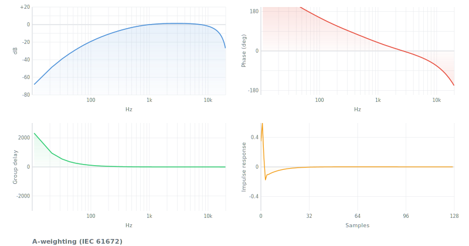

| Param | Type | Default | Description |
|---|---|---|---|
| fs | number | 44100 | Sample rate Hz |

```js
import { aWeighting, filter } from 'digital-filter'
let coefs = aWeighting(48000)
filter(data, { coefs })
```

**Use when**: dB(A) measurement, occupational/environmental noise, noise ordinances.
**Not when**: loud sounds (use cWeighting), broadcast loudness (use kWeighting), equipment noise (use itu468).
**See also**: cWeighting, kWeighting.

---

## cWeighting

C-weighting. Nearly flat, models hearing at ~100 phon. For peak SPL measurement. IEC 61672-1.

`cWeighting(fs?)` -> SOS[] (2 sections)

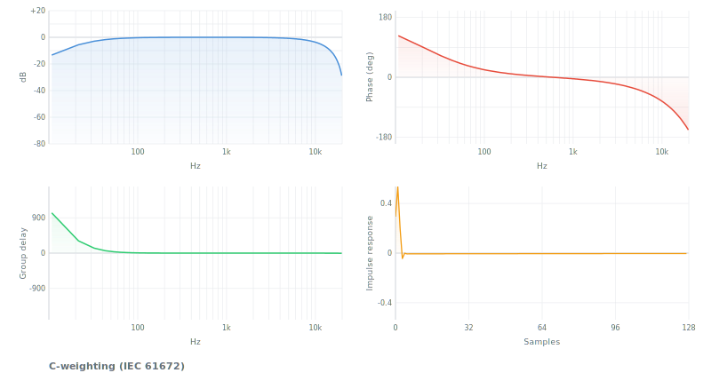

| Param | Type | Default | Description |
|---|---|---|---|
| fs | number | 44100 | Sample rate Hz |

```js
import { cWeighting, filter } from 'digital-filter'
let coefs = cWeighting(48000)
filter(data, { coefs })
```

**Use when**: peak SPL, concert venues, impulse noise, low-frequency assessment (compare C-A).
**Not when**: general noise measurement (use aWeighting), broadcast (use kWeighting).
**See also**: aWeighting, kWeighting.

---

## kWeighting

K-weighting. High-shelf +4 dB above 1.5 kHz + highpass at 38 Hz. For LUFS loudness metering. ITU-R BS.1770-4.

`kWeighting(fs?)` -> SOS[] (2 sections)

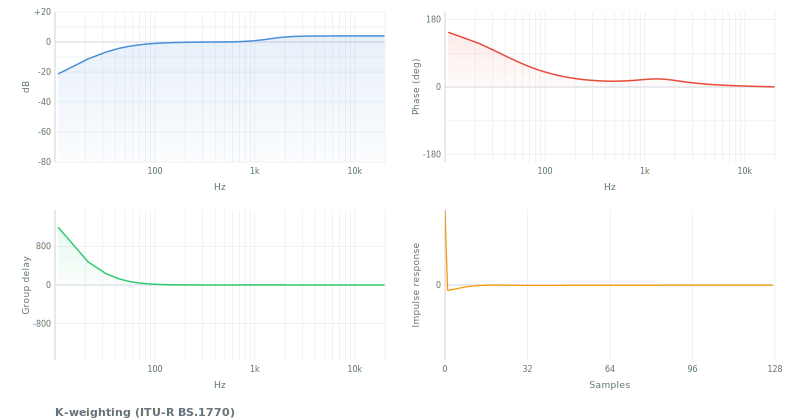

| Param | Type | Default | Description |
|---|---|---|---|
| fs | number | 48000 | Sample rate Hz. Exact ITU coefficients at 48 kHz. |

```js
import { kWeighting, filter } from 'digital-filter'
let coefs = kWeighting(48000)
filter(data, { coefs })
```

**Use when**: broadcast loudness (EBU R128, ATSC A/85), streaming normalization (Spotify, YouTube, Apple Music).
**Not when**: SPL measurement (use aWeighting), equipment noise (use itu468).
**See also**: aWeighting, itu468.

---

## itu468

ITU-R 468 noise weighting. +12.2 dB peak at 6.3 kHz. For audio equipment noise measurement. ITU-R BS.468-4.

`itu468(fs?)` -> SOS[] (4 sections)

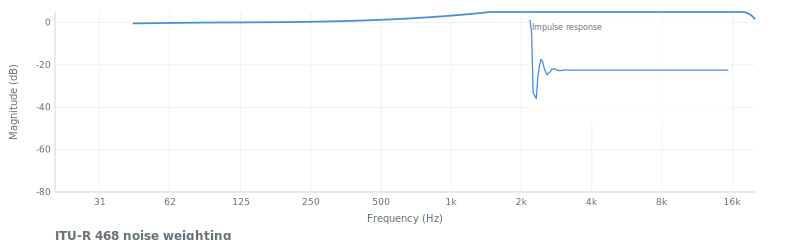

| Param | Type | Default | Description |
|---|---|---|---|
| fs | number | 48000 | Sample rate Hz |

```js
import { itu468, filter } from 'digital-filter'
let coefs = itu468(48000)
filter(data, { coefs })
```

**Use when**: broadcast equipment noise specs (BBC standard), professional audio noise figures.
**Not when**: regulatory noise measurement (use aWeighting), program loudness (use kWeighting).
**See also**: aWeighting, kWeighting.

---

## riaa

RIAA playback equalization for vinyl. Bass boost (+19 dB at 31.5 Hz), treble cut (-16 dB at 10 kHz). RIAA standard (1954).

`riaa(fs?)` -> SOS[] (1 section)

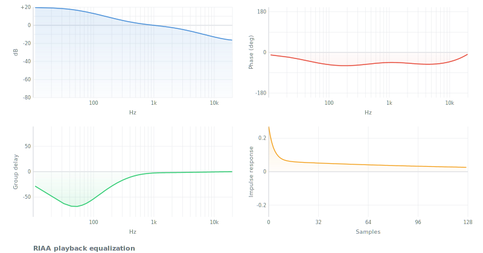

| Param | Type | Default | Description |
|---|---|---|---|
| fs | number | 44100 | Sample rate Hz |

```js
import { riaa, filter } from 'digital-filter'
let coefs = riaa(44100)
filter(vinylSignal, { coefs })
```

**Use when**: vinyl playback/digitization. Not a psychoacoustic weighting -- reverses recording EQ.
**Not when**: anything other than vinyl equalization.
**See also**: emphasis/deemphasis (general pre/de-emphasis).

---

# References

## Textbooks

| Reference | Scope |
|---|---|
| Oppenheim & Schafer, *Discrete-Time Signal Processing* (3rd ed, 2009) | The canonical DSP textbook |
| Proakis & Manolakis, *DSP: Principles, Algorithms, and Applications* (4th ed, 2006) | Comprehensive |
| J.O. Smith III, *Introduction to Digital Filters* (free, [ccrma.stanford.edu](https://ccrma.stanford.edu/~jos/filters/)) | Practical, audio-focused |
| Zolzer, *DAFX: Digital Audio Effects* (2nd ed, 2011) | Audio effects |
| Zavalishin, *The Art of VA Filter Design* (free, Native Instruments, 2012) | Virtual analog, SVF, Moog, ZDF |
| Pirkle, *Designing Audio Effect Plugins in C++* (2019) | Plugin development |
| Haykin, *Adaptive Filter Theory* (5th ed, 2014) | LMS, RLS, Kalman |
| Lyons, *Understanding DSP* (3rd ed, 2010) | Building intuition |
| Steven W. Smith, *The Scientist and Engineer's Guide to DSP* (free, [dspguide.com](http://www.dspguide.com)) | Beginner-friendly |

## Papers & standards

| Reference | Year | Filters |
|---|---|---|
| [RBJ Audio EQ Cookbook](https://www.w3.org/TR/audio-eq-cookbook/) (W3C Note) | 1998 | Biquad (all 9 types) |
| Butterworth, "On the Theory of Filter Amplifiers" | 1930 | Butterworth |
| Thomson, "Delay networks having maximally flat frequency characteristics" | 1949 | Bessel |
| Papoulis, "Optimum Filters with Monotonic Response" | 1958 | Legendre |
| Cauer, *Synthesis of Linear Communication Networks* | 1958 | Elliptic |
| Widrow & Hoff, "Adaptive Switching Circuits" | 1960 | LMS |
| Savitzky & Golay, "Smoothing and Differentiation of Data" (*Anal. Chem.*) | 1964 | Savitzky-Golay |
| Moog, "A Voltage-Controlled Low-Pass High-Pass Filter" (*AES*) | 1965 | Moog ladder |
| Parks & McClellan, "Chebyshev Approximation for Nonrecursive Digital Filters" (*IEEE*) | 1972 | Remez FIR |
| Kaiser, "Nonrecursive digital filter design using the I₀-sinh window function" | 1974 | Kaiser window |
| Linkwitz & Riley, "Active Crossover Networks for Noncoincident Drivers" (*JAES*) | 1976 | Linkwitz-Riley |
| Harris, "On the Use of Windows for Harmonic Analysis with the DFT" (*Proc. IEEE*) | 1978 | Window survey |
| Slepian, "Prolate Spheroidal Wave Functions" (*Bell System Tech. J.*) | 1978 | DPSS |
| Zwicker & Terhardt, "Analytical expressions for critical-band rate" (*JASA*) | 1980 | Bark scale |
| Glasberg & Moore, "Derivation of auditory filter shapes" (*Hearing Research*) | 1990 | Gammatone, ERB |
| Stilson & Smith, "Analyzing the Moog VCF" (*ICMC*) | 1996 | Digital Moog |
| Bond, "Optimum 'L' Filters: Polynomials, Poles and Circuit Elements" | 2004 | Legendre poles |
| Simper, "Linear Trapezoidal Integrated SVF" (Cytomic) | 2011 | SVF |
| Casiez et al., "1€ Filter" (*CHI*) | 2012 | One Euro |
| IEC 61672 | — | A/C-weighting |
| ITU-R BS.1770 | — | K-weighting, LUFS |
| ITU-R BS.468 | — | 468 noise weighting |
| IEC 98 / RIAA | 1954 | RIAA equalization |
| IEC 61260 | — | Octave-band filters |

## Online resources

| Resource | URL |
|---|---|
| Julius O. Smith III — 4 DSP books | [ccrma.stanford.edu/~jos/](https://ccrma.stanford.edu/~jos/) |
| Cytomic technical papers (SVF) | [cytomic.com/technical-papers](https://cytomic.com/technical-papers) |
| Nigel Redmon — biquad tutorials | [earlevel.com](https://www.earlevel.com/main/) |
| musicdsp.org — snippet archive | [musicdsp.org](https://www.musicdsp.org/) |
| DSPRelated.com | [dsprelated.com](https://www.dsprelated.com/) |
| window-function — 34 windows | [github.com/scijs/window-function](https://github.com/scijs/window-function) |
