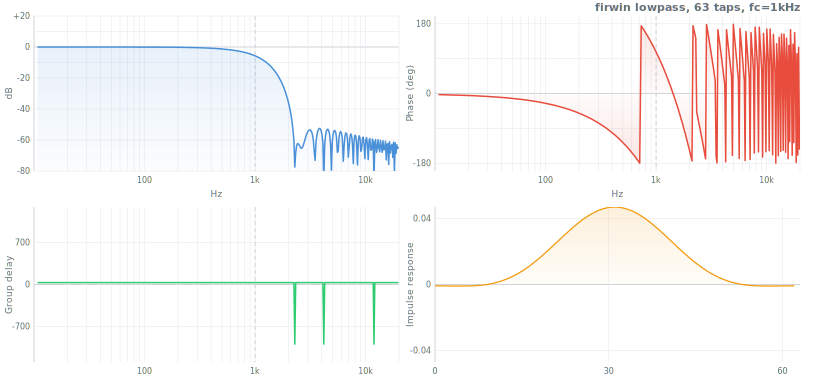
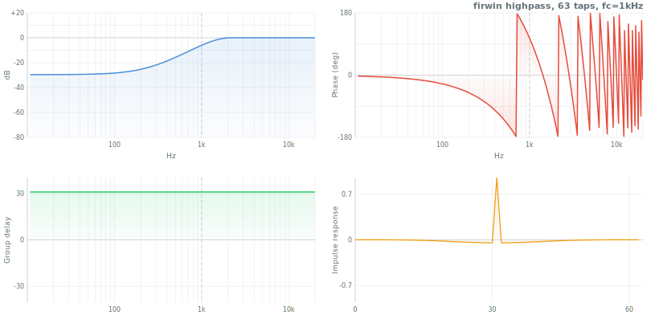
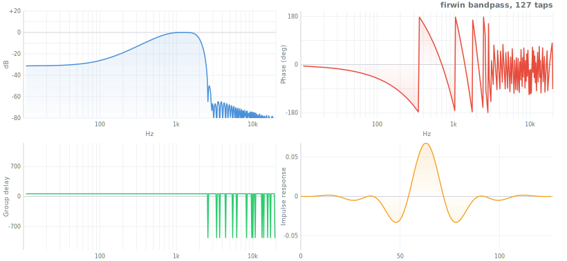
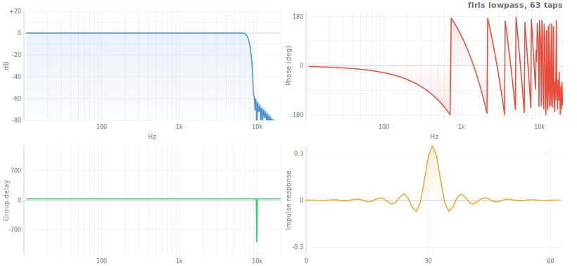
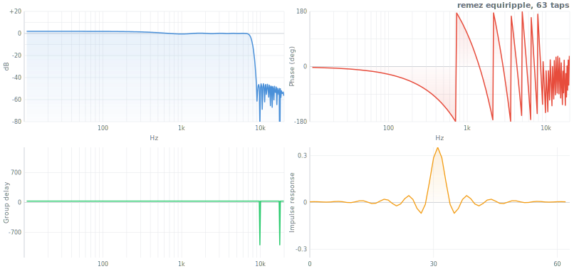
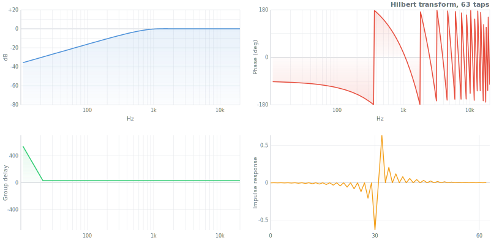
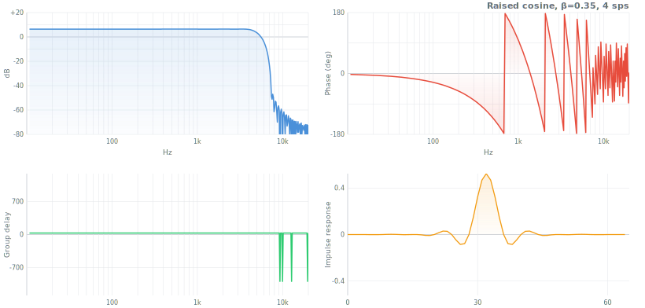

# FIR Filter Design

An FIR (Finite Impulse Response) filter computes each output sample as a weighted sum of the current and past input samples:

$$y[n] = \sum_{k=0}^{N-1} h[k] \, x[n-k]$$

The weights $h[k]$ are the filter coefficients (the impulse response). The filter has exactly $N$ taps -- after $N$ samples, the impulse dies to zero. No feedback, no recursion.

**Why FIR?**

- **Always stable.** All poles sit at the origin. No coefficient combination can make it blow up.
- **Linear phase when symmetric.** If $h[k] = h[N{-}1{-}k]$, every frequency component is delayed by the same amount. The waveform shape is preserved exactly -- only shifted in time.
- **The tradeoff.** More taps = sharper cutoff = more latency. A 1001-tap filter at 44.1 kHz adds ~11 ms of delay. There is no free lunch: tight spectral control costs time.

## Design methods

Three approaches to computing $h[k]$. Each minimizes a different error criterion; which one wins depends on the application.

### Window method -- `firwin`

The ideal lowpass filter has impulse response $h[n] = \text{sinc}(f_c n)$, which is infinite. Truncate it to $N$ samples and multiply by a window function to control spectral leakage:

$$h[n] = w[n] \cdot \frac{\sin(\omega_c \, n)}{\pi \, n}$$

where $\omega_c = \pi f_c / f_{\text{nyq}}$ and $w[n]$ is the window (Hamming, Kaiser, Blackman, etc.).

Simple, predictable, covers 80% of filter design tasks. Supports lowpass, highpass, bandpass, and bandstop.

```js
import firwin from 'digital-filter/fir/firwin.js'

let lp = firwin(101, 1000, 44100)                                    // lowpass at 1 kHz
let hp = firwin(101, 1000, 44100, { type: 'highpass' })               // highpass
let bp = firwin(101, [300, 3400], 44100, { type: 'bandpass' })        // bandpass
let bs = firwin(101, [50, 70], 44100, { type: 'bandstop' })           // notch 50-70 Hz
let kbp = firwin(201, [1000, 4000], 44100, { type: 'bandpass', window: 'kaiser' })
```

**API**: `firwin(numtaps, cutoff, fs?, opts?)` &rarr; `Float64Array`
- `numtaps` -- filter length (odd for type I symmetric)
- `cutoff` -- frequency in Hz (scalar for LP/HP, `[low, high]` for BP/BS)
- `fs` -- sample rate (default 44100)
- `opts.type` -- `'lowpass'` | `'highpass'` | `'bandpass'` | `'bandstop'`
- `opts.window` -- window name string, `Float64Array`, or function (default `'hamming'`)







---

### Least-squares -- `firls`

Minimize the total squared error between the desired and actual frequency response, integrated over specified bands:

$$\min_h \int_{\text{bands}} W(f) \left| H(f) - D(f) \right|^2 \, df$$

where $D(f)$ is the desired response and $W(f)$ is the weighting function.

The solution reduces to solving a system of linear equations (Toeplitz structure). The result has the best average fit -- low total error, but the peak error in transition and stopband regions may be higher than equiripple designs.

```js
import firls from 'digital-filter/fir/firls.js'

// Lowpass: passband 0-0.3, stopband 0.4-1 (Nyquist-normalized)
let h = firls(51, [0, 0.3, 0.4, 1], [1, 1, 0, 0])

// With band weights: emphasize stopband rejection
let h2 = firls(51, [0, 0.3, 0.4, 1], [1, 1, 0, 0], [1, 10])
```

**API**: `firls(numtaps, bands, desired, weight?)` &rarr; `Float64Array`
- `bands` -- frequency band edges as fractions of Nyquist `[0-1]`, e.g. `[0, 0.3, 0.4, 1]`
- `desired` -- gain at each band edge (piecewise-linear interpolation within bands)
- `weight` -- optional weight per band (default all 1)



---

### Equiripple / Parks-McClellan -- `remez`

Minimize the **peak** (worst-case) error across all bands simultaneously:

$$\min_h \max_{f \in \text{bands}} \; W(f) \left| H(f) - D(f) \right|$$

This is the **minimax** (Chebyshev) criterion, solved by the Remez exchange algorithm. The result distributes error evenly as equiripple oscillations -- for a given number of taps, no other filter achieves a narrower transition band. The gold standard for sharp-cutoff FIR design.

```js
import remez from 'digital-filter/fir/remez.js'

// Lowpass: passband 0-0.3, stopband 0.4-1
let h = remez(51, [0, 0.3, 0.4, 1], [1, 1, 0, 0])

// Weighted: 10x priority on stopband rejection
let h2 = remez(51, [0, 0.3, 0.4, 1], [1, 1, 0, 0], [1, 10])
```

**API**: `remez(numtaps, bands, desired, weight?, maxiter?)` &rarr; `Float64Array`
- Same band specification as `firls`
- `maxiter` -- Remez exchange iterations (default 40)



---

### When each wins

| Method | Criterion | Strength | Best for |
|---|---|---|---|
| `firwin` | Windowed sinc | Simplest, fastest, predictable | Quick prototyping, standard LP/HP/BP/BS |
| `firls` | Least-squares | Best average fit (minimum total energy in error) | Smooth approximation, arbitrary slopes |
| `remez` | Minimax (peak) | Sharpest transition for given taps | Tight specs, guaranteed stopband floor |

Rule of thumb: start with `firwin`. If you need an arbitrary shaped response or weighted bands, use `firls`. If you need guaranteed stopband attenuation or minimum transition width, use `remez`.

## Specialized FIR filters

### hilbert -- 90-degree phase shift

Produces a discrete approximation to the Hilbert transform kernel:

$$h[n] = \begin{cases} \frac{2}{\pi n} & n \text{ odd} \\[4pt] 0 & n \text{ even or } n = 0 \end{cases}$$

Convolving a signal with this filter shifts all frequency components by 90 degrees. Combine the original signal (real part) with the Hilbert-filtered signal (imaginary part) to form the **analytic signal** -- the one-sided spectrum used for envelope detection, instantaneous frequency, and single-sideband modulation.

```js
import hilbert from 'digital-filter/fir/hilbert.js'

let h = hilbert(63)
```

**API**: `hilbert(N, opts?)` &rarr; `Float64Array`



---

### differentiator -- discrete derivative

Type III antisymmetric FIR that approximates the ideal differentiator $H(f) = j 2\pi f$, windowed for noise immunity:

$$h[n] = \frac{(-1)^n}{n} \cdot w[n], \quad n \neq 0$$

A raw first difference (`y[n] = x[n] - x[n-1]`) amplifies high-frequency noise. This windowed differentiator rolls off the gain at high frequencies, giving a cleaner derivative estimate.

```js
import differentiator from 'digital-filter/fir/differentiator.js'

let h = differentiator(31)
let h_scaled = differentiator(31, { fs: 44100 })  // scaled to sample rate
```

**API**: `differentiator(N, opts?)` &rarr; `Float64Array`
- `opts.window` -- window name (default `'hamming'`)
- `opts.fs` -- sample rate for scaling output to physical units


---

### integrator -- discrete integral

FIR approximation to integration using Newton-Cotes quadrature rules. Returns short coefficient arrays (1-4 taps) for numerical integration of sampled data.

```js
import integrator from 'digital-filter/fir/integrator.js'

let h = integrator('trapezoidal')   // [0.5, 0.5]
let h2 = integrator('simpson')      // [1/6, 4/6, 1/6]
let h3 = integrator('simpson38')    // [1/8, 3/8, 3/8, 1/8]
```

**API**: `integrator(rule?)` &rarr; `Float64Array`
- `rule` -- `'rectangular'` | `'trapezoidal'` (default) | `'simpson'` | `'simpson38'`

---

### raised-cosine / gaussian-fir -- pulse shaping

**Raised cosine** (RC) and **root-raised cosine** (RRC) are the standard pulse shaping filters for digital communications. They eliminate inter-symbol interference (ISI) by satisfying the Nyquist criterion -- zero crossings fall exactly at neighboring symbol centers.

The roll-off factor $\beta \in [0, 1]$ controls the tradeoff between bandwidth and time-domain decay: $\beta = 0$ is a pure sinc (narrowest bandwidth, slowest decay), $\beta = 1$ is widest (fastest decay, easiest to implement).

```js
import raisedCosine from 'digital-filter/fir/raised-cosine.js'

let rc  = raisedCosine(65, 0.35, 4)                  // raised cosine, beta=0.35, 4 sps
let rrc = raisedCosine(65, 0.35, 4, { root: true })  // root-raised cosine
```

**API**: `raisedCosine(N, beta?, sps?, opts?)` &rarr; `Float64Array`
- `beta` -- roll-off factor 0-1 (default 0.35)
- `sps` -- samples per symbol (default 4)
- `opts.root` -- `true` for root-raised cosine



**Gaussian FIR** is used in GMSK (GSM) and similar modulations. The bandwidth-time product `BT` controls the tradeoff between spectral compactness and ISI:

$$h[n] = c \cdot \exp\!\left(-\frac{2\pi^2 \, \text{BT}^2}{\ln 2} \, t^2\right), \quad t = \frac{n - M}{\text{sps}}$$

```js
import gaussianFir from 'digital-filter/fir/gaussian-fir.js'

let g = gaussianFir(33, 0.3, 4)   // BT=0.3 (GSM standard), 4 samples/symbol
```

**API**: `gaussianFir(N, bt?, sps?)` &rarr; `Float64Array`
- `bt` -- bandwidth-time product (default 0.3)
- `sps` -- samples per symbol (default 4)

---

### matched-filter -- optimal SNR detection

The matched filter for a known signal template is its time-reversed, energy-normalized copy:

$$h[n] = \frac{s[N{-}1{-}n]}{\sum s[k]^2}$$

This maximizes the output signal-to-noise ratio at the detection instant (the peak of the cross-correlation). Used in radar, sonar, and digital communications for detecting known waveforms in noise.

```js
import matchedFilter from 'digital-filter/fir/matched-filter.js'

let template = new Float64Array([0, 0.5, 1, 0.5, 0])
let h = matchedFilter(template)
```

**API**: `matchedFilter(template)` &rarr; `Float64Array`

---

### minimum-phase -- halve the delay

Converts a linear-phase FIR to minimum-phase via the cepstral method. Preserves the magnitude response exactly, but concentrates the energy at the start of the impulse response, reducing group delay by roughly half.

The algorithm: magnitude spectrum &rarr; log &rarr; cepstrum &rarr; fold (causal half only) &rarr; exp &rarr; minimum-phase impulse response.

Use when linear phase is not required and lower latency matters.

```js
import firwin from 'digital-filter/fir/firwin.js'
import minimumPhase from 'digital-filter/fir/minimum-phase.js'

let linear = firwin(101, 1000, 44100)
let minph  = minimumPhase(linear)
// Same magnitude response, ~half the group delay
```

**API**: `minimumPhase(h)` &rarr; `Float64Array`
- `h` -- linear-phase FIR coefficients
- Returns minimum-phase FIR of the same length

## Supporting tools

### kaiserord -- auto-estimate filter length

Given transition bandwidth and desired stopband attenuation, estimates the required number of taps and Kaiser window $\beta$ parameter using Kaiser's empirical formulas:

$$N \approx \frac{A - 7.95}{2.285 \, \Delta\omega}$$

where $A$ is the attenuation in dB and $\Delta\omega$ is the transition bandwidth in radians.

```js
import kaiserord from 'digital-filter/fir/kaiserord.js'

let { numtaps, beta } = kaiserord(0.1, 60)
// numtaps ≈ 37, beta ≈ 5.65
// Use with firwin: firwin(numtaps, fc, fs, { window: kaiser(numtaps, beta) })
```

**API**: `kaiserord(deltaF, attenuation)` &rarr; `{ numtaps, beta }`
- `deltaF` -- transition bandwidth as fraction of Nyquist (0-1)
- `attenuation` -- desired stopband attenuation in dB

---

### firwin2 -- arbitrary magnitude shapes

FIR design via frequency sampling. Specify gain at arbitrary frequency points and get an FIR whose magnitude response passes through those points. Internally: interpolate onto a dense grid, IDFT, truncate, window.

```js
import firwin2 from 'digital-filter/fir/firwin2.js'

// Custom frequency response shape
let h = firwin2(101,
  [0, 0.2, 0.3, 0.5, 1],   // frequency points (0-1, Nyquist-normalized)
  [1, 1, 0.5, 0, 0]          // gain at each point
)
```

**API**: `firwin2(numtaps, freq, gain, opts?)` &rarr; `Float64Array`
- `freq` -- frequency points `[0-1]`, must start at 0 and end at 1
- `gain` -- desired gain at each frequency point
- `opts.window` -- window name (default `'hamming'`)
- `opts.nfft` -- FFT size for interpolation (default 1024)

---

### yulewalk -- IIR from arbitrary response

Designs an **IIR** filter (not FIR) to match an arbitrary magnitude response, using the Yule-Walker method (autocorrelation + Levinson-Durbin). Returns transfer function coefficients `{b, a}`.

Note: this lives in `fir/` because it takes the same frequency/magnitude specification as `firwin2`, but the output is a recursive filter. Lower order than the equivalent FIR for smooth magnitude shapes.

```js
import yulewalk from 'digital-filter/fir/yulewalk.js'

let { b, a } = yulewalk(8,
  [0, 0.2, 0.3, 0.5, 1],
  [1, 1, 0.5, 0, 0]
)
```

**API**: `yulewalk(order, frequencies, magnitudes)` &rarr; `{ b: Float64Array, a: Float64Array }`
- `order` -- filter order (number of poles and zeros)
- `frequencies` -- `[0-1]` frequency points (Nyquist-normalized)
- `magnitudes` -- desired magnitude at each point

---

### lattice -- alternative filter structure

Lattice filter using reflection coefficients instead of direct-form coefficients. Each stage is a two-multiplier butterfly -- numerically better conditioned than direct form for high orders, and the natural structure for LPC speech coding and adaptive filters.

Processes data in-place with persistent state for streaming.

```js
import lattice from 'digital-filter/fir/lattice.js'

let params = { k: new Float64Array([0.5, -0.3, 0.1]) }
lattice(data, params)

// With ladder (feedforward) coefficients for ARMA
let params2 = { k: new Float64Array([0.5, -0.3]), v: new Float64Array([1, 0.2, 0.1]) }
lattice(data, params2)
```

**API**: `lattice(data, params)` &rarr; `data` (in-place)
- `params.k` -- reflection coefficients array
- `params.v` -- optional ladder (feedforward) coefficients for IIR lattice

---

### warped-fir -- perceptual frequency resolution

Replaces the unit delays ($z^{-1}$) in a standard FIR with first-order allpass sections, warping the frequency axis. With $\lambda \approx 0.7$ at 44.1 kHz, low frequencies get finer resolution and high frequencies get coarser -- matching human hearing.

The allpass substitution: $z^{-1} \to \frac{z^{-1} - \lambda}{1 - \lambda z^{-1}}$

Used in perceptual audio coding, loudspeaker equalization, and any application where frequency resolution should follow a perceptual (approximately Bark) scale.

```js
import warpedFir from 'digital-filter/fir/warped-fir.js'

let params = { coefs: h, lambda: 0.7 }
warpedFir(data, params)
```

**API**: `warpedFir(data, params)` &rarr; `data` (in-place)
- `params.coefs` -- FIR coefficients
- `params.lambda` -- warping factor, -1 to 1 (default 0.7; typical for audio at 44.1 kHz)

## Practical guidance

### Choosing the number of taps

More taps = sharper transition = more delay. Rules of thumb:

1. **Kaiser's formula** gives a direct estimate. Use `kaiserord(deltaF, attenuation)` and it returns the required `numtaps`. For 60 dB stopband with a 10% transition band: ~37 taps.

2. **Fred Harris' rule of thumb**: $N \approx \frac{f_s}{(\Delta f)} \cdot \frac{A}{22}$ where $\Delta f$ is the transition bandwidth in Hz and $A$ is attenuation in dB.

3. **Start small, increase until the spec is met.** Design with `remez`, check the stopband via `freqz`, add taps if needed.

The filter delay is $(N-1)/2$ samples. At 44.1 kHz, a 101-tap filter delays by ~1.1 ms. For real-time applications where this matters, consider `minimumPhase` to cut the delay roughly in half (at the cost of linear phase).

### Window selection

| Window | Sidelobe (dB) | Main lobe width | Use case |
|---|---|---|---|
| Rectangular | -13 | Narrowest | Never (for filters) -- only for analysis |
| Hamming | -43 | Moderate | Default, good general choice |
| Hann | -32 | Moderate | Smoother than Hamming, slightly wider |
| Blackman | -58 | Wide | Better stopband, wider transition |
| Kaiser ($\beta$) | Adjustable | Adjustable | When you need to hit a specific attenuation |

Kaiser is the most flexible: $\beta$ trades sidelobe level against main lobe width. Use `kaiserord` to compute $\beta$ from a dB specification. For $\beta = 0$ it is rectangular, $\beta \approx 5$ is similar to Hamming, $\beta \approx 8.5$ reaches ~80 dB.

### Transition bandwidth estimation

The transition band is the gap between passband edge and stopband edge -- the region where the filter rolls off. A narrower transition band requires more taps. Approximate relationship:

$$\Delta f \approx \frac{c}{N}$$

where $c$ depends on the window ($c \approx 3.3$ for Hamming, $c \approx 5.5$ for Blackman, adjustable for Kaiser). This is measured in Nyquist-normalized units; multiply by $f_s / 2$ for Hz.

When designing with `remez` or `firls`, you specify the transition band explicitly as the gap between band edges (e.g., `[0, 0.3, 0.4, 1]` has a 10% transition band from 0.3 to 0.4 of Nyquist). If the algorithm fails to converge or produces poor results, widen the transition band or increase `numtaps`.
