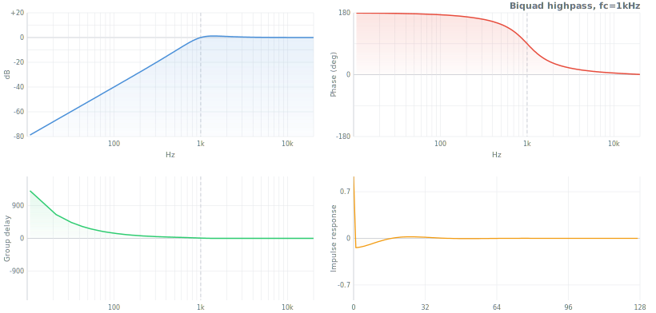
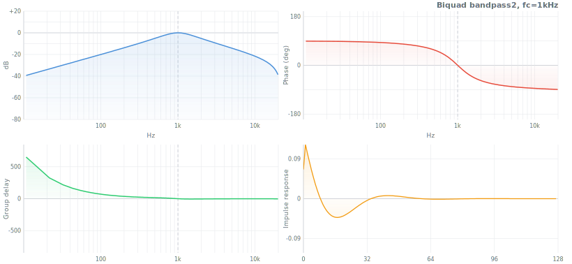
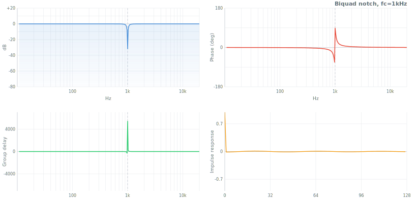
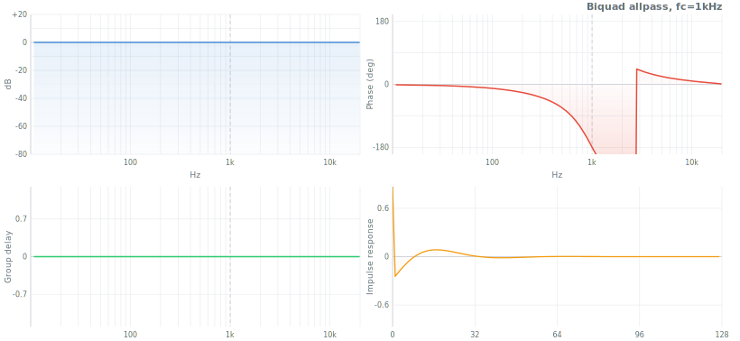
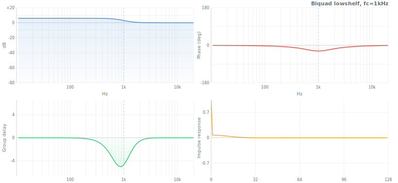
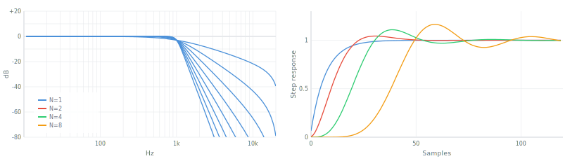
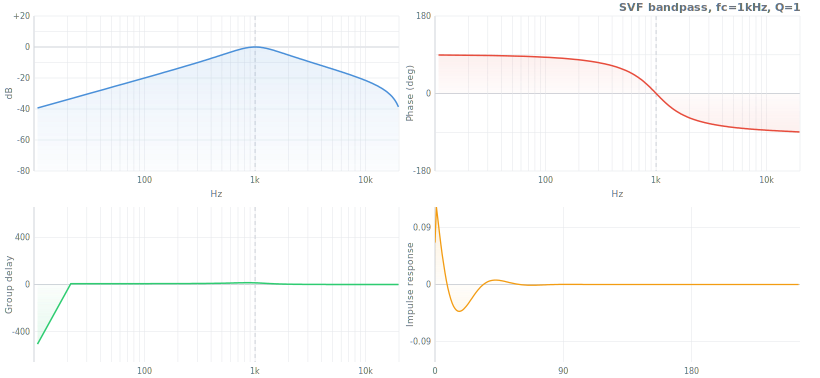
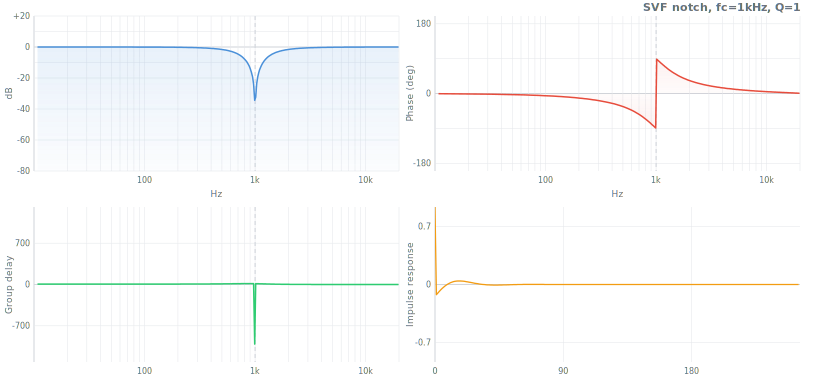
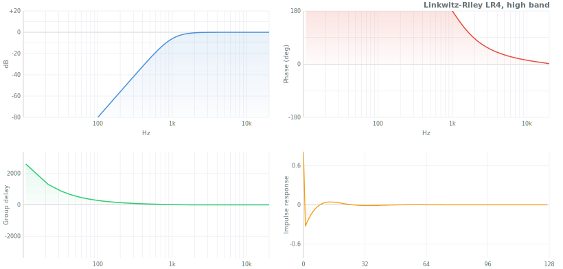

# IIR Filter Design

IIR (Infinite Impulse Response) filters use feedback — the output depends on previous outputs, not just inputs. A single sample can influence the output forever, giving IIR filters "infinite memory." This makes them far more efficient than FIR filters: a 4th-order Butterworth lowpass needs 5 multiply-adds per sample; an FIR with comparable response needs hundreds.

The tradeoff: feedback introduces nonlinear phase. Frequencies near the cutoff arrive later than those far from it. FIR filters can guarantee linear phase (all frequencies delayed equally); IIR filters cannot. When waveform shape matters more than efficiency — symmetric pulses, offline analysis — use FIR. When real-time performance or low latency matters, IIR is the tool.


## The Biquad

Every higher-order IIR filter in this library decomposes into a cascade of **biquads** — second-order sections (SOS). The biquad is the atomic unit of IIR filtering.

The general biquad transfer function:

$$H(z) = \frac{b_0 + b_1 z^{-1} + b_2 z^{-2}}{1 + a_1 z^{-1} + a_2 z^{-2}}$$

Five coefficients (`b0`, `b1`, `b2`, `a1`, `a2`) define the filter completely. The `a0` term is normalized to 1.

The formulas in [`biquad.js`](biquad.js) follow the [RBJ Audio EQ Cookbook](https://www.w3.org/2011/audio/audio-eq-cookbook.html), using intermediate values:

$$\omega_0 = 2\pi f_c / f_s, \quad \alpha = \frac{\sin \omega_0}{2Q}$$

### The 9 types

| Type | What it does | Transfer function numerator | Plots |
|---|---|---|---|
| `lowpass` | Pass below $f_c$ | $\frac{1 - \cos\omega_0}{2}(1 + 2z^{-1} + z^{-2})$ |  |
| `highpass` | Pass above $f_c$ | $\frac{1 + \cos\omega_0}{2}(1 - 2z^{-1} + z^{-2})$ |  |
| `bandpass` | Pass around $f_c$, constant 0dB peak | $\frac{\sin\omega_0}{2}(1 - z^{-2})$ |  |
| `bandpass2` | Pass around $f_c$, constant skirt gain (peak = Q) | $\alpha(1 - z^{-2})$ |  |
| `notch` | Reject $f_c$ | $1 - 2\cos\omega_0\, z^{-1} + z^{-2}$ |  |
| `allpass` | Flat magnitude, shifts phase | $\frac{1 - \alpha - 2\cos\omega_0\, z^{-1} + (1+\alpha)z^{-2}}{1 + \alpha}$ |  |
| `peaking` | Boost/cut at $f_c$ by `dBgain` | Uses $A = 10^{dBgain/40}$ |  |
| `lowshelf` | Boost/cut below $f_c$ | Uses $A$, $2\sqrt{A}\,\alpha$ |  |
| `highshelf` | Boost/cut above $f_c$ | Uses $A$, $2\sqrt{A}\,\alpha$ |  |

All types share the same denominator: $1 + \alpha,\; -2\cos\omega_0,\; 1 - \alpha$.

**When Q matters.** For lowpass/highpass, $Q = 1/\sqrt{2} \approx 0.707$ gives a Butterworth (maximally flat) response. Higher Q adds a resonant peak at $f_c$. For bandpass/notch, Q controls bandwidth: $BW = f_c / Q$. For peaking/shelves, Q controls the shape of the transition.

```js
import { lowpass, peaking } from 'digital-filter/iir/biquad.js'

let lp = lowpass(1000, 0.707, 44100)     // {b0, b1, b2, a1, a2}
let eq = peaking(1000, 2, 44100, 6)      // +6dB bell at 1kHz, Q=2
```

## Classical Filter Families

All classical filters follow the same pipeline: define analog prototype poles (and zeros), then convert to digital SOS via the bilinear transform (see [Design Pipeline](#the-design-pipeline)). They differ only in how the prototype poles are placed.

Each function returns an array of SOS sections: `[{b0, b1, b2, a1, a2}, ...]`.

---

### Butterworth — maximally flat magnitude

The response is as flat as mathematically possible in the passband. No ripple, no surprises.

$$|H(j\omega)|^2 = \frac{1}{1 + (\omega/\omega_c)^{2N}}$$

Prototype poles are equally spaced on the left half of the unit circle:

$$p_m = -\sin\frac{\pi(2m+1)}{2N} + j\cos\frac{\pi(2m+1)}{2N}$$

**Characteristics:**
- Passband: monotonically flat (all derivatives zero at DC)
- Stopband: monotonically decreasing, $-20N$ dB/decade rolloff
- Phase: moderate nonlinearity near cutoff
- Overshoot: minimal (none for 1st-order, small for higher)

**Choose when:** you want predictable, ripple-free behavior and don't need the sharpest cutoff. The safe default.




```js
import butterworth from 'digital-filter/iir/butterworth.js'

let sos = butterworth(4, 1000, 44100)                  // 4th-order LP
let hp  = butterworth(6, 200, 48000, 'highpass')        // 6th-order HP
let bp  = butterworth(4, [300, 3000], 44100, 'bandpass') // 4th-order BP
```

---

### Chebyshev Type I — equiripple passband

Trades a flat passband for a steeper transition. The passband ripples uniformly up to a specified maximum deviation.

$$|H(j\omega)|^2 = \frac{1}{1 + \varepsilon^2 T_N^2(\omega/\omega_c)}$$

where $T_N$ is the Chebyshev polynomial of order $N$, and $\varepsilon = \sqrt{10^{R_p/10} - 1}$ controls the passband ripple $R_p$ in dB.

Prototype poles lie on an ellipse in the $s$-plane:

$$p_m = -\sinh(\mu)\sin\theta_m + j\cosh(\mu)\cos\theta_m, \quad \mu = \frac{\text{asinh}(1/\varepsilon)}{N}$$

**Characteristics:**
- Passband: equiripple (controlled by `ripple` parameter, default 1 dB)
- Stopband: monotonically decreasing, steeper than Butterworth for same order
- Phase: more nonlinear than Butterworth
- Overshoot: more ringing in step response

**Choose when:** you need a sharper cutoff than Butterworth and can tolerate passband ripple. Common in anti-aliasing where the passband isn't critical.


```js
import chebyshev from 'digital-filter/iir/chebyshev.js'

let sos = chebyshev(4, 1000, 44100)           // 1dB ripple (default)
let sos2 = chebyshev(4, 1000, 44100, 0.5)     // 0.5dB ripple
```

---

### Chebyshev Type II — equiripple stopband

The inverse of Type I: flat passband, ripple in the stopband. Less common but useful when passband flatness is non-negotiable but you need better rejection than Butterworth.

$$|H(j\omega)|^2 = \frac{1}{1 + \frac{1}{\varepsilon^2 T_N^2(\omega_c/\omega)}}$$

The prototype has both poles and zeros. Poles are the inverses of Type I poles; zeros lie on the imaginary axis at $\omega_z = 1/\cos\theta_m$.

**Characteristics:**
- Passband: monotonically flat (like Butterworth)
- Stopband: equiripple with guaranteed minimum attenuation
- Has finite transmission zeros — the stopband has notches, not just rolloff
- Note: `fc` parameter specifies the **stopband edge**, not passband edge

**Choose when:** you need guaranteed stopband rejection with a flat passband. Rare in audio, more common in instrumentation.


```js
import chebyshev2 from 'digital-filter/iir/chebyshev2.js'

let sos = chebyshev2(4, 2000, 44100)          // 40dB stopband atten (default)
let sos2 = chebyshev2(4, 2000, 44100, 60)     // 60dB stopband atten
```

---

### Elliptic (Cauer) — sharpest transition band

Allows ripple in both passband and stopband to achieve the absolute sharpest transition for a given order. An $N$th-order elliptic filter has the narrowest transition band of any $N$th-order filter.

$$|H(j\omega)|^2 = \frac{1}{1 + \varepsilon^2 R_N^2(\omega/\omega_c)}$$

where $R_N$ is a rational Chebyshev (elliptic) function defined via Jacobi elliptic functions $\text{sn}$, $\text{cn}$, $\text{dn}$. The prototype poles and zeros are computed from the complete elliptic integral $K(m)$ and Jacobi functions.

**Characteristics:**
- Passband: equiripple (controlled by `ripple`)
- Stopband: equiripple (controlled by `attenuation`)
- Sharpest possible transition of any filter at given order
- Worst phase response among the classical families
- Has finite transmission zeros in the stopband

**Choose when:** order (computational cost) is the binding constraint. A 4th-order elliptic can match the transition sharpness of an 8th-order Butterworth.


```js
import elliptic from 'digital-filter/iir/elliptic.js'

let sos = elliptic(4, 1000, 44100)                    // 1dB ripple, 40dB atten
let sos2 = elliptic(4, 1000, 44100, 0.5, 60)          // 0.5dB ripple, 60dB atten
let hp  = elliptic(4, 1000, 44100, 1, 40, 'highpass')
```

---

### Bessel (Thomson) — maximally flat group delay

Optimized not for magnitude but for **delay**: all frequencies through the passband experience nearly the same delay. The step response has minimal overshoot and ringing. Waveform shape is preserved.

$$\text{Maximizes flatness of } \tau(\omega) = -\frac{d\phi}{d\omega} \text{ at } \omega = 0$$

The analog prototype is derived from Bessel polynomials (reverse Bessel functions). Poles are pre-computed and stored for orders 1--10.

**Characteristics:**
- Passband: monotonic, but rolls off earlier than Butterworth
- Group delay: nearly constant through passband
- Step response: minimal overshoot, fast settling
- Transition band: widest (gentlest rolloff) of all classical families
- Magnitude selectivity is the weakest

**Choose when:** you need to preserve waveform shape — audio transients, pulse-shape-sensitive signals, timing-critical applications. Not for sharp frequency separation.


```js
import bessel from 'digital-filter/iir/bessel.js'

let sos = bessel(4, 1000, 44100)              // orders 1-10
let hp  = bessel(4, 1000, 44100, 'highpass')
```

---

### Legendre (Papoulis) — steepest monotonic rolloff

The steepest rolloff achievable without any passband ripple. Sits between Butterworth (flat but gentle) and Chebyshev I (steep but rippled). Optimizes the integral of the squared magnitude in the stopband.

The prototype poles are pre-computed from optimal $L$-filter theory (Bond 2004). Orders 1--2 are identical to Butterworth (the unique monotonic solution). Stored for orders 1--8.

**Characteristics:**
- Passband: monotonic (no ripple, like Butterworth)
- Rolloff: steeper than Butterworth at the same order
- Phase: between Butterworth and Chebyshev I
- Less known, but the right answer when "flat and steep" are both required

**Choose when:** you want the maximum rolloff steepness while keeping a ripple-free passband. The underappreciated middle ground.


```js
import legendre from 'digital-filter/iir/legendre.js'

let sos = legendre(4, 1000, 44100)            // orders 1-8
```

## Comparison

All 6 families at order 4, $f_c = 1\text{kHz}$, $f_s = 44100\text{Hz}$. Chebyshev I: 1dB ripple. Chebyshev II: 40dB stopband. Elliptic: 1dB ripple, 40dB stopband.

| Property | Butterworth | Chebyshev I | Chebyshev II | Elliptic | Bessel | Legendre |
|---|---|---|---|---|---|---|
| Passband | Flat | 1dB equiripple | Flat | 1dB equiripple | Flat | Flat |
| Stopband shape | Monotonic | Monotonic | Equiripple | Equiripple | Monotonic | Monotonic |
| Rolloff steepness | Moderate | Steep | Moderate | Steepest | Gentlest | Between BW & Ch |
| Atten. at 2x $f_c$ | ~24 dB | ~34 dB | ~40 dB\* | ~42 dB | ~16 dB | ~28 dB |
| Atten. at 5x $f_c$ | ~54 dB | ~62 dB | ~40 dB\* | ~64 dB | ~42 dB | ~56 dB |
| Group delay variation | Low | Higher | Low | Highest | Minimal | Low |
| Step overshoot | Small | Moderate | Small | Largest | Minimal | Small |
| Phase linearity | Moderate | Poor | Moderate | Worst | Best | Moderate |
| Transmission zeros | No | No | Yes | Yes | No | No |

\* Chebyshev II stopband attenuation is fixed at the specified level; it doesn't increase monotonically.

## State Variable Filter (SVF)

The biquad computes all coefficients from frequency/Q, then processes. If you modulate $f_c$ mid-stream (sweeping a synth filter), the biquad's internal state becomes inconsistent with the new coefficients — causing clicks, instability, or blowups.

The SVF ([`svf.js`](svf.js)) solves this. Based on Andrew Simper's (Cytomic) topology, it uses **trapezoidal integration** — a structure where the integrator state remains valid even when coefficients change every sample.

The SVF decomposes the signal into three components simultaneously:

$$v_1 = \text{bandpass}, \quad v_2 = \text{lowpass}, \quad v_0 - kv_1 - v_2 = \text{highpass}$$

All six outputs (lowpass, highpass, bandpass, notch, peak, allpass) are linear combinations of $v_0$, $v_1$, $v_2$:

| Type | Output |
|---|---|
| lowpass | $v_2$ |
| highpass | $v_0 - kv_1 - v_2$ |
| bandpass | $v_1$ |
| notch | $v_0 - kv_1$ |
| peak | $v_0 - kv_1 - 2v_2$ |
| allpass | $v_0 - 2kv_1$ |

where $k = 1/Q$ and $g = \tan(\pi f_c / f_s)$.

**Key differences from biquad:**
- Safe for per-sample parameter modulation (filter sweeps, envelopes)
- Processes in-place — mutates the input array
- Maintains internal state (`ic1eq`, `ic2eq`) across calls
- Coefficients recomputed only when `fc`, `Q`, or `fs` change

 
 

```js
import svf from 'digital-filter/iir/svf.js'

let params = { fc: 1000, Q: 2, fs: 44100, type: 'lowpass' }
svf(audioBuffer, params)              // filtered in-place

// Sweep cutoff per block — no clicks
for (let i = 0; i < blocks.length; i++) {
    params.fc = 200 + i * 10
    svf(blocks[i], params)            // state carries over
}
```

## The Design Pipeline

All classical filters in this library follow the same three-step pipeline, implemented in [`../core/transform.js`](../core/transform.js):

**1. Analog prototype poles.** Each family defines pole locations (and sometimes zeros) for a normalized lowpass with cutoff at $\omega = 1$ rad/s. This is the analog prototype — it captures the family's character independently of any specific cutoff frequency or sample rate.

**2. Frequency transform.** The prototype is scaled to the target cutoff. For highpass, the transform $s \to 1/s$ mirrors the response. For bandpass/bandstop, $s \to (s^2 + \omega_0^2) / (Bs)$ doubles the filter order and creates a pair of cutoff frequencies.

**3. Bilinear transform.** Maps the analog $s$-plane to the digital $z$-plane:

$$s = \frac{2f_s(1 - z^{-1})}{1 + z^{-1}}$$

This warps the infinite analog frequency axis onto the finite digital range $[0, f_s/2]$. The cutoff frequency is **pre-warped** to compensate:

$$\omega_a = 2f_s \tan\left(\frac{\pi f_c}{f_s}\right)$$

The result is a set of second-order sections (SOS), each with 5 coefficients. Processing cascades them: the output of one section feeds the next.

**Why SOS, not a single high-order polynomial?** A 4th-order filter could be expressed as one fraction with 5 numerator and 5 denominator coefficients. But in floating-point arithmetic, high-order polynomials suffer from coefficient sensitivity — tiny rounding errors cause large response deviations or instability. Cascading 2nd-order sections keeps each stage well-conditioned.

## Automatic Design

[`iirdesign.js`](iirdesign.js) selects the optimal filter family and order from frequency specifications:

```js
import iirdesign from 'digital-filter/iir/iirdesign.js'

let { sos, order, type } = iirdesign(
    1000,    // passband edge (Hz)
    1500,    // stopband edge (Hz)
    1,       // max passband ripple (dB)
    40,      // min stopband attenuation (dB)
    44100    // sample rate
)
// → picks elliptic, order 3 (minimum order that meets specs)
```

## Linkwitz-Riley Crossover

[`linkwitz-riley.js`](linkwitz-riley.js) designs crossover filters: a lowpass and highpass that sum to unity (allpass). Built from two cascaded Butterworth filters of half the specified order. LR-4 = two Butterworth-2 in series.

```js
import linkwitzRiley from 'digital-filter/iir/linkwitz-riley.js'

let { low, high } = linkwitzRiley(4, 1000, 44100)
// low + high = allpass (flat magnitude, no comb filtering)
```

 

## Practical Guidance

**Order selection.** Higher order = sharper cutoff but more computation, more phase distortion, and higher risk of instability. Start with order 4. Go to 8 only if you genuinely need it. Above 10--12, consider FIR or multi-stage approaches.

**Stability.** Every SOS section is guaranteed stable if $|a_2| < 1$ and $|a_1| < 1 + a_2$. The library's bilinear transform produces stable sections from stable analog prototypes. If you modify coefficients manually, check stability with `isStable` from `core/`.

**Frequency warping near Nyquist.** The bilinear transform compresses the entire analog frequency range into $[0, f_s/2]$. Near Nyquist, this compression is severe — a filter designed for $f_c = 0.4 f_s$ will have a noticeably warped response compared to its analog counterpart. Rule of thumb: keep $f_c$ below $0.2 f_s$ (or oversample) for responses that closely match the analog prototype.

**Choosing a family.** If unsure, use Butterworth. If you need sharper cutoff and can tolerate ripple, Chebyshev I. If you need to preserve pulse shape, Bessel. If order is the constraint, elliptic. If you want steep and flat, Legendre. Use `iirdesign` to let the math decide.
