# digital-filter [](https://github.com/audiojs/digital-filter/actions/workflows/test.yml) [](https://www.npmjs.com/package/digital-filter) [](https://github.com/krishnized/license)

Digital filter design and processing – from biquad to Butterworth to adaptive.

```js
import { butterworth, filter, freqz, mag2db } from 'digital-filter'

let sos = butterworth(4, 1000, 44100)       // design
filter(data, { coefs: sos })                 // apply
let dB = mag2db(freqz(sos, 512, 44100).magnitude)  // analyze
```

> 53 modules · 116 tests · 1 dependency · pure ESM · **[Guide](guide.md)** — concepts, choosing, recipes

Or import individual modules:

```js
import butterworth from 'digital-filter/iir/butterworth.js'
```

## Reference

<dl>
<dt>IIR design</dt>
<dd>

[biquad](#biquad) ·
[svf](#svfdata-params) ·
[butterworth](#butterworthorder-fc-fs-type) ·
[chebyshev](#chebyshevorder-fc-fs-ripple-type) ·
[chebyshev2](#chebyshev2order-fc-fs-attenuation-type) ·
[elliptic](#ellipticorder-fc-fs-ripple-attenuation-type) ·
[bessel](#besselorder-fc-fs-type) ·
[legendre](#legendreorder-fc-fs-type) ·
[iirdesign](#iirdesignfpass-fstop-rp-rs-fs) ·
[linkwitzRiley](#linkwitzrileyorder-fc-fs)

</dd>
<dt>FIR design</dt>
<dd>

[firwin](#firwinnumtaps-cutoff-fs-opts) ·
[firwin2](#firwin2numtaps-freq-gain-opts) ·
[firls](#firlsnumtaps-bands-desired-weight) ·
[remez](#remeznumtaps-bands-desired-weight) ·
[kaiserord](#kaiserorddeltaf-attenuation) ·
[hilbert](#hilbertn) ·
[minimumPhase](#minimumphaseh) ·
[differentiator](#differentiatorn-opts) ·
[integrator](#integratorrule) ·
[raisedCosine](#raisedcosinen-beta-sps-opts) ·
[gaussianFir](#gaussianfirn-bt-sps) ·
[matchedFilter](#matchedfiltertemplate) ·
[yulewalk](#yulewalkorder-frequencies-magnitudes) ·
[lattice](#latticedata-params) ·
[warpedFir](#warpedfirdata-params)

</dd>
<dt>Smooth</dt>
<dd>

[onePole](#onepoledata-params) ·
[movingAverage](#movingaveragedata-params) ·
[leakyIntegrator](#leakyintegratordata-params) ·
[median](#mediandata-params) ·
[savitzkyGolay](#savitzkygolaydata-params) ·
[gaussianIir](#gaussianiirdata-params) ·
[oneEuro](#oneeuropdata-params) ·
[dynamicSmoothing](#dynamicsmoothingdata-params)

</dd>
<dt>Adaptive</dt>
<dd>

[lms](#lmsinput-desired-params) ·
[nlms](#nlmsinput-desired-params) ·
[rls](#rlsinput-desired-params) ·
[levinson](#levinsonr-order)

</dd>
<dt>Multirate</dt>
<dd>

[decimate](#decimatedata-factor-opts) ·
[interpolate](#interpolatedata-factor-opts) ·
[halfBand](#halfbandnumtaps) ·
[cic](#cicdata-r-n) ·
[polyphase](#polypaseh-m) ·
[farrow](#farrowdata-params) ·
[thiran](#thirandelay-order) ·
[oversample](#oversampledata-factor-opts)

</dd>
<dt>Core</dt>
<dd>

[filter](#filterdata-params) ·
[filtfilt](#filtfiltdata-params) ·
[convolution](#convolutionsignal-ir) ·
[freqz](#freqzcoefs-n-fs) · [mag2db](#mag2dbmag) ·
[groupDelay](#groupdelaycoefs-n-fs) · [phaseDelay](#phasedelaycoefs-n-fs) ·
[impulseResponse](#impulseresponsecoefs-n) · [stepResponse](#stepresponsecoefs-n) ·
[isStable](#isstablesos) · [isMinPhase](#isminphasesos) · [isFir](#isfirsos) · [isLinPhase](#islinphaseh) ·
[sos2zpk](#sos2zpksos) · [sos2tf](#sos2tfsos) · [tf2zpk](#tf2zpkb-a) · [zpk2sos](#zpk2soszpk) ·
[transform](#transform) · [window](#window)

</dd>
</dl>

## IIR design

IIR filters use feedback — efficient (5–20 multiplies for a sharp lowpass), low latency, but nonlinear phase. All design functions return SOS (second-order section) arrays.[^sos]

[^sos]: Every IIR filter is implemented as cascaded biquads. Direct form above order ~6 loses precision; SOS doesn't.

### `biquad`

Nine second-order filter types. The building block for all higher-order IIR. RBJ Audio EQ Cookbook.[^rbj]

[^rbj]: Robert Bristow-Johnson, [Audio EQ Cookbook](https://www.w3.org/TR/audio-eq-cookbook/), 1998.

`biquad.lowpass(fc, Q, fs)` · `biquad.highpass(fc, Q, fs)` · `biquad.bandpass(fc, Q, fs)` · `biquad.bandpass2(fc, Q, fs)` · `biquad.notch(fc, Q, fs)` · `biquad.allpass(fc, Q, fs)` · `biquad.peaking(fc, Q, fs, dBgain)` · `biquad.lowshelf(fc, Q, fs, dBgain)` · `biquad.highshelf(fc, Q, fs, dBgain)`

$$H(z) = \frac{b_0 + b_1 z^{-1} + b_2 z^{-2}}{1 + a_1 z^{-1} + a_2 z^{-2}}$$

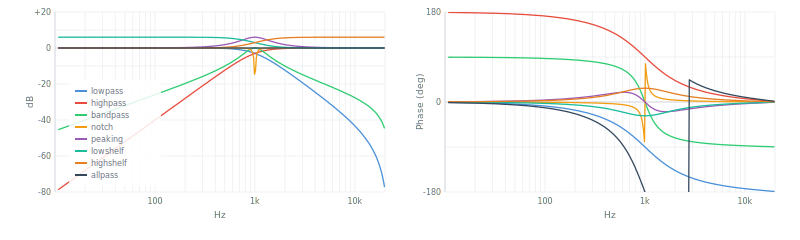

### `svf(data, params)`

State variable filter. Trapezoidal integration (Simper/Cytomic 2011), safe for per-sample parameter modulation. Produces LP/HP/BP/notch/peak/allpass simultaneously. Params: `fc`, `Q`, `fs`, `type`.

$$g = \tan(\pi f_c/f_s), \quad k = 1/Q$$

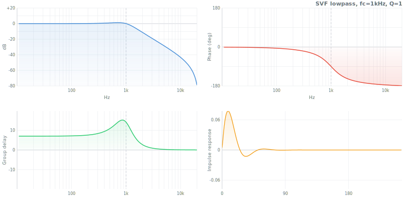

### `butterworth(order, fc, fs, type?)`

Maximally flat magnitude response. No ripple in passband or stopband. The default choice. Butterworth (1930).[^butterworth]

[^butterworth]: S. Butterworth, "On the Theory of Filter Amplifiers," *Wireless Engineer*, 1930.

$$|H(j\omega)|^2 = \frac{1}{1 + (\omega/\omega_c)^{2N}}$$

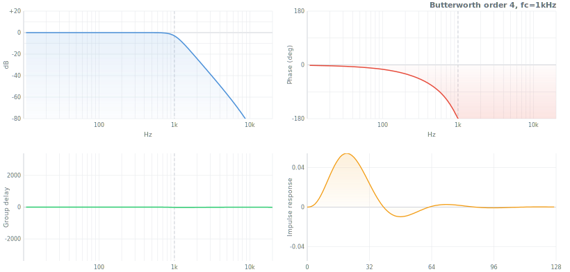

Poles at $s_k = \omega_c \cdot e^{j\pi(2k+N+1)/(2N)}$, uniformly spaced on a circle. Slope: $-6N$ dB/oct.

### `chebyshev(order, fc, fs, ripple?, type?)`

Equiripple passband, steeper cutoff than Butterworth for same order. Trades passband flatness for transition sharpness.

$$|H(j\omega)|^2 = \frac{1}{1 + \varepsilon^2 T_N^2(\omega/\omega_c)}, \quad \varepsilon = \sqrt{10^{R_p/10} - 1}$$


Poles on an s-plane ellipse. Default ripple: 1 dB.

### `chebyshev2(order, fc, fs, attenuation?, type?)`

Flat passband, equiripple stopband. Inverse of Chebyshev I — zeros on the $j\omega$ axis create notches that enforce the stopband floor.

$$|H(j\omega)|^2 = \frac{1}{1 + 1/(\varepsilon^2 T_N^2(\omega_c/\omega))}$$

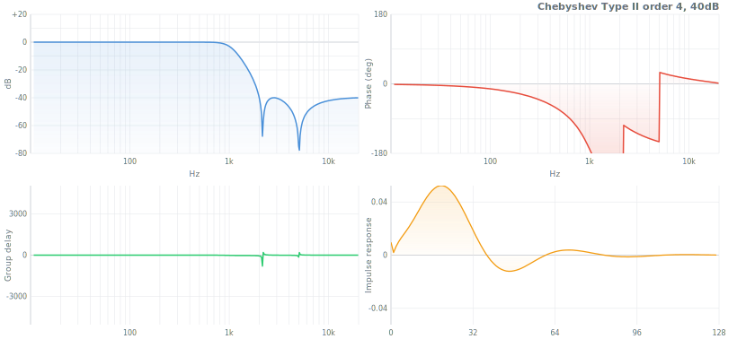

Default attenuation: 40 dB.

### `elliptic(order, fc, fs, ripple?, attenuation?, type?)`

Sharpest transition for a given order. Ripple in both passband and stopband. Cauer (1958).[^cauer] A 4th-order elliptic matches a 7th-order Butterworth in transition width.

[^cauer]: W. Cauer, *Synthesis of Linear Communication Networks*, 1958.

$$|H(j\omega)|^2 = \frac{1}{1 + \varepsilon^2 R_N^2(\omega/\omega_c)}$$

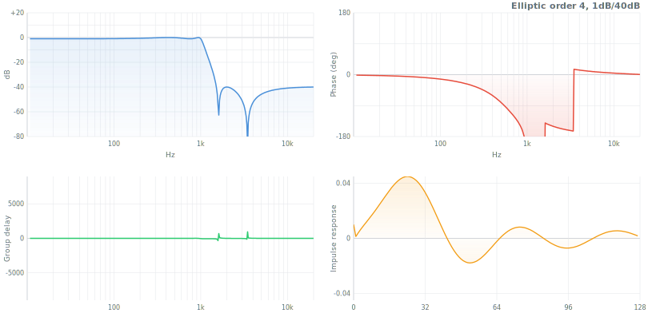

$R_N$ is a rational Chebyshev (Jacobi elliptic) function. Default: 1 dB ripple, 40 dB attenuation.

### `bessel(order, fc, fs, type?)`

Maximally flat group delay — preserves waveform shape. Near-zero overshoot. Thomson (1949).[^thomson]

[^thomson]: W.E. Thomson, "Delay Networks Having Maximally Flat Frequency Characteristics," *Proc. IEE*, 1949.

$$H(s) = \frac{\theta_N(0)}{\theta_N(s/\omega_c)}$$

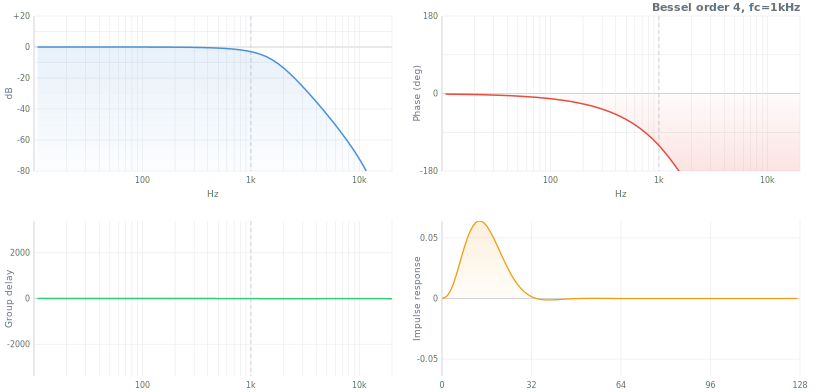

Gentlest rolloff of all families, but best transient response. 0.9% overshoot at order 4.

### `legendre(order, fc, fs, type?)`

Steepest monotonic (ripple-free) rolloff. Between Butterworth and Chebyshev. Papoulis (1958), Bond (2004).[^papoulis]

[^papoulis]: A. Papoulis, "Optimum Filters with Monotonic Response," *Proc. IRE*, 1958.

$$|H(j\omega)|^2 = 1 - P_N\!\left(1 - 2(\omega/\omega_c)^2\right)$$

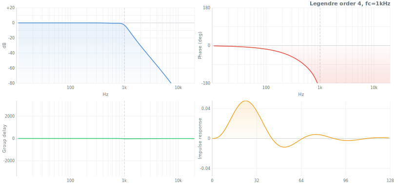

### `iirdesign(fpass, fstop, rp?, rs?, fs?)`

Auto-selects optimal IIR family and minimum order from passband/stopband specs. Returns `{ sos, order, type }`.

### `linkwitzRiley(order, fc, fs)`

Crossover filter. LP + HP sum to flat magnitude. Two cascaded Butterworth filters. Linkwitz & Riley (1976).[^linkwitz] Returns `{ low, high }` SOS arrays. Order must be even (2, 4, 6, 8).

[^linkwitz]: S.H. Linkwitz, "Active Crossover Networks for Noncoincident Drivers," *JAES*, 1976.

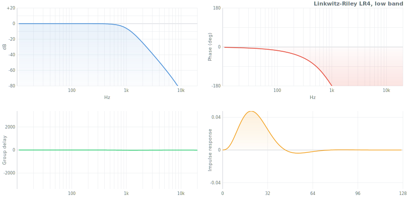

### IIR comparison

All at order 4, $f_c = 1\text{kHz}$, $f_s = 44100\text{Hz}$:

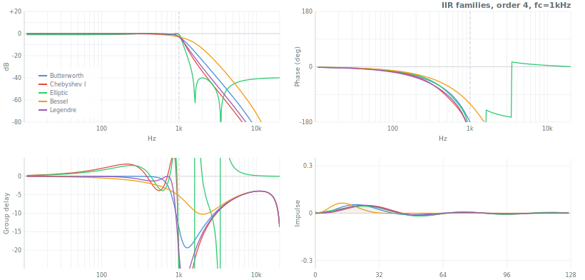

| | Butterworth | Chebyshev I | Chebyshev II | Elliptic | Bessel | Legendre |
|---|---|---|---|---|---|---|
| **Passband** | Flat | 1 dB ripple | Flat | 1 dB ripple | Flat (soft) | Flat |
| **@2 kHz** | –24 dB | –34 dB | –40 dB | –40 dB | –14 dB | –31 dB |
| **Overshoot** | 10.9% | 8.7% | 13.0% | 10.6% | **0.9%** | 11.3% |
| **Best for** | General | Sharp cutoff | Flat pass | Min order | No ringing | Sharp, no ripple |

## FIR design

FIR filters have no feedback — always stable, linear phase when symmetric. More taps = sharper cutoff = more latency. All design functions return `Float64Array` coefficients.

### `firwin(numtaps, cutoff, fs, opts?)`

Window method FIR. Truncated sinc × window function. The default for 80% of FIR tasks.

$$h[n] = \frac{\sin(\omega_c n)}{\pi n} \cdot w[n]$$


Supports `lowpass`, `highpass`, `bandpass`, `bandstop`. Default window: Hamming.

### `firwin2(numtaps, freq, gain, opts?)`

Arbitrary magnitude response via frequency sampling. Draw any shape.

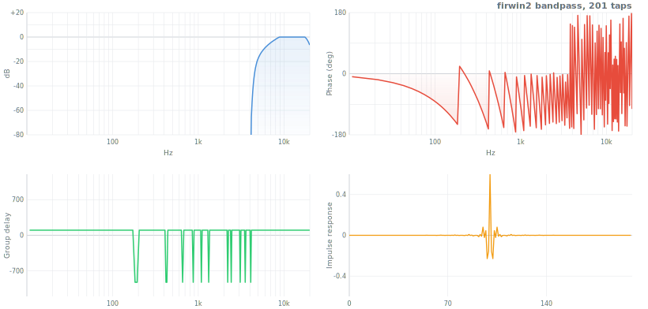

### `firls(numtaps, bands, desired, weight?)`

Least-squares optimal FIR. Minimizes total squared error between actual and desired response. Best average fit.


### `remez(numtaps, bands, desired, weight?)`

Parks-McClellan equiripple. Minimizes peak error — narrowest transition for given length. The gold standard. Parks & McClellan (1972).[^pm]

[^pm]: T.W. Parks, J.H. McClellan, "Chebyshev Approximation for Nonrecursive Digital Filters," *IEEE Trans.*, 1972.

$$\min \max_\omega \left| W(\omega)(H(\omega) - D(\omega)) \right|$$


### `kaiserord(deltaF, attenuation)`

Estimate Kaiser window filter length and $\beta$ from specifications. Returns `{ numtaps, beta }`.

### `hilbert(N)`

FIR Hilbert transformer. 90° phase shift, unity magnitude. For analytic signal, envelope extraction, SSB modulation.

$$h[n] = \begin{cases} 2/(\pi n) & n \text{ odd} \\ 0 & n \text{ even} \end{cases}$$


### `minimumPhase(h)`

Convert linear-phase FIR to minimum-phase via cepstral method. Same magnitude, half the delay.

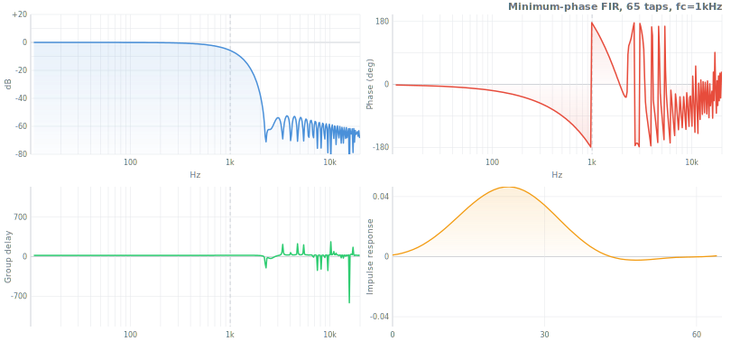

### `differentiator(N, opts?)`

FIR derivative filter. Discrete derivative with noise immunity.


### `integrator(rule?)`

Newton-Cotes quadrature coefficients. Rules: `rectangular`, `trapezoidal`, `simpson`, `simpson38`.

### `raisedCosine(N, beta?, sps?, opts?)`

ISI-free pulse shaping for digital communications. Satisfies Nyquist criterion. `root: true` for matched TX/RX pair.


### `gaussianFir(N, bt?, sps?)`

Gaussian pulse shaping (GMSK, Bluetooth). Controlled by bandwidth-time product.

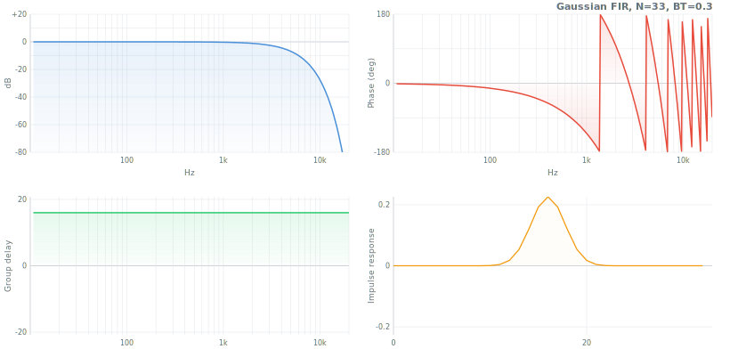

### `matchedFilter(template)`

Maximum SNR detector. Time-reversed, energy-normalized template for known-waveform detection in noise.

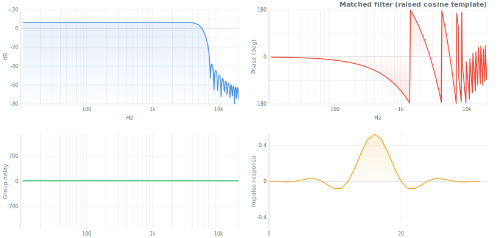

### `yulewalk(order, frequencies, magnitudes)`

IIR design from arbitrary magnitude response via Yule-Walker method. Returns `{ b, a }`.

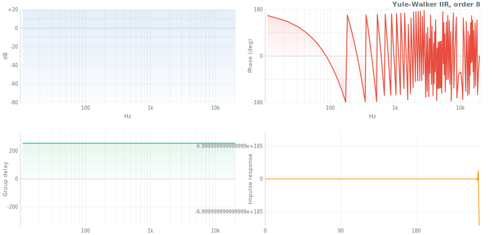

### `lattice(data, params)`

Lattice/ladder IIR structure using reflection coefficients. Better numerical properties than direct form. Params: `k` (reflection), `v` (ladder, optional).

### `warpedFir(data, params)`

Frequency-warped FIR. Allpass delay elements instead of unit delays — concentrates resolution at low frequencies. Params: `coefs`, `lambda` (warping factor).

## Smooth

Domain-agnostic smoothing and denoising. All operate in-place: `fn(data, params) → data`.

### `onePole(data, params)`

One-pole lowpass (exponential moving average). The simplest IIR smoother. Params: `fc`, `fs`.

$y[n] = (1-a)\,x[n] + a\,y[n\!-\!1], \quad a = e^{-2\pi f_c/f_s}$

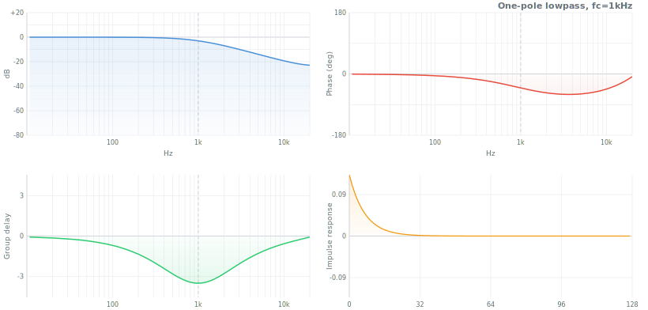

### `movingAverage(data, params)`

Boxcar average of last N samples. Linear phase, no overshoot. Params: `memory`.

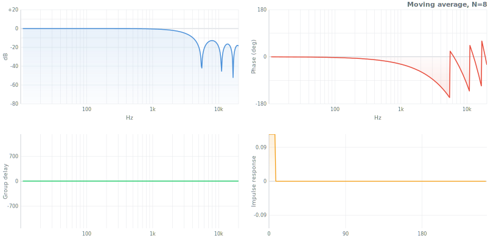

### `leakyIntegrator(data, params)`

Exponential decay. $y[n] = \lambda\,y[n\!-\!1] + (1-\lambda)\,x[n]$. Params: `lambda`.

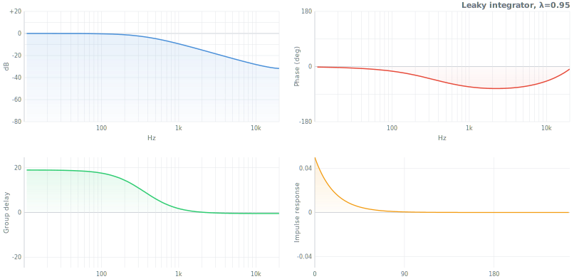

### `median(data, params)`

Nonlinear median filter. Removes impulse noise (clicks, outliers), preserves edges. Params: `size`.

### `savitzkyGolay(data, params)`

Polynomial fit to sliding window. Preserves peaks and shapes. Also computes smooth derivatives. Savitzky & Golay (1964).[^sg] Params: `windowSize`, `degree`, `derivative`.

[^sg]: A. Savitzky, M.J.E. Golay, "Smoothing and Differentiation of Data," *Analytical Chemistry*, 1964.

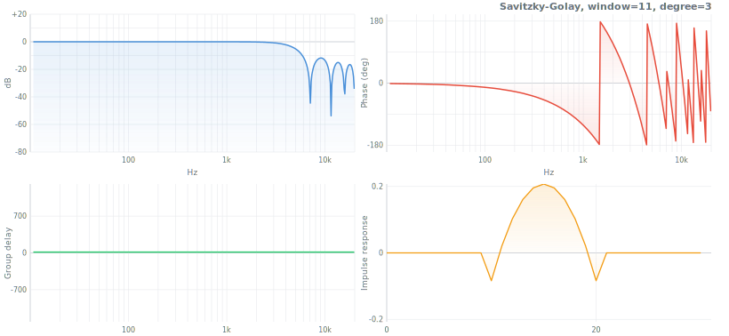

### `gaussianIir(data, params)`

Recursive Gaussian smoothing (Young-van Vliet). O(1) cost regardless of sigma. Forward-backward for zero phase. Params: `sigma`.

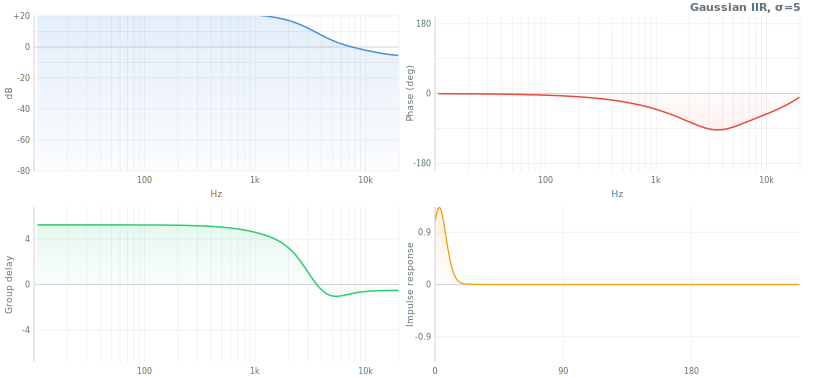

### `oneEuro(data, params)`

Adaptive lowpass — cutoff increases with signal speed. Smooth at rest, responsive when moving. Casiez et al. (2012).[^euro] Params: `minCutoff`, `beta`, `dCutoff`, `fs`.

[^euro]: G. Casiez et al., "1€ Filter," *CHI*, 2012.

### `dynamicSmoothing(data, params)`

Self-adjusting SVF — cutoff adapts to signal speed. Audio parameter smoothing. Params: `minFc`, `maxFc`, `sensitivity`, `fs`.

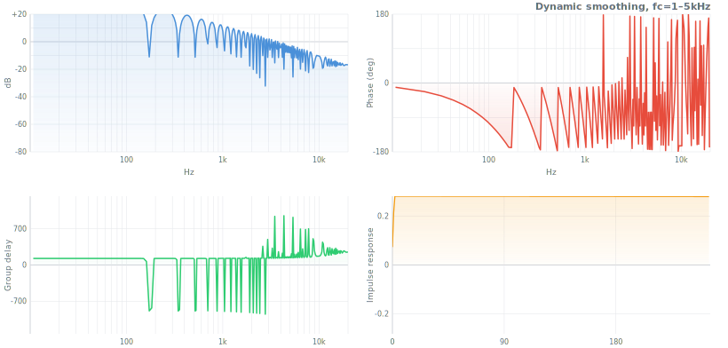

## Adaptive

Filters that learn. Weights adjust in real time to minimize error between desired and actual output. Returns filtered output; `params.error` contains error signal; `params.w` updated in place.

### `lms(input, desired, params)`

Least Mean Squares. Stochastic gradient descent on MSE. Widrow & Hoff (1960).[^lms] Params: `order`, `mu`.

[^lms]: B. Widrow, M.E. Hoff, "Adaptive Switching Circuits," *IRE WESCON*, 1960.

$$\mathbf{w}[n+1] = \mathbf{w}[n] + \mu\,e[n]\,\mathbf{x}[n]$$

O(N)/sample. Convergence condition: $0 < \mu < 2/(N\sigma_x^2)$.

### `nlms(input, desired, params)`

Normalized LMS. Self-normalizing step size — the practical default for real-world adaptive filtering. Params: `order`, `mu`, `eps`.

$$\mathbf{w}[n+1] = \mathbf{w}[n] + \frac{\mu\,e[n]\,\mathbf{x}[n]}{\mathbf{x}^T\mathbf{x} + \varepsilon}$$

O(N)/sample. Convergence: $0 < \mu < 2$ (independent of input power).

### `rls(input, desired, params)`

Recursive Least Squares. Fastest convergence (~2N samples) via inverse correlation matrix. O(N²)/sample. Params: `order`, `lambda`, `delta`.

### `levinson(R, order?)`

Levinson-Durbin algorithm. Solves Toeplitz system for LPC coefficients from autocorrelation. Returns `{ a, error, k }`. O(N²)/block.

## Multirate

Sample rate conversion, fractional delays, polyphase structures.

### `decimate(data, factor, opts?)`

Anti-alias FIR lowpass + downsample by factor M. Returns shorter `Float64Array`.

### `interpolate(data, factor, opts?)`

Upsample + anti-image FIR lowpass by factor L. Returns longer `Float64Array`.

### `halfBand(numtaps?)`

Half-band FIR filter. Nearly half the coefficients are zero — halves multiply count for efficient 2× decimation/interpolation.

### `cic(data, R, N?)`

Cascaded Integrator-Comb. Multiplier-free decimation. Only additions and subtractions.

$$H(z) = \left(\frac{1 - z^{-RM}}{1 - z^{-1}}\right)^N$$

### `polyphase(h, M)`

Decompose FIR into M polyphase components for efficient multirate filtering. Returns `Array<Float64Array>`.

### `farrow(data, params)`

Farrow fractional delay. Variable delay via polynomial interpolation. Params: `delay`, `order`.

### `thiran(delay, order?)`

Thiran allpass fractional delay. Unity magnitude, maximally flat group delay. Returns `{ b, a }`.

### `oversample(data, factor, opts?)`

Multi-stage upsampling with anti-alias FIR. For oversampling before nonlinear processing (distortion, saturation).

## Core

The engine — processing, analysis, conversion. Everything else builds on these.

### `filter(data, params)`

SOS cascade processor. Direct Form II Transposed. Modifies data in-place. State persists in `params.state` between calls. Params: `coefs` (SOS array).

$$y[n] = b_0 x[n] + b_1 x[n\!-\!1] + b_2 x[n\!-\!2] - a_1 y[n\!-\!1] - a_2 y[n\!-\!2]$$

### `filtfilt(data, params)`

Zero-phase forward-backward filtering. Doubles effective order, eliminates phase distortion. Offline only. Params: `coefs`.

### `convolution(signal, ir)`

Direct convolution. Returns `Float64Array` of length N + M – 1.

$(f * g)[n] = \sum_k f[k]\,g[n-k]$

### `freqz(coefs, n?, fs?)`

Frequency response of SOS filter. Returns `{ frequencies, magnitude, phase }`.

### `mag2db(mag)`

Magnitude to decibels. $20\log_{10}(\text{mag})$.

### `groupDelay(coefs, n?, fs?)`

Group delay: $\tau_g(\omega) = -d\phi/d\omega$. Returns `{ frequencies, delay }`.

### `phaseDelay(coefs, n?, fs?)`

Phase delay: $\tau_p(\omega) = -\phi(\omega)/\omega$. Returns `{ frequencies, delay }`.

### `impulseResponse(coefs, N?)`

Compute impulse response of SOS filter. Returns `Float64Array`.

### `stepResponse(coefs, N?)`

Compute step response. Returns `Float64Array`.

### `isStable(sos)` · `isMinPhase(sos)` · `isFir(sos)` · `isLinPhase(h)`

Filter property tests. Stable = all poles inside unit circle. MinPhase = all zeros inside. FIR = no feedback (a1=a2=0). LinPhase = symmetric/antisymmetric coefficients.

### `sos2zpk(sos)` · `sos2tf(sos)` · `tf2zpk(b, a)` · `zpk2sos(zpk)`

Format conversion between SOS, zeros/poles/gain, and transfer function polynomials.

### `transform`

Analog prototype → digital SOS pipeline. `transform.polesSos(poles, fc, fs, type)`, `transform.poleZerosSos(poles, zeros, fc, fs, type)`, `transform.prewarp(f, fs)`.

### `window`

34 window functions re-exported from [window-function](https://github.com/scijs/window-function). `window.hann(N)`, `window.kaiser(N, beta)`, etc.

## See also

- **[audio-filter](https://github.com/audiojs/audio-filter)** — audio and acoustic filters (weighting, EQ, synthesis, measurement) built on digital-filter
- **[window-function](https://github.com/scijs/window-function)** — 34 window functions for spectral analysis

<p align=center><a href="./LICENSE">MIT</a> · <a href="https://github.com/krishnized/license/">ॐ</a></p>
