# digital-filter [](https://github.com/audiojs/digital-filter/actions/workflows/test.yml) [](https://www.npmjs.com/package/digital-filter) [](https://github.com/krishnized/license)

Digital filter design and processing.<br>
Features
[IIR](#iir),
[FIR](#fir),
[smoothing](#smooth),
[adaptive](#adaptive),
[multirate](#multirate)
filters.

## Install

```
npm install digital-filter
```

```js
import { butterworth, filter, onePole } from 'digital-filter'
// import butterworth from 'digital-filter/iir/butterworth.js'

onePole(data, { fc: 100, fs: 44100 })           // smooth in-place

let sos = butterworth(4, 1000, 44100)            // design a 4th-order lowpass
filter(data, { coefs: sos })                     // apply in-place

let params = { coefs: sos }
filter(block1, params)                           // state persists between blocks
filter(block2, params)
```

> For audio-domain filters (weighting, EQ, synth, measurement) see [audio-filter](https://github.com/audiojs/audio-filter).

## Intro

**Filter.** Takes an array of samples, outputs an array of samples. `output[i] = (input[i] + input[i-1] + input[i-2]) / 3` smooths out fast changes – that's a lowpass.

**Frequency response.** Every filter passes some frequencies and cuts others. The plots show how much each frequency is kept (magnitude, in dB) and how much it's delayed (phase). 0 dB = unchanged, –3 dB = half power.

**IIR vs FIR.** IIR uses feedback – few multiplies, low latency, but can't do linear phase and can blow up. FIR has no feedback – always stable, linear phase possible, but needs 100–1000+ taps for a sharp cutoff.

**SOS.** Second-Order Sections – an IIR filter split into a chain of biquads (2nd-order, 5 coefficients each). A 4th-order Butterworth = 2 biquads. All design functions return SOS arrays to avoid float64 precision loss.

**Plots.** Four panels. Top-left: magnitude (dB vs Hz). Top-right: phase (degrees vs Hz). Bottom-left: group delay (samples vs Hz), flat = no distortion. Bottom-right: impulse response. Dashed line = $f_c$.

**Formulas.** $|H(j\omega)|^2$: analog prototype magnitude. $H(z)$: digital transfer function. $h[n]$: impulse response / FIR coefficients.


## IIR

IIR filters use feedback – efficient (5–20 multiplies for a sharp lowpass), low latency, nonlinear phase. Designed from analog prototypes via the bilinear transform, implemented as cascaded second-order sections (SOS).[^sos]

[^sos]: Direct form above order ~6 loses precision with float64. Cascaded biquads don't.

### `biquad`

Nine second-order filter types – the building block for everything else. Every parametric EQ, every crossover, every Butterworth cascade is made of these.[^rbj]

[^rbj]: Robert Bristow-Johnson, [Audio EQ Cookbook](https://www.w3.org/TR/audio-eq-cookbook/), 1998.

* `biquad.lowpass(fc, Q, fs)` · `highpass` · `bandpass` · `bandpass2` · `notch` · `allpass`
* `biquad.peaking(fc, Q, fs, dBgain)` · `lowshelf` · `highshelf`

<sup>Q controls peak width – 0.707 is Butterworth-flat, higher = sharper resonance.</sup>

$H(z) = (b_0 + b_1 z^{-1} + b_2 z^{-2}) / (1 + a_1 z^{-1} + a_2 z^{-2})$

```js
let lp = biquad.lowpass(1000, 0.707, 44100)
filter(data, { coefs: lp })
```

**Use when**: single-band EQ, notch, shelf, simple 2nd-order filter.<br>
**Not for**: steeper than –12 dB/oct (use butterworth/chebyshev which cascade biquads).<br>
**scipy**: `scipy.signal.iirfilter(1, ...)`. **MATLAB**: various Audio Toolbox functions.

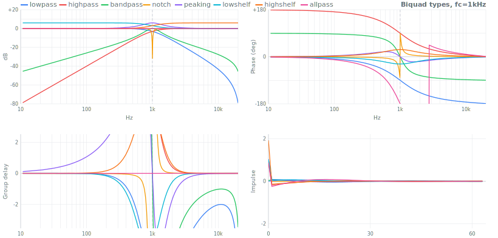

### `svf(data, params)`

State variable filter – same transfer function as a biquad, but trapezoidal integration allows zero-delay feedback. Safe for per-sample parameter modulation. Six simultaneous outputs. Simper/Cytomic (2011). Params: `fc`, `Q`, `fs`, `type`.

$g = \tan(\pi f_c/f_s)$, $k = 1/Q$

```js
svf(data, { fc: 1000, Q: 2, fs: 44100, type: 'lowpass' })
```

**Use when**: real-time synthesis with parameter modulation (LFO, envelope, touch).<br>
**Not for**: need SOS coefficients for analysis (use biquad), higher than 2nd order.

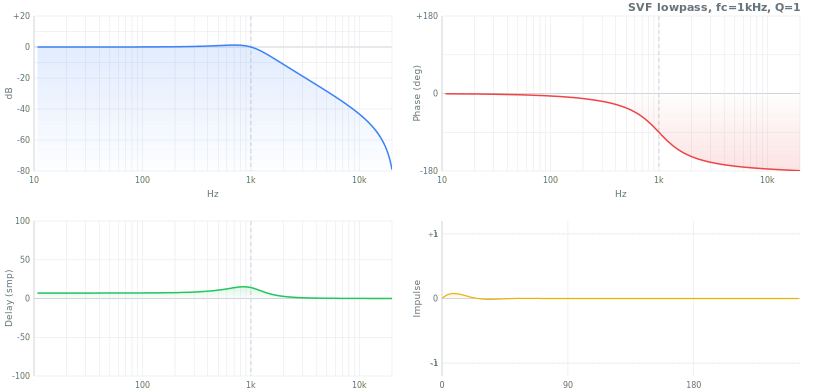

### `butterworth(order, fc, fs, type?)`

Maximally flat magnitude – no ripple anywhere. The safe default for anti-aliasing, crossovers, general-purpose filtering. Butterworth (1930).[^bw]

[^bw]: S. Butterworth, "On the Theory of Filter Amplifiers," *Wireless Engineer*, 1930.

$|H(j\omega)|^2 = 1/(1 + (\omega/\omega_c)^{2N})$<br>
Poles at $s_k = \omega_c \cdot e^{j\pi(2k+N+1)/(2N)}$.

**–3 dB at fc · –6N dB/oct slope · 10.9% overshoot at order 4 · 73 samples settling**

```js
let sos = butterworth(4, 1000, 44100)
filter(data, { coefs: sos })
```

**Use when**: general-purpose filtering, anti-aliasing, crossovers.<br>
**Not for**: sharpest transition (use [chebyshev](#chebyshev2order-fc-fs-attenuation-type)/[elliptic](#ellipticorder-fc-fs-ripple-attenuation-type)), waveform preservation (use [bessel](#besselorder-fc-fs-type)).<br>
**scipy**: `scipy.signal.butter`. **MATLAB**: `butter`.

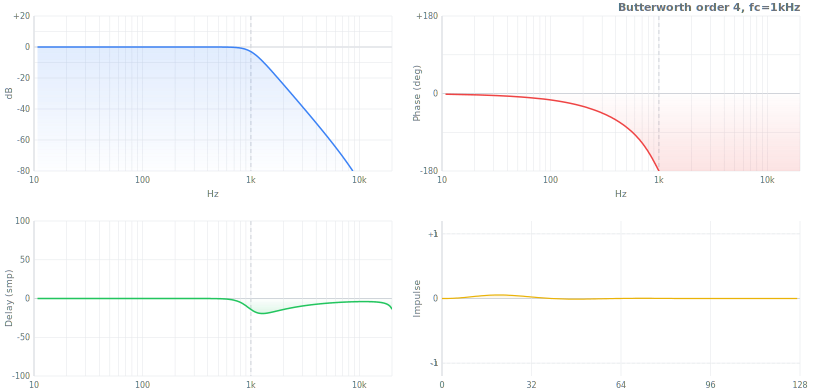


### `chebyshev(order, fc, fs, ripple?, type?)`

Steeper cutoff than Butterworth for the same order – at the cost of passband ripple.

$|H(j\omega)|^2 = 1/(1 + \varepsilon^2 T_N^2(\omega/\omega_c))$ — $T_N$ is the Nth Chebyshev polynomial (oscillates in passband, grows fast in stopband). $\varepsilon = \sqrt{10^{R_p/10} - 1}$.

**Default 1 dB ripple · –34 dB at 2× fc · 8.7% overshoot · 256 samples settling**

```js
let sos = chebyshev(4, 1000, 44100, 1)  // 1 dB ripple
```

**Use when**: sharper cutoff than Butterworth, passband ripple tolerable.<br>
**Not for**: passband flatness (use butterworth/legendre), waveform shape (use bessel).<br>
**scipy**: `scipy.signal.cheby1`. **MATLAB**: `cheby1`.

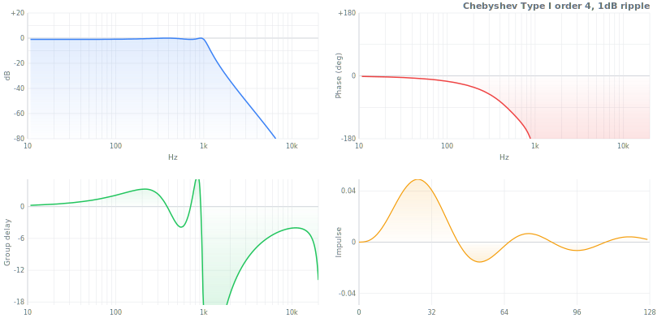


### `chebyshev2(order, fc, fs, attenuation?, type?)`

Flat passband, equiripple stopband. The ripple goes into the rejection region instead.

$|H(j\omega)|^2 = 1/(1 + 1/(\varepsilon^2 T_N^2(\omega_c/\omega)))$ — inverse of Type I. Zeros on $j\omega$ axis enforce stopband floor.

**Flat passband · –40 dB stopband floor · –40 dB at 2× fc**

```js
let sos = chebyshev2(4, 2000, 44100, 40)  // 40 dB rejection
```

**Use when**: flat passband needed with sharper rolloff than Butterworth.<br>
**Not for**: deep stopband at high frequencies (Butterworth keeps falling; Cheby II bounces).<br>
**scipy**: `scipy.signal.cheby2`. **MATLAB**: `cheby2`.

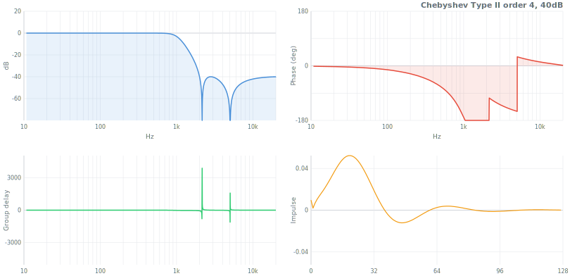

### `elliptic(order, fc, fs, ripple?, attenuation?, type?)`

Sharpest transition for a given order – ripple in both passband and stopband. A 4th-order elliptic matches a 7th-order Butterworth. Cauer (1958).[^cauer]

[^cauer]: W. Cauer, *Synthesis of Linear Communication Networks*, 1958.

$|H(j\omega)|^2 = 1/(1 + \varepsilon^2 R_N^2(\omega/\omega_c))$ — $R_N$ is a rational Chebyshev (Jacobi elliptic) function.

**Default 1 dB ripple, 40 dB attenuation · –40 dB at 2× fc · 10.6% overshoot**

```js
let sos = elliptic(4, 1000, 44100, 1, 40)
```

**Use when**: minimum order / sharpest transition is critical.<br>
**Not for**: passband flatness or waveform shape (worst phase response of all families).<br>
**scipy**: `scipy.signal.ellip`. **MATLAB**: `ellip`.


### `bessel(order, fc, fs, type?)`

Maximally flat group delay – preserves waveform shape with near-zero overshoot. For biomedical signals (ECG, EEG), control systems, anywhere ringing distorts the measurement. Thomson (1949).[^thomson]

[^thomson]: W.E. Thomson, "Delay Networks Having Maximally Flat Frequency Characteristics," *Proc. IEE*, 1949.

$H(s) = \theta_N(0)/\theta_N(s/\omega_c)$ — $\theta_N$ is the reverse Bessel polynomial. Poles cluster near negative real axis.

**–3 dB at fc · –14 dB at 2× fc (gentlest rolloff) · 0.9% overshoot · 28 samples settling**

```js
let sos = bessel(4, 1000, 44100)
```

**Use when**: waveform preservation (ECG, transients, control systems).<br>
**Not for**: sharp frequency cutoff (gentlest rolloff of all families).<br>
**scipy**: `scipy.signal.bessel`. **MATLAB**: `besself` (analog only).

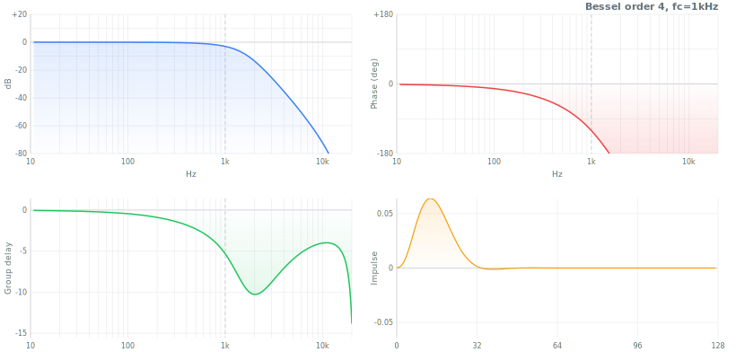

### `legendre(order, fc, fs, type?)`

Steepest monotonic (ripple-free) rolloff. Between Butterworth and Chebyshev. Papoulis (1958), Bond (2004).[^papoulis]

[^papoulis]: A. Papoulis, "Optimum Filters with Monotonic Response," *Proc. IRE*, 1958.

$|H(j\omega)|^2 = 1 - P_N(1 - 2(\omega/\omega_c)^2)$ — $P_N$ maximizes rolloff slope while staying monotonic.

**–3 dB at fc · –31 dB at 2× fc · no ripple · 11.3% overshoot**

```js
let sos = legendre(4, 1000, 44100)
```

**Use when**: sharpest cutoff without any ripple.<br>
**Not for**: ripple tolerable (chebyshev is steeper), waveform shape (use bessel).

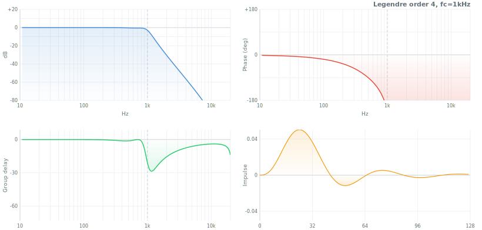

### `linkwitzRiley(order, fc, fs)`

Crossover: LP + HP sum to perfectly flat magnitude. Two cascaded Butterworth filters. Linkwitz & Riley (1976).[^lr] Returns `{ low, high }`. Order must be even (2, 4, 6, 8).

[^lr]: S.H. Linkwitz, "Active Crossover Networks for Noncoincident Drivers," *JAES*, 1976.

**–6 dB at fc (both bands) · bands sum to 0 dB at all frequencies**

```js
let { low, high } = linkwitzRiley(4, 2000, 44100)
```

**Use when**: crossover networks, multiband processing.<br>
**Not for**: single-band filtering (use butterworth).


### `iirdesign(fpass, fstop, rp?, rs?, fs?)`

Give it your specs and it picks the best family and minimum order automatically. Returns `{ sos, order, type }`.

```js
let { sos, order, type } = iirdesign(1000, 1500, 1, 40, 44100)
```

**Use when**: you know specs (passband, stopband, ripple, attenuation) but not the family.<br>
**Not for**: when you already know which family to use.

### IIR comparison

All at order 4, $f_c = 1\text{kHz}$, $f_s = 44100\text{Hz}$:

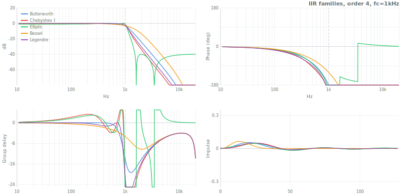

| | Butterworth | Chebyshev I | Chebyshev II | Elliptic | Bessel | Legendre |
|---|---|---|---|---|---|---|
| **Passband** | Flat | 1 dB ripple | Flat | 1 dB ripple | Flat (soft) | Flat |
| **@2 kHz** | –24 dB | –34 dB | –40 dB | –40 dB | –14 dB | –31 dB |
| **Overshoot** | 10.9% | 8.7% | 13.0% | 10.6% | **0.9%** | 11.3% |
| **Best for** | General | Sharp cutoff | Flat pass | Min order | No ringing | Sharp, no ripple |


## FIR

Finite impulse response – no feedback, always stable. Symmetric coefficients give perfect linear phase. More taps = sharper cutoff = more latency. All design functions return `Float64Array`.

### `firwin(numtaps, cutoff, fs, opts?)`

Window method FIR – truncated sinc multiplied by a window function. Supports `lowpass`, `highpass`, `bandpass`, `bandstop`. Default window: Hamming.

$h[n] = \sin(\omega_c n)/(\pi n) \cdot w[n]$ — sinc gives ideal brick-wall, window smooths truncation.

**Linear phase · delay = (N–1)/2 samples · –43 dB sidelobes (Hamming)**

```js
let h = firwin(63, 1000, 44100)
```

**Use when**: 80% of FIR tasks – quick, predictable LP/HP/BP/BS.<br>
**Not for**: tight specs (use remez), arbitrary shapes (use firwin2).<br>
**scipy**: `scipy.signal.firwin`. **MATLAB**: `fir1`.

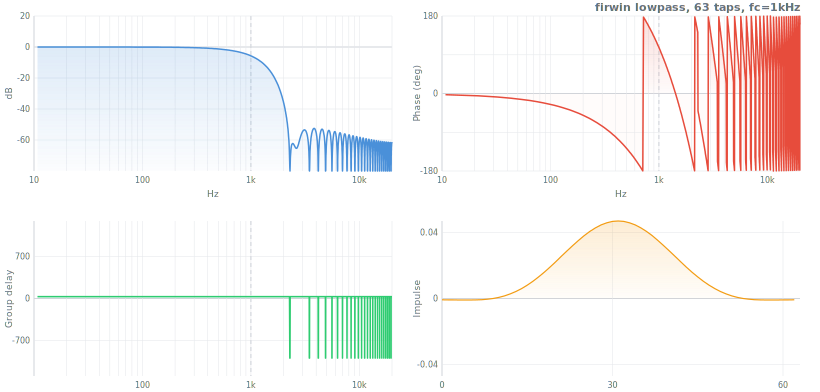

### `firls(numtaps, bands, desired, weight?)`

Least-squares optimal – minimizes total squared error. Smoother transitions than remez.

**Linear phase · smooth transition · no equiripple**

```js
let h = firls(63, [0, 0.3, 0.4, 1], [1, 1, 0, 0])
```

**Use when**: average error matters more than worst-case, audio interpolation.<br>
**Not for**: tight stopband specs (use remez).<br>
**scipy**: `scipy.signal.firls`. **MATLAB**: `firls`.

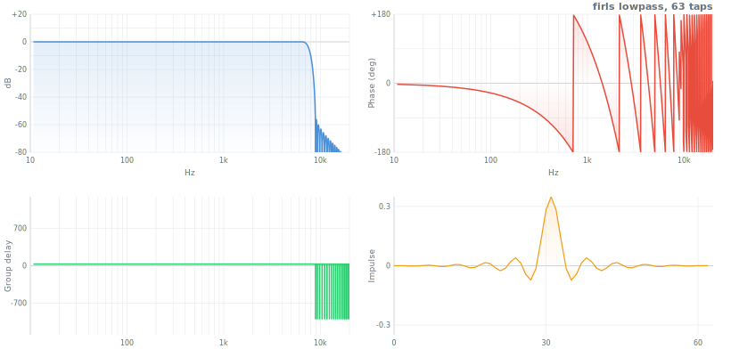

### `remez(numtaps, bands, desired, weight?)`

Parks-McClellan equiripple – narrowest transition band for given taps. Parks & McClellan (1972).[^pm]

[^pm]: T.W. Parks, J.H. McClellan, "Chebyshev Approximation for Nonrecursive Digital Filters," *IEEE Trans.*, 1972.

$\min \max_\omega |W(\omega)(H(\omega) - D(\omega))|$ — minimizes peak (worst-case) error.

**Linear phase · equiripple · sharpest cutoff per tap**

```js
let h = remez(63, [0, 0.3, 0.4, 1], [1, 1, 0, 0])
```

**Use when**: tight specs, guaranteed worst-case rejection.<br>
**Not for**: sidelobes must decay (use firwin with window), average error (use firls).<br>
**scipy**: `scipy.signal.remez`. **MATLAB**: `firpm`.

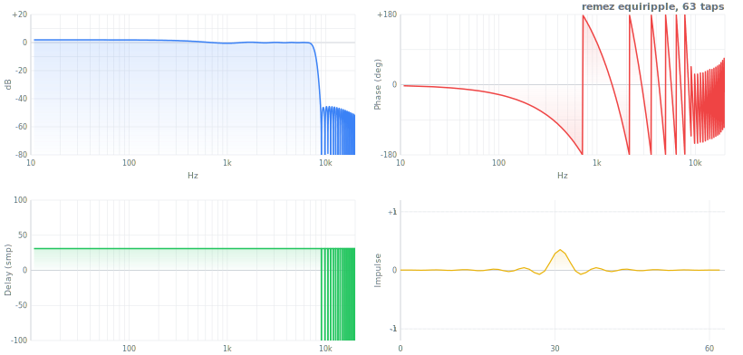

### `firwin2(numtaps, freq, gain, opts?)`

Arbitrary magnitude response via frequency sampling. Specify gain at any frequency points.

**Linear phase · any shape**

```js
let h = firwin2(201, [0, 0.1, 0.2, 0.4, 0.5, 1], [0, 0, 1, 1, 0, 0])
```

**Use when**: custom EQ curves, matching measured responses.<br>
**scipy**: `scipy.signal.firwin2`. **MATLAB**: `fir2`.

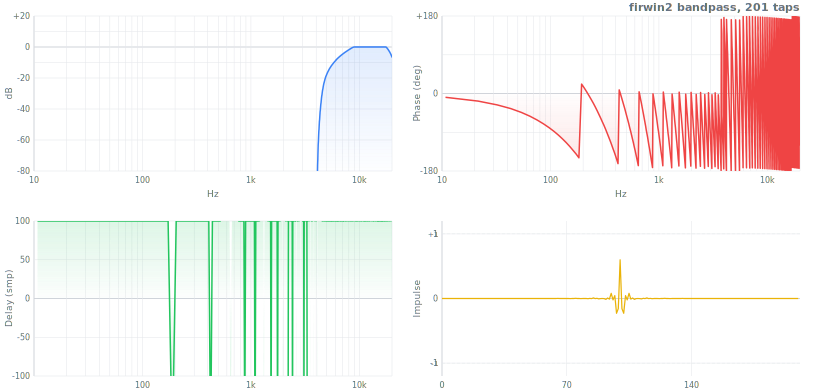

### `hilbert(N)`

90° phase shift at unity magnitude. For analytic signal, envelope extraction, SSB modulation, pitch detection.

$h[n] = 2/(\pi n)$ for odd $n$, $0$ for even — ideal Hilbert transformer, windowed.

**Linear phase · zero at DC and Nyquist**

```js
let h = hilbert(65)
```

**Use when**: analytic signal, envelope, instantaneous frequency.<br>
**Not for**: wideband to DC (Hilbert is zero at DC/Nyquist).<br>
**scipy**: `scipy.signal.hilbert` (different – applies to signal, not design).

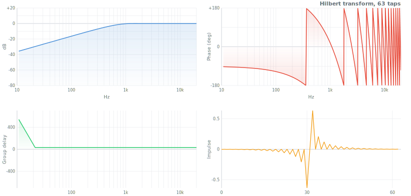

### `differentiator(N, opts?)`

FIR derivative with better noise immunity than a first difference.

$h[n] = (-1)^n/n$ windowed.

**Antisymmetric · linear phase**

```js
let h = differentiator(31)
```

**Use when**: rate-of-change, velocity from position, edge detection.<br>
**Not for**: noisy data needing simultaneous smoothing (use savitzkyGolay with derivative:1).

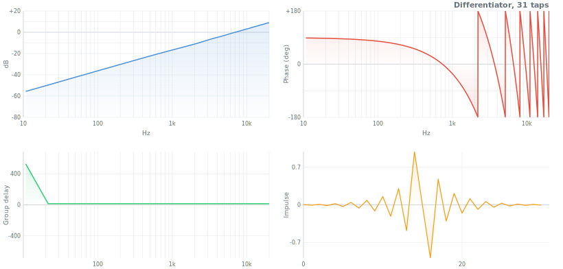

### `raisedCosine(N, beta?, sps?, opts?)`

Pulse shaping for digital communications (QAM, PSK, OFDM). Zero ISI at symbol centers. `root: true` for matched TX/RX pair.

$\beta$ controls excess bandwidth: 0 = minimum (long ringing), 0.35 = standard, 1 = widest.

```js
let h = raisedCosine(101, 0.35, 8, { root: true })
```

**Use when**: QAM/PSK pulse shaping, SDR baseband.

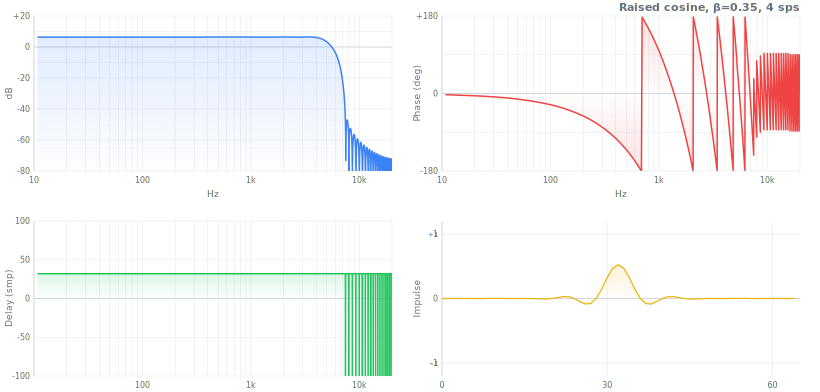

### `gaussianFir(N, bt?, sps?)`

Gaussian pulse shaping – the standard for GMSK (GSM) and Bluetooth. More spectrally compact than raised cosine at the cost of some ISI.

```js
let h = gaussianFir(33, 0.3, 4)
```

**Use when**: GMSK/Bluetooth modulation.<br>
**Not for**: ISI-free pulses (use raisedCosine).

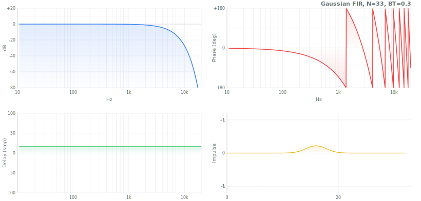

### `matchedFilter(template)`

Optimal detector for a known waveform in white noise – time-reversed, energy-normalized template. Maximizes SNR at detection point.

```js
let h = matchedFilter(template)
let corr = convolution(received, h)
```

**Use when**: radar, sonar, preamble/sync detection.

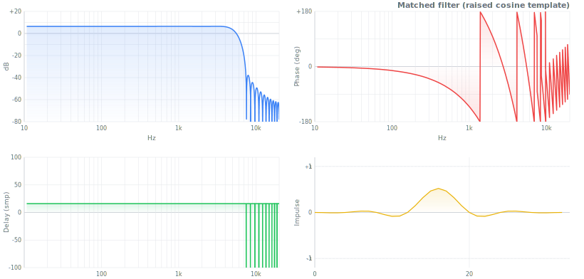

### `minimumPhase(h)`

Convert linear-phase FIR to minimum-phase via cepstral method. Same magnitude, ~half the delay.

```js
let hMin = minimumPhase(firwin(101, 4000, 44100))
```

**Use when**: FIR latency too high, linear phase not required.

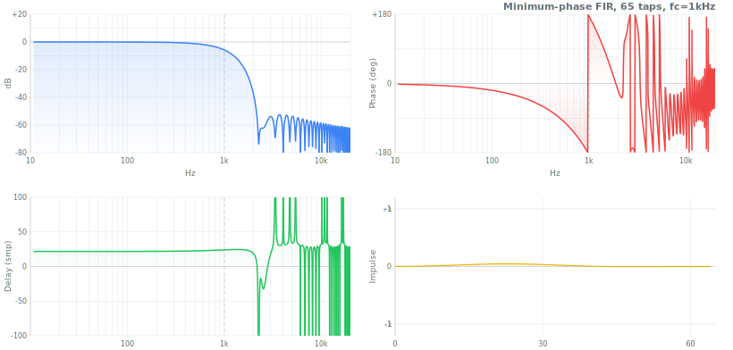

### `yulewalk(order, frequencies, magnitudes)`

IIR approximation of an arbitrary magnitude response via Yule-Walker method. Returns `{ b, a }`.

```js
let { b, a } = yulewalk(8, [0, 0.2, 0.3, 0.5, 1], [1, 1, 0, 0, 0])
```

**Use when**: IIR match to target curve. **MATLAB**: `yulewalk`.

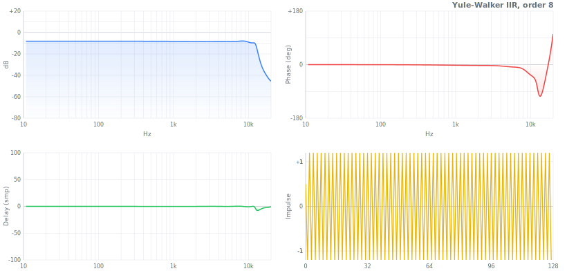

### `integrator(rule?)`

Newton-Cotes quadrature coefficients. Rules: `rectangular` [1], `trapezoidal` [0.5, 0.5], `simpson` [1/6, 4/6, 1/6], `simpson38` [1/8, 3/8, 3/8, 1/8].

```js
let h = integrator('simpson')
```

**Use when**: numerical integration of sampled data.

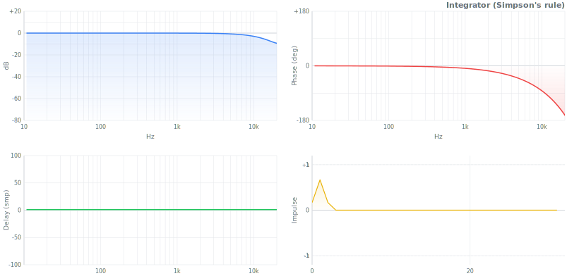

### `lattice(data, params)`

Lattice/ladder IIR using reflection coefficients (PARCOR). Alternative topology to direct form – each stage is independently stable when $|k_i| < 1$. Params: `k` (reflection coefficients), `v` (ladder/feedforward, optional).

```js
// Use reflection coefficients from levinson LPC analysis
let { k } = levinson(autocorrelation, 12)
lattice(data, { k })  // apply as synthesis filter
```

**Use when**: LPC synthesis, speech coding, high-precision filtering where numerical stability matters.<br>
**Not for**: general filtering (use filter with SOS).

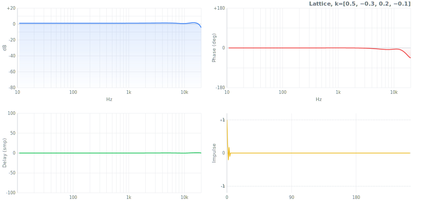

### `warpedFir(data, params)`

Frequency-warped FIR – replaces unit delays with allpass delays. Concentrates frequency resolution at low frequencies, matching how the ear perceives pitch. Params: `coefs`, `lambda` (warping factor).

```js
// lambda ≈ 0.7 for 44.1 kHz maps to Bark-like resolution
warpedFir(data, { coefs: new Float64Array([0.5, 0.3, 0.15, 0.05]), lambda: 0.7 })
```

**Use when**: perceptual audio coding, low-order EQ that sounds better than uniform-resolution FIR.<br>
**Not for**: linear phase (warped FIR is not linear phase).

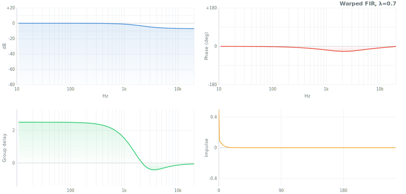

### `kaiserord(deltaF, attenuation)`

Estimates how many FIR taps you need and what Kaiser window $\beta$ to use, given your transition width and desired stopband rejection. Feed the result into `firwin`.

```js
// "I need 60 dB rejection with 10% of Nyquist transition width"
let { numtaps, beta } = kaiserord(0.1, 60)
// numtaps ≈ 55, beta ≈ 5.65
let h = firwin(numtaps, 4000, 44100, { window: kaiser(numtaps, beta) })
```

**Use when**: estimating FIR order before designing with firwin.

## Smooth

Smoothing and denoising. All operate in-place: `fn(data, params) → data`.

### `onePole(data, params)`

Exponential moving average – the simplest IIR smoother. One multiply, no overshoot. Params: `fc`, `fs`.

$y[n] = (1-a)\,x[n] + a\,y[n-1]$, $a = e^{-2\pi f_c/f_s}$, $H(z) = (1-a)/(1-az^{-1})$

**–6 dB/oct · 1 multiply · IIR**

```js
onePole(data, { fc: 100, fs: 44100 })
```

**Use when**: smoothing control signals, sensor data, parameter changes.<br>
**Not for**: sharp cutoff (use butterworth), preserving peaks (use savitzkyGolay).<br>
**scipy**: `scipy.signal.lfilter([1-a], [1, -a])`. **MATLAB**: `filter(1-a, [1 -a], x)`.

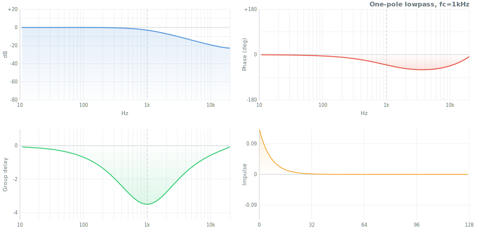

### `movingAverage(data, params)`

Boxcar average of last N samples. Params: `memory`.

$h[n] = 1/N$ for $n = 0..N-1$, $H(z) = (1 - z^{-N})/(N(1 - z^{-1}))$

**Linear phase · FIR · nulls at multiples of fs/N**

```js
movingAverage(data, { memory: 8 })
```

**Use when**: periodic noise removal, simple averaging.<br>
**Not for**: preserving peaks (use savitzkyGolay).

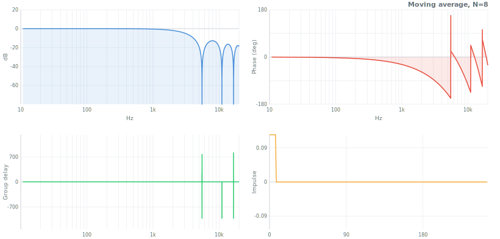

### `leakyIntegrator(data, params)`

Exponential decay accumulator. Same as onePole but parameterized by decay factor. Params: `lambda` (0–1).

$y[n] = \lambda\,y[n-1] + (1-\lambda)\,x[n]$

**1 multiply · IIR**

```js
leakyIntegrator(data, { lambda: 0.95 })
```

**Use when**: running average, DC estimation.

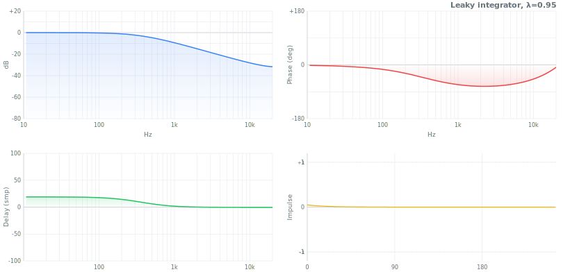

### `savitzkyGolay(data, params)`

Polynomial fit to sliding window – preserves peak height, width, and shape. Also computes smooth derivatives. Savitzky & Golay (1964).[^sg] Params: `windowSize`, `degree`, `derivative`.

[^sg]: A. Savitzky, M.J.E. Golay, "Smoothing and Differentiation of Data," *Analytical Chemistry*, 1964.

**FIR · linear phase · preserves moments up to degree**

```js
savitzkyGolay(data, { windowSize: 11, degree: 3 })
```

**Use when**: spectroscopy, chromatography, peak-sensitive measurement.<br>
**Not for**: frequency-selective filtering, causal/online processing.<br>
**scipy**: `scipy.signal.savgol_filter`. **MATLAB**: `sgolayfilt`.

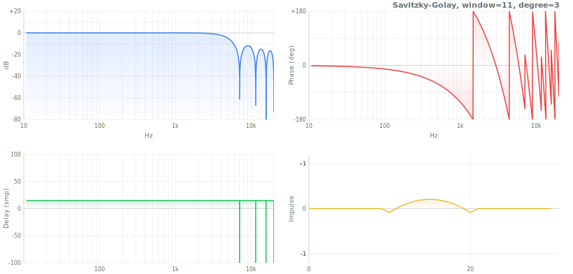

### `gaussianIir(data, params)`

Recursive Gaussian (Young-van Vliet). O(1) cost regardless of sigma. Forward-backward for zero phase. Params: `sigma`.

**IIR · zero phase (offline) · O(1) per sample**

```js
gaussianIir(data, { sigma: 10 })
```

**Use when**: large-kernel Gaussian smoothing.<br>
**Not for**: exact Gaussian (approximation), causal filtering.

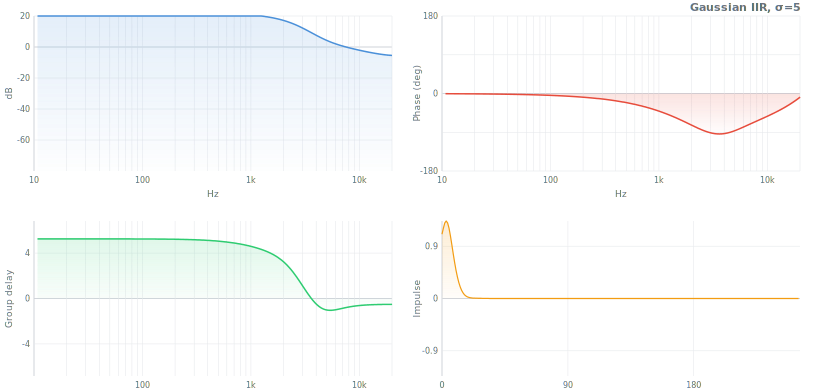

### `dynamicSmoothing(data, params)`

Self-adjusting SVF – cutoff adapts to signal speed. For smoothing parameter changes without zipper noise. Params: `minFc`, `maxFc`, `sensitivity`, `fs`.

**Adaptive · 2nd-order SVF**

```js
dynamicSmoothing(data, { minFc: 1, maxFc: 5000, sensitivity: 1, fs: 44100 })
```

**Use when**: audio parameter smoothing at audio rate.

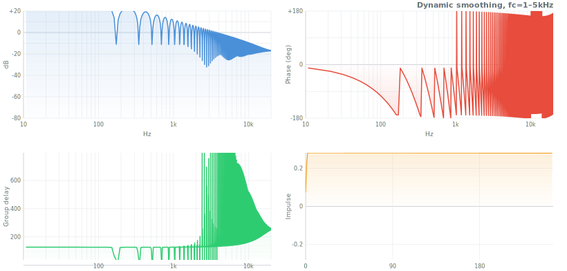

### `median(data, params)`

Nonlinear – replaces each sample with neighborhood median. Removes impulse noise while preserving edges. Params: `size`.

**Nonlinear · preserves edges · O(N log N) per sample**

```js
median(data, { size: 5 })
```

**Use when**: clicks, pops, sensor outliers, edge-preserving denoising.<br>
**Not for**: frequency-selective filtering (no defined frequency response).<br>
**scipy**: `scipy.signal.medfilt`. **MATLAB**: `medfilt1`.

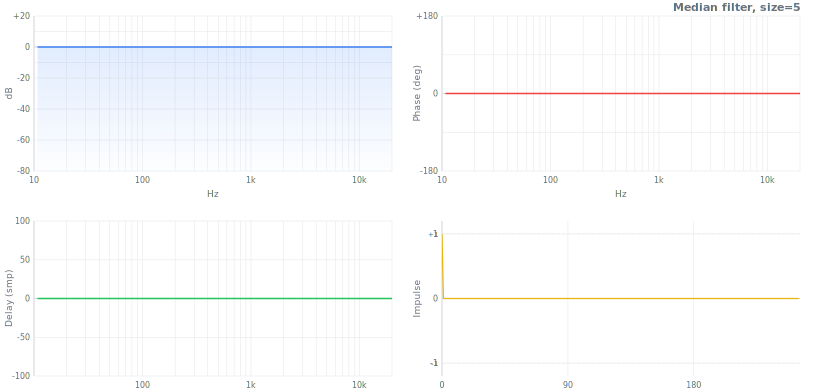

### `oneEuro(data, params)`

Adaptive lowpass – cutoff increases with signal speed. Smooth at rest, responsive when moving. Casiez et al. (2012).[^euro] Params: `minCutoff`, `beta`, `dCutoff`, `fs`.

[^euro]: G. Casiez et al., "1€ Filter," *CHI*, 2012.

**Adaptive · 1st-order IIR with time-varying cutoff**

```js
oneEuro(data, { minCutoff: 1, beta: 0.007, fs: 60 })
```

**Use when**: mouse/touch/gaze input, sensor fusion, UI jitter.<br>
**Not for**: audio-rate processing (use dynamicSmoothing).

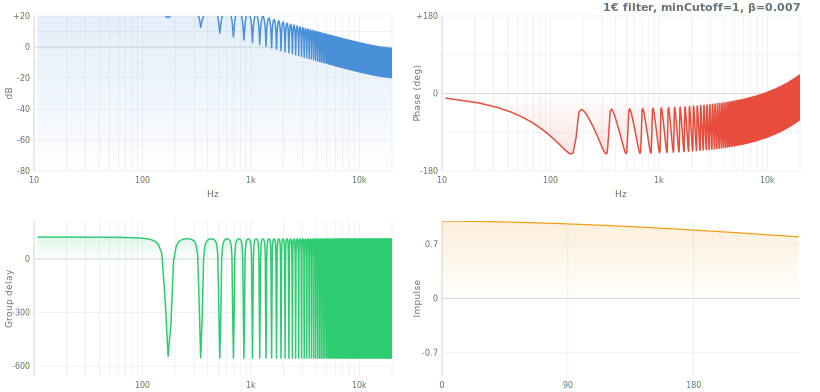


## Adaptive

Filters that learn from a reference signal. Returns filtered output; `params.error` contains error; `params.w` updated in place.

### `lms(input, desired, params)`

Least Mean Squares – stochastic gradient descent. Widrow & Hoff (1960).[^lms] Params: `order`, `mu`.

[^lms]: B. Widrow, M.E. Hoff, "Adaptive Switching Circuits," *IRE WESCON*, 1960.

$\mathbf{w}[n+1] = \mathbf{w}[n] + \mu\,e[n]\,\mathbf{x}[n]$, $e[n] = d[n] - \mathbf{w}^T\mathbf{x}[n]$. Convergence: $0 < \mu < 2/(N\sigma_x^2)$.

**O(N)/sample · slow convergence · very robust**

```js
lms(input, desired, { order: 128, mu: 0.01 })
```

**Use when**: educational, simple implementation.<br>
**Not for**: practice – almost always use nlms instead.

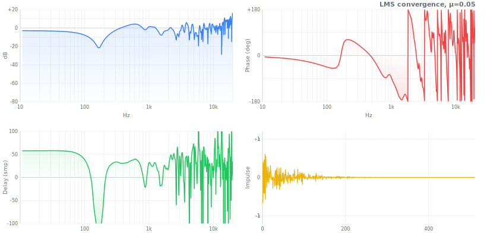

### `nlms(input, desired, params)`

Normalized LMS – step size adapts to input power. The practical default. Params: `order`, `mu` (0–2), `eps`.

$\mathbf{w}[n+1] = \mathbf{w}[n] + \mu\,e[n]\,\mathbf{x}[n] / (\mathbf{x}^T\mathbf{x} + \varepsilon)$. Convergence: $0 < \mu < 2$ regardless of input level.

**O(N)/sample · medium convergence · robust**

```js
nlms(farEnd, microphone, { order: 512, mu: 0.5 })
// params.error = cleaned signal
```

**Use when**: echo cancellation, noise cancellation, system identification. Start here.<br>
**Not for**: fastest convergence (use rls).

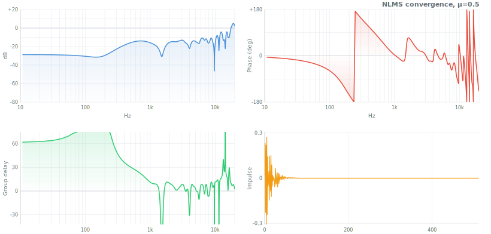

### `rls(input, desired, params)`

Recursive Least Squares – fastest convergence (~2N samples) via inverse correlation matrix. Params: `order`, `lambda`, `delta`.

**O(N²)/sample · fast convergence · fragile if lambda wrong · use for N ≤ 64**

```js
rls(input, desired, { order: 32, lambda: 0.99, delta: 100 })
```

**Use when**: fast-changing systems, short filters.<br>
**Not for**: N > 128 (O(N²) too expensive), robustness matters (use nlms).

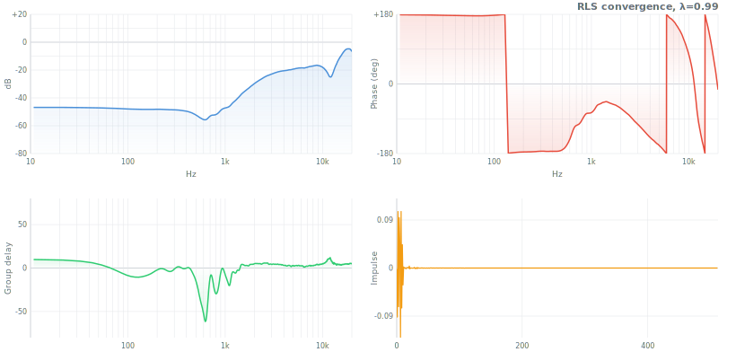

### `levinson(R, order?)`

Levinson-Durbin recursion – takes autocorrelation values, returns LPC prediction coefficients. The standard way to compute linear prediction for speech, spectral estimation, and lattice filter coefficients. Returns `{ a, error, k }` (prediction coefficients, prediction error power, reflection coefficients).

**O(N²)/block · batch (not real-time)**

```js
// Compute autocorrelation of a speech frame, then solve for LPC coefficients
let R = new Float64Array(13)
for (let lag = 0; lag < 13; lag++)
  for (let i = 0; i < frame.length - lag; i++)
    R[lag] += frame[i] * frame[i + lag]

let { a, error, k } = levinson(R, 12)
// a = prediction coefficients, k = reflection coefficients for lattice
```

**Use when**: LPC analysis, speech coding (CELP, LPC-10), AR spectral estimation.<br>
**Not for**: real-time sample-by-sample adaptation (use nlms/rls).

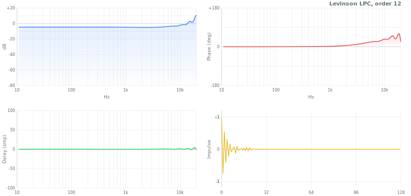


## Multirate

Change sample rates without aliasing. Anti-alias before decimating, anti-image after interpolating.

### `decimate(data, factor, opts?)`

Anti-alias FIR lowpass + downsample by factor M. Returns shorter `Float64Array`.

```js
let down = decimate(data, 4)
```

**Use when**: reducing sample rate, downsampling for analysis.<br>
**scipy**: `scipy.signal.decimate`. **MATLAB**: `decimate`.

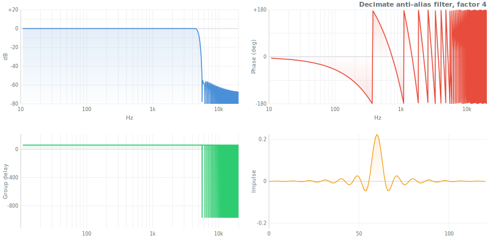

### `interpolate(data, factor, opts?)`

Upsample by factor L + anti-image FIR lowpass. Returns longer `Float64Array`.

```js
let up = interpolate(data, 4)
```

**Use when**: increasing sample rate, upsampling before nonlinear processing.<br>
**scipy**: `scipy.signal.resample_poly`. **MATLAB**: `interp`.

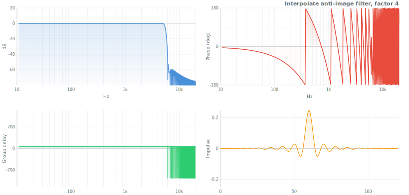

### `halfBand(numtaps?)`

Half-band FIR – nearly half the coefficients are zero, halving multiply count. The building block for efficient 2× rate changes.

```js
let h = halfBand(31)
```

**Use when**: efficient 2× decimation/interpolation. Cascade for 4×, 8×.

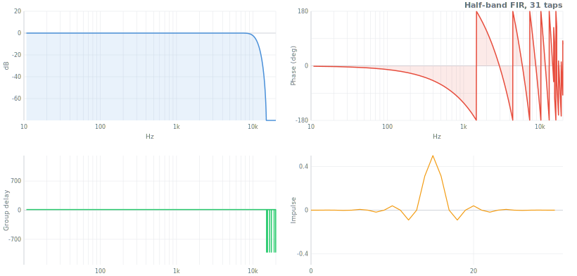

### `cic(data, R, N?)`

Cascaded Integrator-Comb – multiplier-free decimation. Only additions and subtractions.

$H(z) = ((1 - z^{-RM})/(1 - z^{-1}))^N$

**Multiplier-free · sinc-shaped passband droop**

```js
let down = cic(data, 8, 3)
```

**Use when**: high decimation ratios (10×–1000×), hardware/FPGA, SDR.

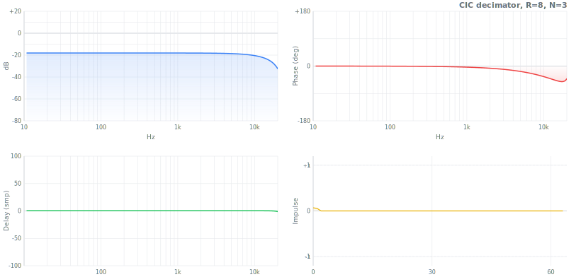

### `polyphase(h, M)`

Decompose FIR into M polyphase components. Compute only the output samples you keep. Returns `Array<Float64Array>`.

```js
let phases = polyphase(firCoefs, 4)
```

**Use when**: efficient multirate filtering.

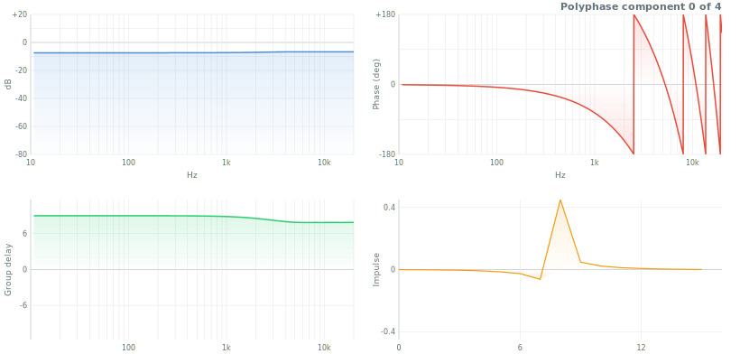

### `farrow(data, params)`

Fractional delay via polynomial interpolation. Delay can change every sample. Params: `delay`, `order`.

```js
farrow(data, { delay: 3.7, order: 3 })
```

**Use when**: pitch shifting, variable-rate resampling, time-stretching.<br>
**Not for**: fixed delay (use thiran – allpass, preserves all frequencies).

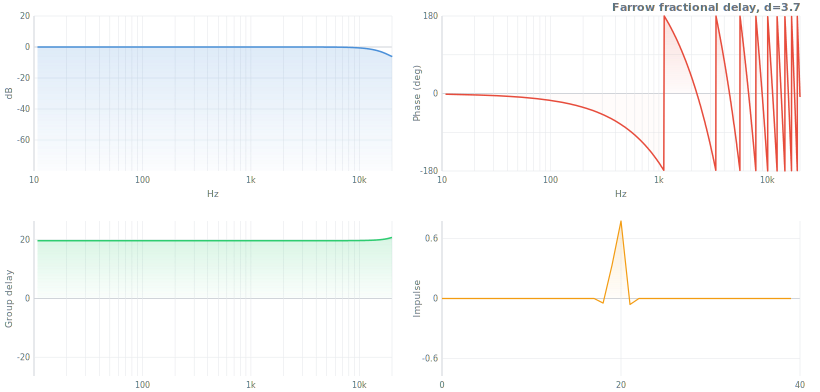

### `thiran(delay, order?)`

Allpass fractional delay – unity magnitude, maximally flat group delay. Returns `{ b, a }`.

```js
let { b, a } = thiran(3.7)
```

**Use when**: physical modeling synthesis (waveguide strings, tubes).<br>
**Not for**: variable delay per sample (use farrow).

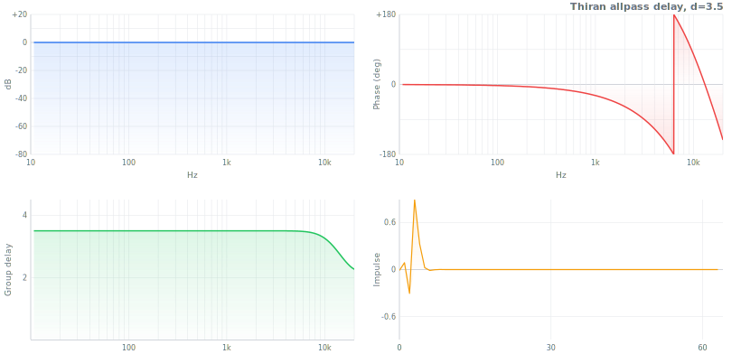

### `oversample(data, factor, opts?)`

Multi-stage upsampling with anti-alias FIR. Oversample before nonlinear processing, then decimate back.

```js
let up = oversample(data, 4)
```

**Use when**: oversampling before distortion/waveshaping/saturation.

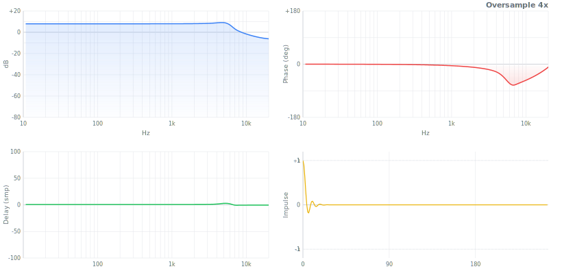


## Core

Apply coefficients, analyze responses, convert formats.

### `filter(data, params)`

Applies SOS coefficients to data in-place. Direct Form II Transposed. State persists between calls. Params: `coefs`.

$y[n] = b_0 x[n] + b_1 x[n-1] + b_2 x[n-2] - a_1 y[n-1] - a_2 y[n-2]$

```js
let sos = butterworth(4, 1000, 44100)
let params = { coefs: sos }
filter(block1, params)   // state preserved
filter(block2, params)   // seamless
```

### `filtfilt(data, params)`

Zero-phase forward-backward filtering. Doubles effective order, eliminates phase distortion. Offline only. Params: `coefs`.

```js
filtfilt(data, { coefs: butterworth(4, 1000, 44100) })
```

### `convolution(signal, ir)`

Direct convolution. Returns `Float64Array` of length N + M – 1.

$(f * g)[n] = \sum_k f[k]\,g[n-k]$

```js
let out = convolution(signal, firCoefs)
```

### `freqz(coefs, n?, fs?)` · `mag2db(mag)`

Frequency response of SOS filter. Returns `{ frequencies, magnitude, phase }`.

```js
let { frequencies, magnitude, phase } = freqz(sos, 512, 44100)
let dB = mag2db(magnitude)  // 20·log10(mag)
```

### `groupDelay(coefs, n?, fs?)` · `phaseDelay(coefs, n?, fs?)`

$\tau_g = -d\phi/d\omega$ (group delay), $\tau_p = -\phi/\omega$ (phase delay). Returns `{ frequencies, delay }`.

```js
let { frequencies, delay } = groupDelay(sos, 512, 44100)
```

### `impulseResponse(coefs, N?)` · `stepResponse(coefs, N?)`

Time-domain analysis. Returns `Float64Array`.

```js
let ir = impulseResponse(sos, 256)
let step = stepResponse(sos, 256)
```

### `isStable(sos)` · `isMinPhase(sos)` · `isFir(sos)` · `isLinPhase(h)`

Filter property tests.

```js
isStable(sos)     // all poles inside unit circle?
isMinPhase(sos)   // all zeros inside unit circle?
isFir(sos)        // a1=a2=0 (no feedback)?
isLinPhase(h)     // symmetric/antisymmetric coefficients?
```

### `sos2zpk(sos)` · `sos2tf(sos)` · `tf2zpk(b, a)` · `zpk2sos(zpk)`

Format conversion between SOS, zeros/poles/gain, and transfer function polynomials.

```js
let { zeros, poles, gain } = sos2zpk(sos)
let { b, a } = sos2tf(sos)
let zpk = tf2zpk(b, a)
let sos2 = zpk2sos(zpk)
```

### `transform`

Analog prototype → digital SOS pipeline. Used internally by IIR design functions.

```js
transform.polesSos(poles, fc, fs, 'lowpass')
transform.poleZerosSos(poles, zeros, fc, fs, 'bandpass')
transform.prewarp(fc, fs)  // bilinear frequency prewarping
```


## FAQ

**What does the dB scale mean?** $\text{dB} = 20\log_{10}(\text{ratio})$. 0 dB = unchanged, –3 dB = half power, –6 dB = half amplitude, –20 dB = 10%, –60 dB = 0.1%.

**When does phase matter?** When waveform shape must be preserved: crossovers (drivers must sum correctly), biomedical (ECG/EEG morphology), communications (intersymbol interference). For EQ, phase is usually inaudible.

**What is the bilinear transform?** Maps analog prototypes to digital: $s = (2/T)(z-1)/(z+1)$. All IIR design functions prewarp automatically – the cutoff you specify is the cutoff you get.

**When can a filter become unstable?** When poles move outside the unit circle. Causes: coefficient quantization (use SOS, not direct form), Q approaching 0, feedback gain too high. Check with `isStable(sos)`. FIR is always stable.

**What is aliasing?** Frequencies above $f_s/2$ (Nyquist) fold back as artifacts. `decimate` and `interpolate` handle anti-aliasing automatically.


## Choosing a filter

| I need to… | Use | Notes |
|---|---|---|
| Remove frequencies above/below a cutoff | `butterworth(N, fc, fs)` | Default, flat passband |
| Sharpest possible cutoff | `elliptic(N, fc, fs, rp, rs)` | Minimum order for specs |
| Sharp, passband ripple OK | `chebyshev(N, fc, fs, ripple)` | Steeper than Butterworth |
| Sharp, no ripple anywhere | `legendre(N, fc, fs)` | Between Butterworth and Chebyshev |
| Auto-select family + order | `iirdesign(fpass, fstop, rp, rs, fs)` | From specs |
| Notch out one frequency | `biquad.notch(fc, Q, fs)` | Q=30 for narrow null |
| Boost/cut a band | `biquad.peaking(fc, Q, fs, dB)` | Parametric EQ |
| Split into bands | `linkwitzRiley(4, fc, fs)` | LP+HP sum to flat |
| No ringing/overshoot | `bessel(N, fc, fs)` | Flat group delay |
| No phase distortion | `filtfilt(data, {coefs})` | Zero-phase, offline |
| Smooth a signal | `onePole(data, {fc, fs})` | Simplest |
| Smooth, preserve peaks | `savitzkyGolay(data, {windowSize, degree})` | Polynomial fit |
| Reduce sensor jitter | `oneEuro(data, params)` | Adaptive |
| Cancel echo/noise | `nlms(input, desired, params)` | Start here |
| Quick FIR | `firwin(N, fc, fs, {type})` | Window method |
| Sharp FIR | `remez(N, bands, desired)` | Parks-McClellan |
| Downsample | `decimate(data, factor)` | Anti-alias included |
| Upsample | `interpolate(data, factor)` | Anti-image included |

### IIR family decision tree

```
Linear phase needed?
├── Yes → FIR or filtfilt (offline)
└── No
    Waveform must be preserved?
    ├── Yes → bessel
    └── No
        Passband ripple OK?
        ├── Yes
        │   ├── Stopband ripple also OK? → elliptic
        │   └── Stopband monotonic → chebyshev
        └── No (passband must be flat)
            ├── Stopband ripple OK? → chebyshev2
            └── No ripple anywhere?
                ├── Steepest monotonic? → legendre
                └── Default → butterworth
```


## Recipes

### Hum removal

```js
for (let f of [60, 120, 180]) filter(data, { coefs: biquad.notch(f, 30, 44100) })
```

### Echo cancellation

```js
let params = { order: 512, mu: 0.5 }
nlms(farEnd, microphone, params)
// params.error = cleaned signal
```

### ECG filtering

```js
filter(data, { coefs: butterworth(2, 0.5, 500, 'highpass') })  // baseline wander
filter(data, { coefs: butterworth(4, 40, 500) })                 // noise
filter(data, { coefs: biquad.notch(50, 35, 500) })               // powerline
```

### Pulse shaping

```js
let htx = raisedCosine(101, 0.35, 8, { root: true })
let shaped = convolution(symbols, htx)
```


## Pitfalls

- **FIR when IIR suffices** – Butterworth order 4: 10 multiplies. Equivalent FIR: 100+.
- **High order when elliptic works** – elliptic 4 ≈ Butterworth 12. Use `iirdesign`.
- **Forgetting SOS** – never use high-order direct form. This library returns SOS by default.
- **filtfilt in real-time** – needs entire signal for backward pass.
- **LP+HP for crossover** – doesn't sum flat. Use `linkwitzRiley`.
- **Q too high** – Q > 10 creates tall resonance. For EQ: 0.5–8.
- **In-place** – `filter()` modifies data. Copy first: `Float64Array.from(data)`.
- **Stale state** – state persists in params. New signal → new params.


## Plot generation

Generate 4-panel SVG plots (magnitude, phase, group delay, impulse response) for any filter. Used internally for this readme's illustrations; available for downstream packages like [audio-filter](https://github.com/audiojs/audio-filter).

```js
import { plotFilter, plotFir, plotCompare, theme } from 'digital-filter/plot'
import { writeFileSync } from 'node:fs'

// SOS filter → SVG string
writeFileSync('my-filter.svg', plotFilter(sos, 'Butterworth order 4, fc=1kHz'))

// Impulse response → SVG string
writeFileSync('my-fir.svg', plotFir(h, 'firwin lowpass, 63 taps'))

// Compare multiple filters overlaid
writeFileSync('comparison.svg', plotCompare([
  ['Butterworth', butterworth(4, 1000, 44100)],
  ['Chebyshev', chebyshev(4, 1000, 44100, 1)],
], 'IIR comparison, fc=1kHz'))
```

**`plotFilter(sos, title?, opts?)`** – SOS (biquad cascade) → 4-panel SVG.
**`plotFir(h, title?, opts?)`** – impulse response array → 4-panel SVG.
**`plotCompare(filters, title?, opts?)`** – multiple SOS overlaid → 4-panel SVG. `filters`: array of `[name, sos]` or `[name, sos, color]`.

Options: `{ fs, bins, color, fill }`. Defaults from `theme`.

**`theme`** – mutable object controlling defaults:

```js
theme.colors = ['#4a90d9', '#e74c3c', '#2ecc71', ...]  // per-panel or per-series
theme.fill = true      // fill under curves
theme.fs = 44100
theme.bins = 2048      // FFT bins
theme.grid = '#e5e7eb' // grid line color
theme.axis = '#d1d5db' // axis color
theme.text = '#6b7280' // label color
```

Regenerate all plots: `npm run plot`

## See also

- **[audio-filter](https://github.com/audiojs/audio-filter)** – weighting, EQ, synthesis, measurement, effects
- **[window-function](https://github.com/scijs/window-function)** – 34 window functions
