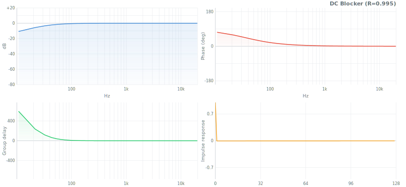
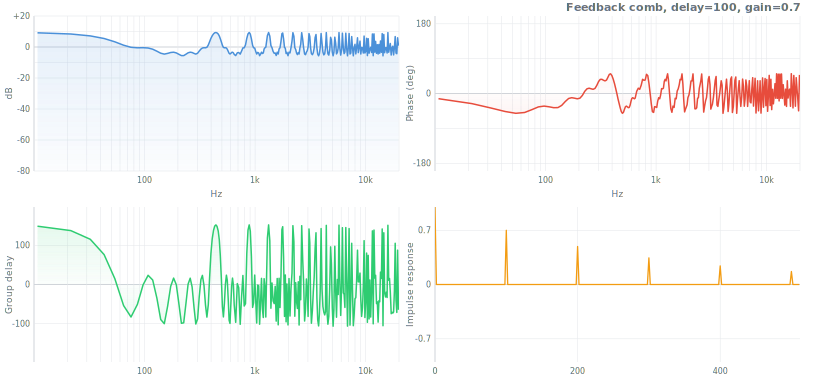
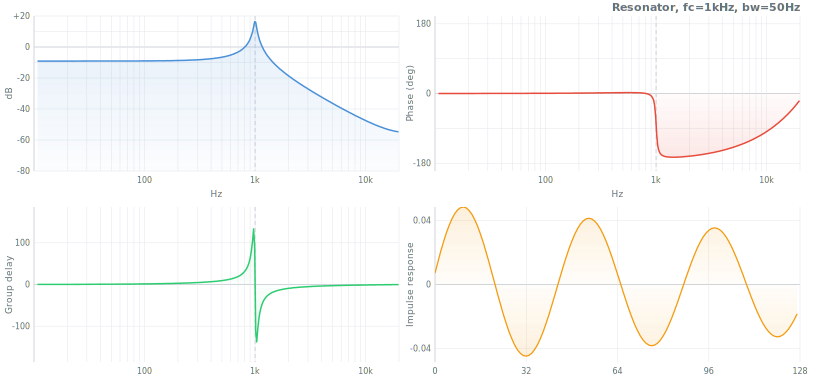
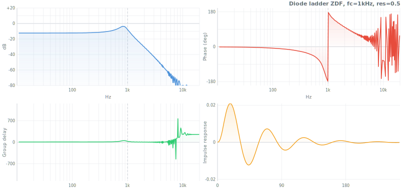
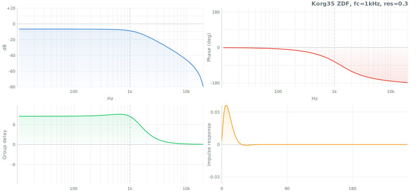
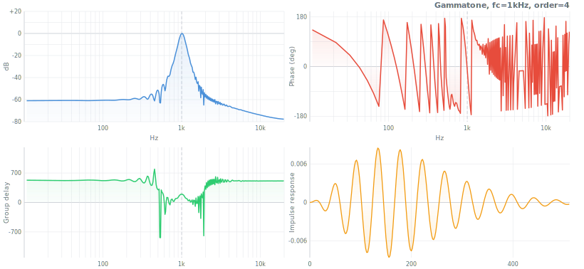
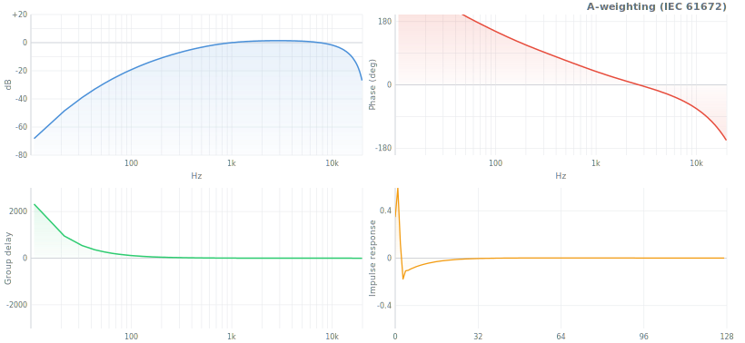
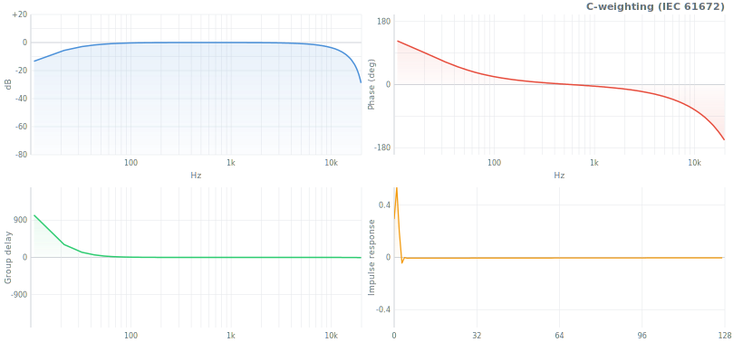
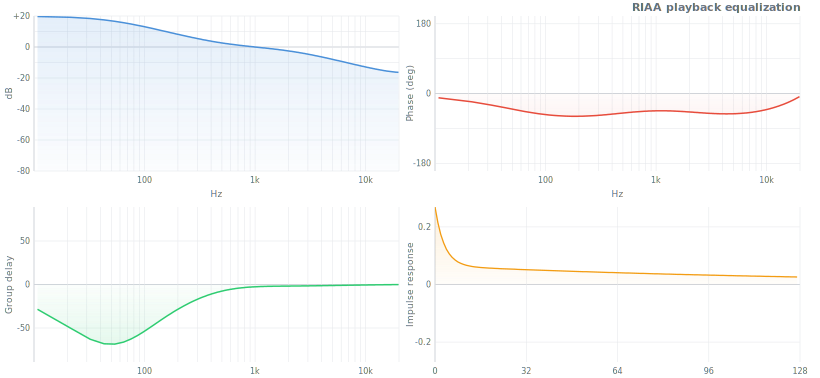

# Filter Reference

API reference for every export in `digital-filter`. Ctrl+F searchable.

For educational guides, comparisons, and decision aids, see the README in each module folder.

## Contents

- [IIR Design](#iir-design) — butterworth, chebyshev, chebyshev2, elliptic, bessel, legendre, iirdesign
- [Biquad](#biquad) — lowpass, highpass, bandpass, notch, allpass, peaking, lowshelf, highshelf
- [FIR Design](#fir-design) — firwin, firwin2, firls, remez, kaiserord, hilbert, differentiator, integrator, raisedCosine, gaussianFir, matchedFilter, yulewalk, minimumPhase
- [Simple Filters](#simple-filters) — onePole, movingAverage, leakyIntegrator, dcBlocker, comb, allpass, emphasis/deemphasis, resonator, envelope, slewLimiter, median
- [Specialized](#specialized) — svf, linkwitzRiley, savitzkyGolay, filtfilt, gaussianIir
- [Virtual Analog](#virtual-analog) — moogLadder, diodeLadder, korg35
- [Psychoacoustic](#psychoacoustic) — gammatone, octaveBank, erbBank, barkBank
- [Adaptive](#adaptive) — lms, nlms, rls, levinson
- [Dynamic](#dynamic) — noiseShaping, pinkNoise, oneEuro, dynamicSmoothing, spectralTilt, variableBandwidth
- [Multirate](#multirate) — decimate, interpolate, halfBand, cic, polyphase, farrow, thiran, oversample
- [Composites](#composites) — graphicEq, parametricEq, crossover, crossfeed, formant, vocoder
- [Structures](#structures) — lattice, warpedFir, convolution
- [Analysis & Conversion](#analysis--conversion) — freqz, mag2db, groupDelay, phaseDelay, impulseResponse, stepResponse, isStable, isMinPhase, isFir, isLinPhase, sos2zpk, sos2tf, tf2zpk, zpk2sos
- [Core](#core) — filter, transform, window
- [Weighting](#weighting) — aWeighting, cWeighting, kWeighting, itu468, riaa

# IIR Design

All IIR design functions return SOS (second-order sections): $H(z) = \prod_k \frac{b_0 + b_1 z^{-1} + b_2 z^{-2}}{1 + a_1 z^{-1} + a_2 z^{-2}}$

Common params: `fs` (default 44100), `type` = `'lowpass'` | `'highpass'` | `'bandpass'` | `'bandstop'`. Array `[fLow, fHigh]` for BP/BS.

## butterworth

Maximally flat magnitude response. No ripple. Butterworth (1930).

`butterworth(order, fc, fs, type?)` -> SOS[]


| Param | Type | Default | Description |
|---|---|---|---|
| order | number | -- | Filter order (1-10). Slope = -6N dB/oct. |
| fc | number | -- | Cutoff Hz (-3 dB) |

$$|H(j\omega)|^2 = \frac{1}{1 + (\omega/\omega_c)^{2N}}$$

```js
let sos = butterworth(4, 1000, 44100)
filter(data, { coefs: sos })
```

## chebyshev

Chebyshev Type I. Trades passband ripple for steeper cutoff. Chebyshev (1854).

`chebyshev(order, fc, fs, ripple?, type?)` -> SOS[]


| Param | Type | Default | Description |
|---|---|---|---|
| order | number | -- | Filter order |
| fc | number | -- | Passband edge Hz (NOT -3 dB point) |
| ripple | number | 1 | Max passband ripple dB |

$$|H(j\omega)|^2 = \frac{1}{1 + \varepsilon^2 T_N^2(\omega/\omega_c)}$$

where $T_N$ is the Nth Chebyshev polynomial and $\varepsilon = \sqrt{10^{R_p/10} - 1}$.

```js
let sos = chebyshev(4, 1000, 44100, 1)
filter(data, { coefs: sos })
```

## chebyshev2

Chebyshev Type II (inverse Chebyshev). Flat passband, equiripple stopband with controllable floor.

`chebyshev2(order, fc, fs, attenuation?, type?)` -> SOS[]


| Param | Type | Default | Description |
|---|---|---|---|
| order | number | -- | Filter order |
| fc | number | -- | Stopband edge Hz (NOT passband edge) |
| attenuation | number | 40 | Minimum stopband rejection dB |

$$|H(j\omega)|^2 = \frac{1}{1 + \frac{1}{\varepsilon^2 T_N^2(\omega_c/\omega)}}$$

where $\varepsilon = 1/\sqrt{10^{R_s/10} - 1}$.

```js
let sos = chebyshev2(4, 1000, 44100, 40)
filter(data, { coefs: sos })
```

## elliptic

Elliptic (Cauer) filter. Sharpest possible transition for a given order. Ripple in both bands. Cauer (1958).

`elliptic(order, fc, fs, ripple?, attenuation?, type?)` -> SOS[]


| Param | Type | Default | Description |
|---|---|---|---|
| order | number | -- | Filter order |
| fc | number | -- | Cutoff Hz |
| ripple | number | 1 | Max passband ripple dB |
| attenuation | number | 40 | Min stopband rejection dB |

$$|H(j\omega)|^2 = \frac{1}{1 + \varepsilon^2 R_N^2(\omega/\omega_c)}$$

where $R_N$ is a rational Chebyshev (Jacobi elliptic) function, $\varepsilon = \sqrt{10^{R_p/10} - 1}$.

```js
let sos = elliptic(4, 1000, 44100, 1, 40)
filter(data, { coefs: sos })
```

## bessel

Maximally flat group delay. Preserves waveform shape. Thomson (1949).

`bessel(order, fc, fs, type?)` -> SOS[]


| Param | Type | Default | Description |
|---|---|---|---|
| order | number | -- | Filter order (1-10) |
| fc | number | -- | Cutoff Hz (-3 dB point) |

$$H(s) = \frac{\theta_N(0)}{\theta_N(s/\omega_c)}$$

where $\theta_N(s)$ is the Nth-order reverse Bessel polynomial.

```js
let sos = bessel(4, 1000, 44100)
filter(data, { coefs: sos })
```

## legendre

Steepest monotonic (ripple-free) response. Papoulis (1958), Bond (2004).

`legendre(order, fc, fs, type?)` -> SOS[]


| Param | Type | Default | Description |
|---|---|---|---|
| order | number | -- | Filter order (1-8) |
| fc | number | -- | Cutoff Hz (-3 dB) |

$$|H(j\omega)|^2 = 1 - P_N\!\left(1 - 2(\omega/\omega_c)^2\right)$$

where $P_N$ is an optimized Legendre polynomial.

```js
let sos = legendre(4, 1000, 44100)
filter(data, { coefs: sos })
```

## iirdesign

Auto-design: picks optimal IIR family and order from passband/stopband specs.

`iirdesign(fpass, fstop, rp?, rs?, fs?)` -> `{ sos, order, type }`

| Param | Type | Default | Description |
|---|---|---|---|
| fpass | number | -- | Passband edge Hz |
| fstop | number | -- | Stopband edge Hz |
| rp | number | 1 | Max passband ripple dB |
| rs | number | 40 | Min stopband attenuation dB |
| fs | number | 44100 | Sample rate Hz |

```js
let { sos, order, type } = iirdesign(1000, 1500, 1, 40, 44100)
filter(data, { coefs: sos })
```

# Biquad

Second-order IIR filter. RBJ Audio EQ Cookbook formulas.


All biquad functions: `biquad.type(fc, Q, fs, dBgain?)` -> `{b0, b1, b2, a1, a2}`

| Function | Description |
|---|---|
| `biquad.lowpass(fc, Q, fs)` | -12 dB/oct lowpass |
| `biquad.highpass(fc, Q, fs)` | -12 dB/oct highpass |
| `biquad.bandpass(fc, Q, fs)` | Constant-peak bandpass |
| `biquad.bandpass2(fc, Q, fs)` | Constant-skirt bandpass |
| `biquad.notch(fc, Q, fs)` | Band rejection |
| `biquad.allpass(fc, Q, fs)` | Phase shift, unity magnitude |
| `biquad.peaking(fc, Q, fs, dBgain)` | Parametric EQ bell |
| `biquad.lowshelf(fc, Q, fs, dBgain)` | Shelf boost/cut below fc |
| `biquad.highshelf(fc, Q, fs, dBgain)` | Shelf boost/cut above fc |

RBJ intermediates: $\omega_0 = 2\pi f_c / f_s$, $\alpha = \sin(\omega_0)/(2Q)$.

Lowpass: $b_0 = \frac{1 - \cos(\omega_0)}{2}$, $b_1 = 1 - \cos(\omega_0)$, $b_2 = b_0$, $a_0 = 1 + \alpha$, $a_1 = -2\cos(\omega_0)$, $a_2 = 1 - \alpha$. All divided by $a_0$.

```js
let coefs = biquad.lowpass(2000, 0.707, 44100)
filter(data, { coefs })
let eq = biquad.peaking(1000, 2, 44100, 6) // +6dB at 1kHz
```

# FIR Design

## firwin

Window method FIR design. Truncated sinc with window function.

`firwin(numtaps, cutoff, fs, opts?)` -> Float64Array


| Param | Type | Default | Description |
|---|---|---|---|
| numtaps | number | -- | Filter length (odd, >=3) |
| cutoff | number or [number, number] | -- | Cutoff Hz. Array for bandpass/bandstop. |
| fs | number | 44100 | Sample rate Hz |
| opts.type | string | `'lowpass'` | `'lowpass'` `'highpass'` `'bandpass'` `'bandstop'` |
| opts.window | string or Float64Array | `'hamming'` | Window function name or custom array |

$$h_{\text{ideal}}[n] = \frac{\sin(\omega_c n)}{\pi n}, \quad h_{\text{ideal}}[0] = \frac{\omega_c}{\pi}$$

Window method: $h[n] = h_{\text{ideal}}[n - M] \cdot w[n]$ where M = (numtaps-1)/2.

```js
let h = firwin(101, 4000, 44100)
let out = convolution(signal, h)
```

## firwin2

Arbitrary frequency response via frequency sampling. Draw any magnitude curve.

`firwin2(numtaps, freq, gain, opts?)` -> Float64Array

| Param | Type | Default | Description |
|---|---|---|---|
| numtaps | number | -- | Filter length (odd, >=3) |
| freq | Array | -- | Normalized frequency breakpoints [0...1] (1=Nyquist). Must start at 0, end at 1. |
| gain | Array | -- | Desired gain at each frequency point |
| opts.window | string | `'hamming'` | Window function |
| opts.nfft | number | 1024 | FFT size for interpolation |

```js
let h = firwin2(201, [0, 0.1, 0.2, 0.4, 0.5, 1], [0, 0, 1, 1, 0, 0])
```

## firls

Least-squares optimal FIR. Minimizes total squared error between actual and desired response.

`firls(numtaps, bands, desired, weight?)` -> Float64Array


| Param | Type | Default | Description |
|---|---|---|---|
| numtaps | number | -- | Filter length (odd, >=3) |
| bands | Array | -- | Band edges as fractions of Nyquist [0-1], in pairs |
| desired | Array | -- | Desired gain at each band edge (piecewise linear) |
| weight | Array | all 1s | Weight per band. Higher = tighter fit. |

```js
let h = firls(51, [0, 0.3, 0.4, 1], [1, 1, 0, 0])
```

## remez

Parks-McClellan equiripple. Optimal minimax FIR -- narrowest transition for given length.

`remez(numtaps, bands, desired, weight?, maxiter?)` -> Float64Array


| Param | Type | Default | Description |
|---|---|---|---|
| numtaps | number | -- | Filter length (odd, >=3) |
| bands | Array | -- | Band edges as fractions of Nyquist [0-1] |
| desired | Array | -- | Desired gain at each band edge |
| weight | Array | all 1s | Relative importance per band |
| maxiter | number | 40 | Maximum Remez iterations |

$$\min \max_\omega \left| W(\omega) \cdot (H(\omega) - D(\omega)) \right|$$

$$\mathbf{Bellanger:}\quad N \approx \frac{-\frac{2}{3}\log_{10}(10\,\delta_p\,\delta_s)}{\Delta f}$$

$$\mathbf{Kaiser:}\quad N \approx \frac{-20\log_{10}\!\left(\sqrt{\delta_p\,\delta_s}\right) - 13}{14.6\,\Delta f}$$

```js
let h = remez(51, [0, 0.3, 0.4, 1], [1, 1, 0, 0], [1, 10])
```

## kaiserord

Estimate Kaiser window FIR length and beta from specifications.

`kaiserord(deltaF, attenuation)` -> `{ numtaps, beta }` -- deltaF: transition BW as fraction of Nyquist, attenuation: stopband dB

## hilbert

FIR Hilbert transformer. 90-degree phase shift, unity magnitude.

$$h[n] = \begin{cases} \frac{2}{\pi n} & n \text{ odd} \\ 0 & n \text{ even} \end{cases}$$

`hilbert(N, opts?)` -> Float64Array


| Param | Type | Default | Description |
|---|---|---|---|
| N | number | -- | Filter length (odd, >=3) |
| opts.window | Float64Array or function | Hamming | Window function |

```js
let h = hilbert(65)
let imag = convolution(signal, h)
```

## differentiator

FIR derivative filter. Computes discrete derivative with noise immunity.

$$h[n] = \frac{(-1)^n}{n} \cdot w[n], \quad n \neq 0$$

`differentiator(N, opts?)` -> Float64Array


| Param | Type | Default | Description |
|---|---|---|---|
| N | number | -- | Filter length (odd, >=3) |
| opts.window | string | `'hamming'` | Window function |
| opts.fs | number | -- | If provided, scales output to units/second |

```js
let h = differentiator(31, { fs: 44100 })
let deriv = convolution(signal, h)
```

## integrator

FIR integrator via Newton-Cotes quadrature.

`integrator(rule='trapezoidal')` -> Float64Array -- `'rectangular'` `'trapezoidal'` `'simpson'` `'simpson38'`

## raisedCosine

Pulse shaping for digital communications. Satisfies Nyquist ISI criterion.

$$h(t) = \operatorname{sinc}\!\left(\frac{t}{T}\right) \frac{\cos(\pi\beta t/T)}{1 - (2\beta t/T)^2}$$

`raisedCosine(N, beta?, sps?, opts?)` -> Float64Array


| Param | Type | Default | Description |
|---|---|---|---|
| N | number | -- | Filter length (odd) |
| beta | number | 0.35 | Roll-off factor (0=sinc, 1=widest) |
| sps | number | 4 | Samples per symbol |
| opts.root | boolean | false | Root-raised cosine if true |

```js
let rrc = raisedCosine(65, 0.35, 4, { root: true })
```

## gaussianFir

Gaussian pulse shaping (GMSK, Bluetooth). $h(t) = \frac{\sqrt{2\pi}\,BT}{T} \exp\!\left(-\frac{2\pi^2 (BT)^2 t^2}{T^2}\right)$

`gaussianFir(N, bt=0.3, sps=4)` -> Float64Array

## matchedFilter

Optimal detector for known signal in white Gaussian noise. Time-reversed, energy-normalized template.

`matchedFilter(template)` -> Float64Array -- `let corr = convolution(received, matchedFilter(chirp))`

## yulewalk

IIR design matching arbitrary frequency response via Yule-Walker method.

`yulewalk(order, frequencies, magnitudes)` -> `{ b, a }` -- frequencies/magnitudes: [0-1] breakpoints (1=Nyquist)

```js
let { b, a } = yulewalk(8, [0, 0.2, 0.3, 0.5, 1], [1, 1, 0, 0, 0])
```

## minimumPhase

Converts linear-phase FIR to minimum-phase FIR. Same magnitude, near-zero latency. Cepstral method.

`minimumPhase(h)` -> Float64Array -- `let minph = minimumPhase(firwin(101, 4000, 44100))`

# Simple Filters

## onePole

One-pole lowpass (exponential moving average). $y[n] = (1-a)\,x[n] + a\,y[n\!-\!1]$, where $a = e^{-2\pi f_c / f_s}$.

`onePole(data, params)` -> data (in-place)


| Param | Type | Default | Description |
|---|---|---|---|
| params.fc | number | -- | Cutoff frequency Hz (used to compute `a`) |
| params.a | number | auto | Pole coefficient. Auto-computed from fc/fs if omitted. |
| params.fs | number | 44100 | Sample rate Hz |

```js
onePole(data, { fc: 1000, fs: 44100 })
```

## movingAverage

Simple moving average. Replaces each sample with mean of last N samples.

`movingAverage(data, { memory })` -> data (in-place) -- memory: window size (default 8)

## leakyIntegrator

$y[n] = \lambda\,y[n\!-\!1] + (1-\lambda)\,x[n]$.

`leakyIntegrator(data, { lambda })` -> data (in-place) -- lambda: decay factor 0-1 (default 0.95)

## dcBlocker

Removes DC offset. $H(z) = (1 - z^{-1}) / (1 - Rz^{-1})$.

`dcBlocker(data, { R })` -> data (in-place) -- R: pole radius (default 0.995)



## comb

Comb filter. Feedforward: $H(z) = 1 + g\,z^{-M}$, Feedback: $H(z) = 1/(1 - g\,z^{-M})$.

`comb(data, params)` -> data (in-place)



| Param | Type | Default | Description |
|---|---|---|---|
| params.delay | number | -- | Delay in samples (M) |
| params.gain | number | 0.5 | Feedforward/feedback gain |
| params.type | string | `'feedforward'` | `'feedforward'` or `'feedback'` |

```js
comb(data, { delay: 441, gain: 0.5, type: 'feedback' })
```

## allpass

Allpass filter. Unity magnitude, frequency-dependent phase shift.

`allpass.first(data, params)` -> data (in-place) -- $H(z) = (a + z^{-1})/(1 + a\,z^{-1})$

`allpass.second(data, params)` -> data (in-place) -- Second-order via biquad

| Param | Type | Default | Description |
|---|---|---|---|
| params.a | number | -- | First-order coefficient |
| params.fc | number | -- | Center frequency Hz (second-order) |
| params.Q | number | 0.707 | Quality factor (second-order) |
| params.fs | number | 44100 | Sample rate Hz |

```js
allpass.first(data, { a: 0.5 })
allpass.second(data, { fc: 1000, Q: 2, fs: 44100 })
```

## emphasis / deemphasis

Pre-emphasis: $H(z) = 1 - \alpha z^{-1}$. De-emphasis: $H(z) = 1/(1 - \alpha z^{-1})$.

`emphasis(data, { alpha })` / `deemphasis(data, { alpha })` -> data (in-place) -- alpha: coefficient 0-1 (default 0.97)

## resonator

Constant-peak-gain resonator. Peak gain stays constant regardless of Q.

`resonator(data, params)` -> data (in-place)



| Param | Type | Default | Description |
|---|---|---|---|
| params.fc | number | -- | Center frequency Hz |
| params.bw | number | 50 | Bandwidth Hz |
| params.fs | number | 44100 | Sample rate Hz |

```js
resonator(data, { fc: 440, bw: 30, fs: 44100 })
```

## envelope

Attack/release envelope follower. Rectifies + asymmetric smoothing.

`envelope(data, params)` -> data (in-place)

| Param | Type | Default | Description |
|---|---|---|---|
| params.attack | number | 0.001 | Attack time in seconds |
| params.release | number | 0.05 | Release time in seconds |
| params.fs | number | 44100 | Sample rate Hz |

```js
envelope(data, { attack: 0.001, release: 0.05, fs: 44100 })
```

## slewLimiter

Rate-of-change limiter. Clips the derivative. Nonlinear.

`slewLimiter(data, params)` -> data (in-place)

| Param | Type | Default | Description |
|---|---|---|---|
| params.rise | number | 1000 | Max rise rate (units/second) |
| params.fall | number | 1000 | Max fall rate (units/second) |
| params.fs | number | 44100 | Sample rate Hz |

```js
slewLimiter(data, { rise: 1000, fall: 1000, fs: 44100 })
```

## median

Median filter. Replaces each sample with median of its neighborhood.

`median(data, { size })` -> data (in-place) -- size: window width, odd (default 5)

# Specialized

## svf

State Variable Filter. Trapezoidal integration, stable under real-time parameter modulation. Simper / Cytomic (2013).

`svf(data, params)` -> data (in-place)


| Param | Type | Default | Description |
|---|---|---|---|
| params.fc | number | -- | Cutoff frequency Hz |
| params.Q | number | 0.707 | Quality factor |
| params.fs | number | 44100 | Sample rate Hz |
| params.type | string | `'lowpass'` | `'lowpass'` `'highpass'` `'bandpass'` `'notch'` `'peak'` `'allpass'` |

Coefficients: $g = \tan(\pi f_c / f_s)$, $k = 1/Q$.

$$a_1 = \frac{1}{1 + g(g + k)}, \quad a_2 = g\,a_1, \quad a_3 = g\,a_2$$

Per-sample update:

$$v_3 = v_0 - \text{ic}_{2\text{eq}}$$
$$v_1 = a_1 \cdot \text{ic}_{1\text{eq}} + a_2 \cdot v_3 \quad \text{(bandpass)}$$
$$v_2 = \text{ic}_{2\text{eq}} + a_2 \cdot \text{ic}_{1\text{eq}} + a_3 \cdot v_3 \quad \text{(lowpass)}$$

Six simultaneous outputs: LP $v_2$, HP $v_0 - k\,v_1 - v_2$, BP $v_1$, notch $v_0 - k\,v_1$, peak $v_0 - k\,v_1 - 2v_2$, allpass $v_0 - 2k\,v_1$.

```js
let params = { fc: 1000, Q: 2, fs: 44100, type: 'lowpass' }
svf(data, params)
params.fc = 500 + 1500 * Math.sin(lfo) // modulate safely
svf(nextBlock, params)
```

## linkwitzRiley

Crossover filter. LP + HP sum to flat magnitude. Linkwitz & Riley (1976).

`linkwitzRiley(order, fc, fs)` -> `{ low: SOS[], high: SOS[] }`

| Param | Type | Default | Description |
|---|---|---|---|
| order | number | -- | Even: 2, 4, 6, 8. Slope = -6N dB/oct per band. |
| fc | number | -- | Crossover frequency Hz (-6 dB point) |
| fs | number | 44100 | Sample rate Hz |

```js
let { low, high } = linkwitzRiley(4, 2000, 44100)
filter(Float64Array.from(data), { coefs: low })
filter(Float64Array.from(data), { coefs: high })
```

## savitzkyGolay

Polynomial smoothing / derivative. Fits polynomial to sliding window. Savitzky & Golay (1964).

`savitzkyGolay(data, params)` -> data (in-place)


| Param | Type | Default | Description |
|---|---|---|---|
| params.windowSize | number | 5 | Sliding window width (odd, >=3) |
| params.degree | number | 2 | Polynomial degree (0 = moving average) |
| params.derivative | number | 0 | 0=smoothing, 1=first deriv, 2=second deriv |

```js
savitzkyGolay(data, { windowSize: 11, degree: 2 })
```

## filtfilt

Zero-phase forward-backward filtering. Eliminates phase distortion (offline only). Doubles the filter order.

`filtfilt(data, { coefs })` -> data (in-place) -- `filtfilt(data, { coefs: butterworth(4, 1000, 44100) })`

## gaussianIir

Recursive Gaussian smoothing (Young-van Vliet). O(N) cost regardless of sigma.

`gaussianIir(data, { sigma })` -> data (in-place) -- sigma: std dev in samples (default 5)

# Virtual Analog

## moogLadder

Moog transistor ladder filter. 4-pole -24 dB/oct lowpass with tanh saturation. Moog (1966).

`moogLadder(data, params)` -> data (in-place)


| Param | Type | Default | Description |
|---|---|---|---|
| params.fc | number | 1000 | Cutoff frequency Hz (clamped to 0.45*fs) |
| params.resonance | number | 0 | Resonance 0-1 (1 = self-oscillation) |
| params.fs | number | 44100 | Sample rate Hz |

ZDF trapezoidal integrator: $g = \tan(\pi f_c / f_s)$, $G = g/(1+g)$.

$$S = G^3 s_0 + G^2 s_1 + G\,s_2 + s_3$$
$$u = \frac{\text{input} - k\,S}{1 + k\,G^4}$$
$$u = \tanh(u \cdot \text{drive})$$

Per-stage: $y = G(v - s_j) + s_j, \quad s_j = 2y - s_j$

```js
moogLadder(data, { fc: 400, resonance: 0.7, fs: 44100 })
```

## diodeLadder

Diode ladder filter (TB-303 / EMS VCS3 style). Per-stage tanh saturation. Zavalishin (2012).

`diodeLadder(data, params)` -> data (in-place)



| Param | Type | Default | Description |
|---|---|---|---|
| params.fc | number | 1000 | Cutoff frequency Hz |
| params.resonance | number | 0 | Resonance 0-1 |
| params.fs | number | 44100 | Sample rate Hz |

```js
diodeLadder(data, { fc: 800, resonance: 0.8, fs: 44100 })
```

## korg35

Korg MS-20 style filter. 2-pole with nonlinear feedback. Stilson & Smith (1996), Zavalishin (2012).

`korg35(data, params)` -> data (in-place)



| Param | Type | Default | Description |
|---|---|---|---|
| params.fc | number | 1000 | Cutoff frequency Hz |
| params.resonance | number | 0 | Resonance 0-1 |
| params.fs | number | 44100 | Sample rate Hz |
| params.type | string | `'lowpass'` | `'lowpass'` or `'highpass'` |

```js
korg35(data, { fc: 1500, resonance: 0.6, type: 'lowpass' })
```

# Psychoacoustic

## gammatone

Gammatone auditory filter (cochlear model). Cascade of complex one-pole filters with ERB bandwidth.

`gammatone(data, params)` -> data (in-place)



| Param | Type | Default | Description |
|---|---|---|---|
| params.fc | number | 1000 | Center frequency Hz |
| params.order | number | 4 | Filter order (cascade stages) |
| params.fs | number | 44100 | Sample rate Hz |

```js
gammatone(data, { fc: 1000, order: 4, fs: 44100 })
```

## octaveBank

IEC 61260 fractional-octave filter bank. Standard ISO center frequencies.

`octaveBank(fraction?, fs?, opts?)` -> `[{ fc, coefs }]`

| Param | Type | Default | Description |
|---|---|---|---|
| fraction | number | 3 | Octave fraction (1=octave, 3=third-octave) |
| fs | number | 44100 | Sample rate Hz |
| opts.fmin | number | 31.25 | Minimum center frequency |
| opts.fmax | number | 16000 | Maximum center frequency |

```js
let bands = octaveBank(3, 48000)
bands.forEach(b => filter(Float64Array.from(data), { coefs: b.coefs }))
```

## erbBank

ERB-spaced filter bank. Equivalent Rectangular Bandwidth (human auditory resolution). Glasberg & Moore (1990).

`erbBank(fs?, opts?)` -> `[{ fc, erb, bw }]`

| Param | Type | Default | Description |
|---|---|---|---|
| fs | number | 44100 | Sample rate Hz |
| opts.fmin | number | 50 | Minimum frequency |
| opts.fmax | number | 16000 | Maximum frequency |
| opts.density | number | 1 | Bands per ERB |

```js
let bands = erbBank(44100, { fmin: 100, fmax: 8000 })
```

## barkBank

Bark-scale filter bank. 24 critical bands per Zwicker.

`barkBank(fs=44100, { fmin?, fmax? })` -> `[{ bark, fLow, fHigh, fc, coefs }]`

# Adaptive

## lms

Least Mean Squares adaptive filter. Widrow & Hoff (1960).

`lms(input, desired, params)` -> Float64Array (filtered output)

| Param | Type | Default | Description |
|---|---|---|---|
| input | Float64Array | -- | Input signal |
| desired | Float64Array | -- | Desired (reference) signal, same length |
| params.order | number | 32 | Number of filter taps |
| params.mu | number | 0.01 | Step size. 0 < mu < 2/(N*sigma^2). |

Returns filtered output. `params.error` = error signal. `params.w` updated in place.

$$\mathbf{w}[n+1] = \mathbf{w}[n] + \mu\,e[n]\,\mathbf{x}[n], \quad e[n] = d[n] - \mathbf{w}^T\mathbf{x}[n]$$

Convergence: $0 < \mu < 2/(N\sigma_x^2)$.

```js
let output = lms(speaker, mic, { order: 128, mu: 0.01 })
```

## nlms

Normalized LMS. Self-normalizing step size. Nagumo & Noda (1967).

`nlms(input, desired, params)` -> Float64Array (filtered output)

| Param | Type | Default | Description |
|---|---|---|---|
| input | Float64Array | -- | Input signal |
| desired | Float64Array | -- | Desired (reference) signal |
| params.order | number | 32 | Number of filter taps |
| params.mu | number | 0.5 | Normalized step size (0 < mu < 2) |
| params.eps | number | 1e-8 | Regularization (prevents div by zero) |

Returns filtered output. `params.error` = error signal.

$$\mathbf{w}[n+1] = \mathbf{w}[n] + \frac{\mu\,e[n]\,\mathbf{x}[n]}{\mathbf{x}^T\mathbf{x} + \varepsilon}$$

```js
let output = nlms(speaker, mic, { order: 256, mu: 0.5 })
```

## rls

Recursive Least Squares. Fast convergence (~2N samples). O(N^2) per sample.

`rls(input, desired, params)` -> Float64Array (filtered output)

| Param | Type | Default | Description |
|---|---|---|---|
| input | Float64Array | -- | Input signal |
| desired | Float64Array | -- | Desired (reference) signal |
| params.order | number | 16 | Number of filter taps |
| params.lambda | number | 0.99 | Forgetting factor (0.9-1.0). 1 = no forgetting. |
| params.delta | number | 100 | Initial P matrix scaling |

Returns filtered output. `params.error` = error signal.

```js
let output = rls(speaker, mic, { order: 32, lambda: 0.99 })
```

## levinson

Levinson-Durbin. Toeplitz solver for LPC coefficients in O(N^2).

`levinson(R, order?)` -> `{ a, error, k }` -- a: prediction coefficients, error: prediction error, k: reflection coefficients

# Dynamic

## noiseShaping

Noise shaping for quantization. Feeds quantization error through filter to shape noise spectrum.

`noiseShaping(data, { bits, coefs? })` -> data (in-place) -- bits: target depth (default 16), coefs: shaping filter (default 1st-order HP)

## pinkNoise

Pink noise filter (1/f, -3 dB/oct). Paul Kellet's refined IIR method. Apply to white noise.

`pinkNoise(data, params)` -> data (in-place) -- `pinkNoise(whiteNoise, {})`

## oneEuro

One Euro filter. Adaptive lowpass for jitter removal. Casiez et al. (CHI 2012).

`oneEuro(data, params)` -> data (in-place)

| Param | Type | Default | Description |
|---|---|---|---|
| params.minCutoff | number | 1 | Minimum cutoff Hz (controls smoothness at rest) |
| params.beta | number | 0.007 | Speed coefficient (higher = more responsive) |
| params.dCutoff | number | 1 | Cutoff for derivative estimation Hz |
| params.fs | number | 60 | Sample rate (default 60 for UI) |

```js
oneEuro(mousePositions, { minCutoff: 1, beta: 0.007, fs: 60 })
```

## dynamicSmoothing

Adaptive smoothing. Cutoff auto-adjusts based on signal speed. Andrew Simper's approach.

`dynamicSmoothing(data, params)` -> data (in-place)

| Param | Type | Default | Description |
|---|---|---|---|
| params.minFc | number | 1 | Min cutoff Hz (at rest) |
| params.maxFc | number | 5000 | Max cutoff Hz (during fast change) |
| params.sensitivity | number | 1 | Speed sensitivity |
| params.fs | number | 44100 | Sample rate Hz |

```js
dynamicSmoothing(data, { minFc: 1, maxFc: 5000, sensitivity: 1 })
```

## spectralTilt

Constant dB/octave slope. Cascade of octave-spaced shelving sections.

`spectralTilt(data, { slope, fs? })` -> data (in-place) -- slope: dB/oct (positive = boost HF). `spectralTilt(data, { slope: -3 })`

## variableBandwidth

Biquad with automatic coefficient recomputation when fc/Q change.

`variableBandwidth(data, params)` -> data (in-place)

| Param | Type | Default | Description |
|---|---|---|---|
| params.fc | number | 1000 | Cutoff Hz |
| params.Q | number | 0.707 | Quality factor |
| params.fs | number | 44100 | Sample rate Hz |
| params.type | string | `'lowpass'` | `'lowpass'` `'highpass'` `'bandpass'` |

```js
let params = { fc: 1000, Q: 2, type: 'bandpass' }
variableBandwidth(data, params)
params.fc = 2000 // auto-recomputes coefficients
variableBandwidth(moreData, params)
```

# Multirate

## decimate

Downsample by factor M with anti-alias FIR lowpass.

`decimate(data, factor, opts?)` -> Float64Array (shorter)

| Param | Type | Default | Description |
|---|---|---|---|
| data | Float64Array | -- | Input signal |
| factor | number | -- | Decimation factor M |
| opts.numtaps | number | 30*M+1 | Anti-alias FIR length |
| opts.fs | number | 44100 | Sample rate Hz |

```js
let down = decimate(data, 4) // 44100 -> 11025 Hz
```

## interpolate

Upsample by factor L with anti-image FIR lowpass.

`interpolate(data, factor, opts?)` -> Float64Array (longer)

| Param | Type | Default | Description |
|---|---|---|---|
| data | Float64Array | -- | Input signal |
| factor | number | -- | Interpolation factor L |
| opts.numtaps | number | 30*L+1 | Anti-image FIR length |
| opts.fs | number | 44100 | Sample rate Hz |

```js
let up = interpolate(data, 4) // 44100 -> 176400 Hz
```

## halfBand

Half-band FIR filter. Nearly half the coefficients are zero.

`halfBand(numtaps=31)` -> Float64Array

## cic

Cascaded Integrator-Comb. Multiplier-free decimation filter.

$$H(z) = \left(\frac{1 - z^{-RM}}{1 - z^{-1}}\right)^N$$

`cic(data, R, N?)` -> Float64Array (decimated)

| Param | Type | Default | Description |
|---|---|---|---|
| data | Float64Array | -- | Input signal |
| R | number | -- | Decimation ratio |
| N | number | 3 | Number of CIC stages |

```js
let down = cic(data, 8, 3)
```

## polyphase

Decompose FIR into M polyphase components.

`polyphase(h, M)` -> Array\<Float64Array\> -- `let phases = polyphase(firCoefs, 4)`

## farrow

Farrow fractional delay. Variable delay via polynomial interpolation.

`farrow(data, { delay, order? })` -> data (in-place) -- delay: fractional samples (e.g. 3.7), order: polynomial degree (default 3)

## thiran

Thiran allpass fractional delay. Unity magnitude, maximally flat group delay.

`thiran(delay, order?)` -> `{ b, a }` -- order defaults to ceil(delay). `let { b, a } = thiran(3.7)`

## oversample

Upsample with anti-alias FIR filtering.

`oversample(data, factor, { numtaps? })` -> Float64Array -- numtaps default 63. `let up = oversample(data, 4)`

# Composites

## graphicEq

10-band graphic EQ at ISO octave frequencies (31.25 - 16000 Hz). Peaking biquads.

`graphicEq(data, { gains, fs? })` -> data (in-place) -- gains: `{ 125: 3, 4000: -2 }` (dB per band)

## parametricEq

N-band parametric EQ. Each band has fc, Q, gain, and type.

`parametricEq(data, params)` -> data (in-place)

| Param | Type | Default | Description |
|---|---|---|---|
| params.bands | Array | [] | `[{ fc, Q, gain, type }]` where type = `'peak'` `'lowshelf'` `'highshelf'` |
| params.fs | number | 44100 | Sample rate Hz |

```js
parametricEq(data, { bands: [
  { fc: 80, Q: 0.7, gain: 3, type: 'lowshelf' },
  { fc: 3000, Q: 2, gain: -4, type: 'peak' },
  { fc: 10000, Q: 0.7, gain: 2, type: 'highshelf' }
]})
```

## crossover

N-way crossover using Linkwitz-Riley filters. Returns SOS arrays per band.

`crossover(frequencies, order?, fs?)` -> Array<SOS[]>

| Param | Type | Default | Description |
|---|---|---|---|
| frequencies | Array | -- | Crossover points [f1, f2, ...]. N-1 freqs for N bands. |
| order | number | 4 | LR order (2, 4, 8) |
| fs | number | 44100 | Sample rate Hz |

```js
let bands = crossover([500, 3000], 4) // 3-way
bands.forEach(b => filter(Float64Array.from(data), { coefs: b }))
```

## crossfeed

Headphone crossfeed. Mixes L->R and R->L through lowpass.

`crossfeed(left, right, { fc, level, fs? })` -> modifies in-place -- fc: cutoff Hz (700), level: mix 0-1 (0.3)

## formant

Parallel formant filter bank. Vowel/formant synthesis using resonators.

`formant(data, params)` -> data (in-place)

| Param | Type | Default | Description |
|---|---|---|---|
| params.formants | Array | /a/ vowel | `[{ fc, bw, gain }]` for each formant |
| params.fs | number | 44100 | Sample rate Hz |

```js
formant(data, { formants: [
  { fc: 730, bw: 90, gain: 1 },
  { fc: 1090, bw: 110, gain: 0.5 },
  { fc: 2440, bw: 170, gain: 0.3 }
]})
```

## vocoder

Channel vocoder. Analyzes modulator spectrum, applies it to carrier.

`vocoder(carrier, modulator, params)` -> Float64Array (new array)

| Param | Type | Default | Description |
|---|---|---|---|
| carrier | Float64Array | -- | Carrier signal (e.g., sawtooth) |
| modulator | Float64Array | -- | Modulator signal (e.g., voice) |
| params.bands | number | 16 | Number of analysis/synthesis bands |
| params.fmin | number | 100 | Min frequency Hz |
| params.fmax | number | 8000 | Max frequency Hz |
| params.fs | number | 44100 | Sample rate Hz |

```js
let output = vocoder(carrier, voice, { bands: 16 })
```

# Structures

## lattice

Lattice IIR filter. Uses reflection coefficients (k) instead of direct-form.

`lattice(data, { k, v? })` -> data (in-place) -- k: reflection coefficients, v: ladder coefficients (optional, ARMA)

## warpedFir

Frequency-warped FIR. Allpass delay elements instead of unit delays.

`warpedFir(data, { coefs, lambda })` -> data (in-place) -- lambda: warping factor -1..1 (0.7 typical for 44.1 kHz)

## convolution

Direct convolution. $(f * g)[n] = \sum_k f[k]\,g[n-k]$. O(N*M).

`convolution(signal, ir)` -> Float64Array (length = N + M - 1)

# Analysis & Conversion

## freqz

Frequency response (magnitude and phase) of SOS filter.

`freqz(coefs, n=512, fs=44100)` -> `{ frequencies, magnitude, phase }`

```js
let { frequencies, magnitude } = freqz(sos, 512, 44100)
let dB = mag2db(magnitude)
```

## mag2db

$20\log_{10}(\text{mag})$. Accepts number or Float64Array.

## groupDelay / phaseDelay

`groupDelay(coefs, n?, fs?)` -> `{ frequencies, delay }` -- $\tau_g = -d\phi/d\omega$
`phaseDelay(coefs, n?, fs?)` -> `{ frequencies, delay }` -- $\tau_p = -\phi/\omega$

## impulseResponse / stepResponse

`impulseResponse(coefs, N=256)` -> Float64Array
`stepResponse(coefs, N=256)` -> Float64Array

## Predicates

| Function | Returns | Description |
|---|---|---|
| `isStable(sos)` | boolean | All poles inside unit circle |
| `isMinPhase(sos)` | boolean | All zeros inside/on unit circle |
| `isFir(sos)` | boolean | All poles at origin (a1=a2=0) |
| `isLinPhase(h)` | boolean | Symmetric or antisymmetric FIR |

## Conversions

| Function | Returns |
|---|---|
| `sos2zpk(sos)` | `{ zeros, poles, gain }` |
| `sos2tf(sos)` | `{ b: Float64Array, a: Float64Array }` |
| `tf2zpk(b, a)` | `{ zeros, poles, gain }` |
| `zpk2sos({ zeros, poles, gain })` | SOS[] |

# Core

## filter

Biquad cascade (SOS) processor. Direct Form II Transposed. Processes data in-place.

`filter(data, params)` -> data (same reference)

| Param | Type | Default | Description |
|---|---|---|---|
| data | Float64Array | -- | Input samples (modified in-place) |
| params.coefs | SOS[] or SOS | -- | Biquad coefficients `{b0,b1,b2,a1,a2}` or array thereof |
| params.state | Array | auto | Filter state `[[s0,s1], ...]` (persisted between calls) |

```js
let params = { coefs: butterworth(4, 1000, 44100) }
filter(data, params)          // first block
filter(moreData, params)      // state preserved
```

## transform

Analog-to-digital transform utilities (used internally by IIR design).

`transform.polesSos(poles, fc, fs, type)` | `transform.poleZerosSos(poles, zeros, fc, fs, type)` | `transform.prewarp(f, fs)`

## window

Window functions re-exported from `window-function` package. All: `fn(N, ...params)` -> Float64Array.

Common: `rectangular`, `hamming` (-43 dB, default), `hann` (-32 dB), `blackman` (-58 dB), `kaiser(N, beta)`, `flatTop` (-93 dB), `gaussian(N, sigma)`, `tukey(N, alpha)`, `dolphChebyshev(N, atten)`.

All: `bartlett`, `bartlettHann`, `blackmanHarris`, `blackmanNuttall`, `bohman`, `cauchy(N, alpha)`, `confinedGaussian(N, sigma)`, `connes`, `cosine`, `dpss(N, bw)`, `exactBlackman`, `exponential(N, tau)`, `generalizedNormal(N, p)`, `hannPoisson(N, alpha)`, `kaiserBesselDerived(N, alpha)`, `lanczos`, `nuttall`, `parzen`, `planckTaper(N, eps)`, `powerOfSine(N, p)`, `rifeVincent(N, order)`, `taylor(N, nbar, sll)`, `triangular`, `ultraspherical(N, mu, x0)`, `welch`.

Also re-exports `generate` and `apply` from `window-function`.

```js
let w = window.kaiser(101, 5.0)
```

# Weighting

All weighting functions: `fn(fs?)` -> SOS[]. Default fs = 44100 (kWeighting/itu468 default 48000).

| Function | Description | Sections |
|---|---|---|
| `aWeighting(fs?)` | ~40 phon hearing model. IEC 61672-1 | 3 |
| `cWeighting(fs?)` | ~100 phon, nearly flat. IEC 61672-1 | 2 |
| `kWeighting(fs?)` | +4 dB shelf >1.5 kHz + HP 38 Hz. ITU-R BS.1770-4 | 2 |
| `itu468(fs?)` | +12.2 dB peak at 6.3 kHz. ITU-R BS.468-4 | 4 |
| `riaa(fs?)` | Vinyl playback EQ. RIAA (1954) | 1 |

    

$$H_A(s) = \frac{k_A \cdot s^4}{(s + 2\pi\!\cdot\!20.6)^2\,(s + 2\pi\!\cdot\!107.7)\,(s + 2\pi\!\cdot\!737.9)\,(s + 2\pi\!\cdot\!12194)^2}$$

```js
filter(data, { coefs: aWeighting(48000) })
```
